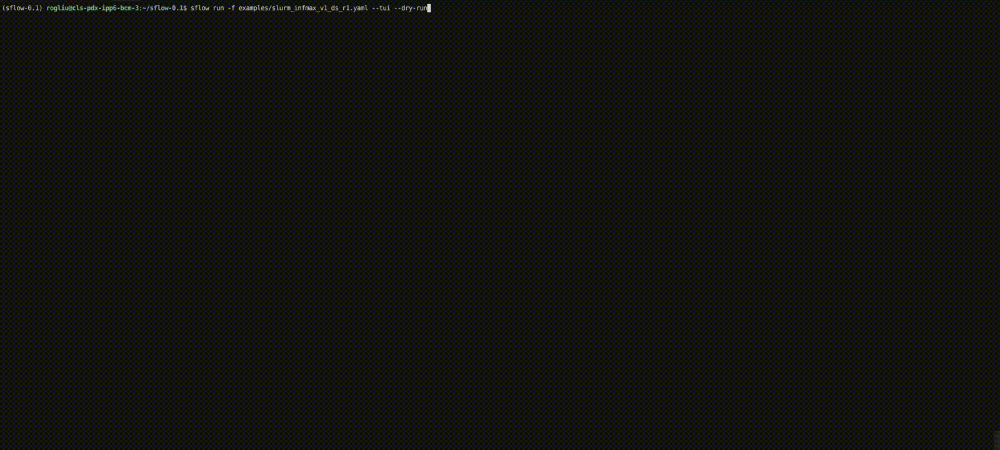
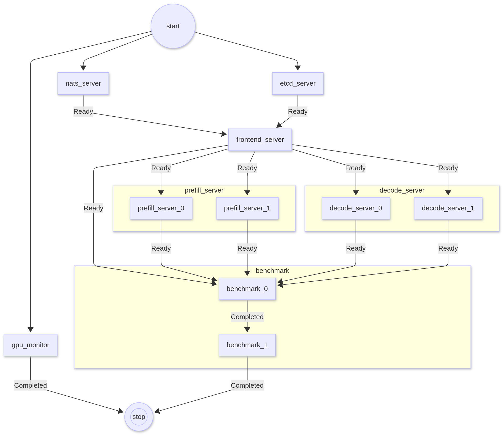

# sflow

[](LICENSE)
[](https://www.python.org/downloads/)
[](https://github.com/NVIDIA/nv-sflow/actions/workflows/ci.yml)

A **declarative workflow descriptor** that separates _what to deploy_ from _where to deploy it_, see our [project page](https://nvidia.github.io/nv-sflow/).

Describe your workflow once in a portable YAML -- tasks, dependencies, resources, and launch methods -- and `sflow` executes the DAG through swappable backends, leveraging each platform's native ecosystem. Write one `sflow.yaml` and run it across environments with minimal changes.

The current focus is **Slurm**, which lacks a built-in workflow orchestration layer. Docker and Kubernetes backends are planned.



## Key Features

| Feature | Description |
|---------|-------------|
| **Modular Composition** | Split workflows into reusable YAML fragments, merge at runtime with `sflow compose` or multi-file `sflow run -f` |
| **Topology-aware GPU Allocation** | Automatic node/GPU placement with `CUDA_VISIBLE_DEVICES` slicing across tasks and replicas |
| **Probes** | Readiness and failure gates -- TCP port, HTTP, log watch with pattern matching |
| **Replicas & Sweeps** | Parallel/sequential replicas with Cartesian product variable sweeps |
| **Batch Mode** | Generate sbatch scripts, CSV-driven bulk sweeps, parallel preflight validation |
| **Expressions** | Jinja2 `${{ }}` syntax for variables, backend info, and task metadata |
| **Artifacts** | Named URIs (`fs://`, `file://`, `http://`) with inline content generation |
| **Live TUI** | Rich terminal interface with task status, log tailing, and allocation maps |
| **AI Agent Skills** | Built-in skills that teach coding assistants (Cursor, Copilot) to write and debug sflow YAML |
| **Preflight Validation** | Container image checks, GPU oversubscription detection, dependency cycle analysis |

## Production-Ready Samples

Modular workflow samples for LLM inference serving with [NVIDIA Dynamo](https://github.com/ai-dynamo/dynamo):

| Framework | Aggregated | Disaggregated (P/D) | Multi-Node |
|-----------|:----------:|:-------------------:|:----------:|
| SGLang    | Yes        | Yes                 | Yes        |
| vLLM      | Yes        | Yes                 | Yes        |
| TRT-LLM   | Yes        | Yes                 | Yes        |

All frameworks share a common infrastructure layer (etcd, NATS, frontend, nginx) -- only the server task files differ.

<p align="center">
  
</p>

## CLI at a Glance

| Command | Purpose | Key Flags |
|---------|---------|-----------|
| `sflow run` | Execute a workflow | `--dry-run` `--tui` `--set` `-f` (multi-file) |
| `sflow batch` | Generate sbatch scripts | `--submit` `--bulk-input` `--row` |
| `sflow compose` | Merge multiple YAMLs | `--resolve` `--missable-tasks` `-o` |
| `sflow visualize` | Render DAG graph | `--format png/svg/mermaid` |
| `sflow sample` | List / copy examples | `--list` `-o` |
| `sflow skill` | Export AI agent skills | `--list` `-o` |

## Documentation

Full user documentation: **https://nvidia.github.io/nv-sflow/**

- [Introduction](https://nvidia.github.io/nv-sflow/docs/user/intro) -- concepts and architecture
- [Quickstart](https://nvidia.github.io/nv-sflow/docs/user/quickstart) -- local and Slurm setup
- [Configuration](https://nvidia.github.io/nv-sflow/docs/user/configuration) -- full YAML schema
- [Modular Workflows](https://nvidia.github.io/nv-sflow/docs/user/modular-workflows) -- multi-file composition
- [Quick Reference](https://nvidia.github.io/nv-sflow/docs/user/quick-reference) -- all fields at a glance
- [CLI Reference](https://nvidia.github.io/nv-sflow/docs/user/cli) -- commands and flags
- [Sample Workflows](https://nvidia.github.io/nv-sflow/docs/user/samples) -- production examples

## Quickstart

Validate the workflow engine locally (no Slurm required):

```bash
uv venv
source .venv/bin/activate
uv pip install "sflow @ git+https://github.com/NVIDIA/nv-sflow.git@main"

sflow run --file examples/local_hello_world.yaml --tui
```

Minimal workflow:

```yaml
version: "0.1"

variables:
  WHO:
    description: "who to greet"
    value: Nvidia

workflow:
  name: hello_local
  tasks:
    - name: hello
      script:
        - echo "Hello ${WHO}"
```

Run a modular multi-file workflow on Slurm:

```bash
sflow run \
  -f slurm_config.yaml -f common_workflow.yaml \
  -f sglang/prefill.yaml -f sglang/decode.yaml -f benchmark_aiperf.yaml \
  --missable-tasks agg_server --tui
```

Export AI agent skills for your IDE:

```bash
sflow skill -o .cursor/skills/
```

## Development Setup

### Prerequisites

- **Python 3.10 or higher**
- **uv** (Python package installer and resolver)

  ```bash
  curl -LsSf https://astral.sh/uv/install.sh | sh
  ```

### Install in Development Mode

```bash
git clone https://github.com/NVIDIA/nv-sflow.git
cd nv-sflow
uv venv
source .venv/bin/activate
uv pip install -e ".[dev]"
pytest
```

## Contributing

Please see [CONTRIBUTING.md](CONTRIBUTING.md) for details on how to contribute to this project.

## License

This project is licensed under the [Apache License 2.0](LICENSE).
