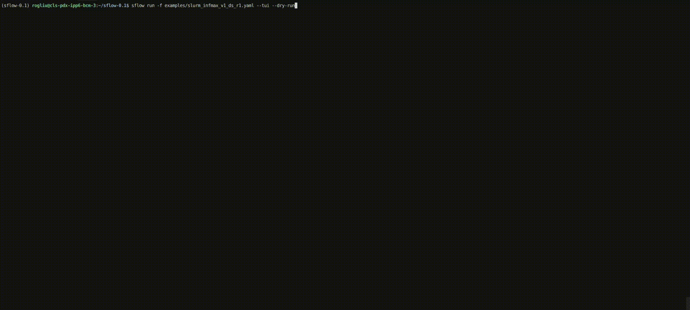
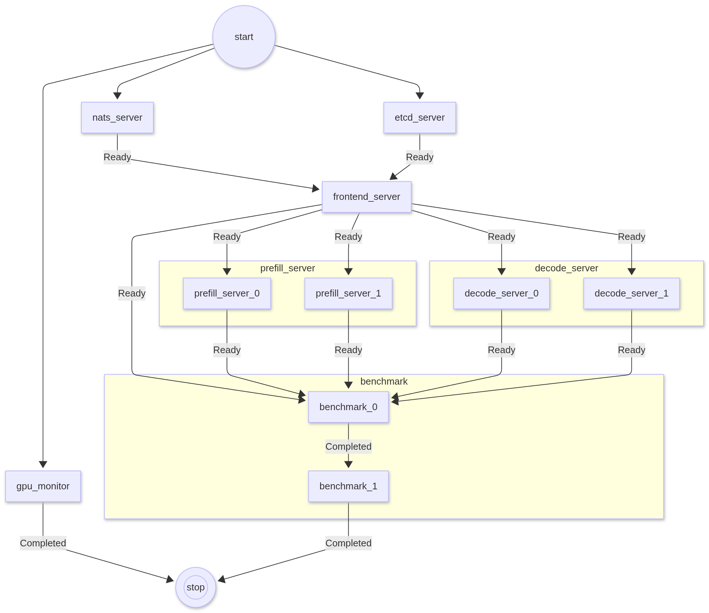

# sflow

[](LICENSE)
[](https://www.python.org/downloads/)
[](https://github.com/NVIDIA/nv-sflow/actions/workflows/ci.yml)

## Install

```bash
uv venv --python python3 && source .venv/bin/activate
uv pip install "sflow @ git+https://github.com/NVIDIA/nv-sflow.git@main"
sflow --version
```

Already on **sflow v0.3.0+**? Upgrade in place -- no incantation to remember:

```bash
sflow upgrade                 # latest main; --branch <ref> / --dry-run also supported
```

No `uv`? `pip install uv` (or `curl -LsSf https://astral.sh/uv/install.sh | sh`).
Optional extras: `sflow[s3]` (S3 uploads), `sflow[monitor]` (PNG hardware charts).

**Quickstart:** https://nvidia.github.io/nv-sflow/docs/user/quickstart

## What is sflow

A **declarative workflow descriptor for massive GPU clusters** that separates _what to deploy_ from _where to deploy it_, see our [project page](https://nvidia.github.io/nv-sflow/).

**One semantic across every platform -- backend agnostic by design.** A deployment's logic never changes: start etcd and NATS, launch a frontend, spin up workers, run the benchmark. Only the infrastructure glue does -- and today that glue is rewritten from scratch for every platform. `sflow` consolidates it into a single portable YAML: tasks, dependencies, resources, and launch methods. The **same `sflow.yaml` runs on Docker, Slurm, and Kubernetes** -- swap the backend block, rewrite nothing. Backends delegate to each platform's native ecosystem rather than reimplementing it.

**Cluster-level orchestration at scale.** Topology-aware node and GPU placement, multi-node replicas and sweeps, readiness/failure probes, and batch submission -- so one descriptor drives hundreds of GPUs instead of a pile of hand-written bash.

All four backends ship today: `local`, `docker`, `slurm`, and `kubernetes`.



## Key Features

| Feature | Description |
|---------|-------------|
| **Backend Agnostic** | One recipe on `local`, `docker`, `slurm`, `kubernetes` (`k8s` / `k8s_mpi`) -- swap the backend fragment, keep the DAG |
| **Modular Composition** | Reusable YAML fragments deep-merged by name at runtime (`sflow compose`, multi-file `sflow run -f`), with `required_by` reverse edges |
| **Topology-aware GPU Allocation** | Automatic node/GPU placement and `CUDA_VISIBLE_DEVICES` slicing; pin devices with `gpus.indices`, UUID-based re-selection inside Slurm steps, and machine-local GPU reservation on Docker |
| **Probes** | Readiness and failure gates -- TCP port, HTTP, log watch with pattern matching |
| **Replicas & Sweeps** | Parallel/sequential replicas with Cartesian product variable sweeps |
| **Batch Mode** | Generate sbatch scripts, CSV-driven bulk sweeps, parallel preflight validation |
| **Expressions** | Jinja2 `${{ }}` syntax for variables, backend info, and task metadata |
| **Artifacts** | Named URIs (`fs://`, `file://`, `http://`) with inline content generation |
| **Live TUI** | Rich terminal interface with task status, log tailing, and allocation maps |
| **Results & Uploads** | Declarative `result:` parsing into `result.json`, plus `uploads:` / `upload_all:` to S3 |
| **Hardware Monitoring** | `monitor:` GPU/CPU/memory/network telemetry with per-device charts and log-marker `window:` reports (Local, Docker, Slurm) |
| **Run Diagnostics** | Self-explaining `sflow_summary.log`: GPU assignment, node topology, external command health, event-loop stall dumps |
| **AI Agent Skills** | Built-in skills that teach coding assistants (Cursor, Copilot) to write and debug sflow YAML |
| **Preflight Validation** | Container image checks, GPU oversubscription detection, dependency cycle analysis |

## Production-Ready Samples

Modular workflow samples for LLM inference serving with [NVIDIA Dynamo](https://github.com/ai-dynamo/dynamo):

| Framework | Aggregated | Disaggregated (P/D) | Multi-Node |
|-----------|:----------:|:-------------------:|:----------:|
| SGLang    | Yes        | Yes                 | Yes        |
| vLLM      | Yes        | Yes                 | Yes        |
| TRT-LLM   | Yes        | Yes                 | Yes        |

All frameworks share a common infrastructure layer (etcd, NATS, frontend, nginx) -- only the server task files differ.

**The same workload, three platforms.** `examples/modular/backend_agnostic/` composes a backend fragment + a workload + a benchmark. Moving platforms means swapping one `-f`:

```bash
# Kubernetes
sflow run -f backends/k8s.yaml  -f workloads/dynamo_common.yaml -f workloads/dynamo_trtllm.yaml -f benchmark.yaml
# Slurm -- same workload, same benchmark
sflow run -f backends/slurm.yaml -f workloads/dynamo_common.yaml -f workloads/dynamo_trtllm.yaml -f benchmark.yaml
# One local box, containers
sflow run -f backends/docker.yaml -f workloads/sglang_serve.yaml -f benchmark.yaml
```

<p align="center">
  
</p>

## CLI at a Glance

| Command | Purpose | Key Flags |
|---------|---------|-----------|
| `sflow run` | Execute a workflow | `--dry-run` `--tui` `--set` `-f` (multi-file) |
| `sflow batch` | Generate sbatch scripts | `--submit` `--bulk-input` `--row` |
| `sflow compose` | Merge multiple YAMLs | `--resolve` `--missable-tasks` `-o` |
| `sflow visualize` | Render DAG graph | `--format png/svg/mermaid` |
| `sflow sample` | List / copy examples | `--list` `-o` |
| `sflow skill` | Export AI agent skills | `--list` `-o` |
| `sflow upgrade` | Reinstall sflow in place (alias: `sflow update`) | `--branch` `--dry-run` `--force` |

## Documentation

Full user documentation: **https://nvidia.github.io/nv-sflow/**

- [Introduction](https://nvidia.github.io/nv-sflow/docs/user/intro) -- concepts and architecture
- [Quickstart](https://nvidia.github.io/nv-sflow/docs/user/quickstart) -- local and Slurm setup
- [Configuration](https://nvidia.github.io/nv-sflow/docs/user/configuration) -- full YAML schema
- [Modular Workflows](https://nvidia.github.io/nv-sflow/docs/user/modular-workflows) -- multi-file composition
- [Quick Reference](https://nvidia.github.io/nv-sflow/docs/user/quick-reference) -- all fields at a glance
- [Backends](https://nvidia.github.io/nv-sflow/docs/user/backends) -- local, Docker, Slurm, Kubernetes
- [Monitor](https://nvidia.github.io/nv-sflow/docs/user/monitor) -- hardware telemetry and reports
- [Understanding Run Output](https://nvidia.github.io/nv-sflow/docs/user/run-output) -- output tree and failure triage
- [CLI Reference](https://nvidia.github.io/nv-sflow/docs/user/cli) -- commands and flags
- [Sample Workflows](https://nvidia.github.io/nv-sflow/docs/user/samples) -- production examples

Release notes live in [`docs/release_notes/`](docs/release_notes) -- start with [v0.3.1](docs/release_notes/RELEASE_NOTES_v0.3.1.md) for the current breaking changes and upgrade checklist.

## Quickstart

Validate the workflow engine locally (no Slurm required):

```bash
sflow run --file examples/local_hello_world.yaml --tui
```

Minimal workflow:

```yaml
version: "0.1"

variables:
  WHO:
    description: "who to greet"
    value: Nvidia

workflow:
  name: hello_local
  tasks:
    - name: hello
      script:
        - echo "Hello ${WHO}"
```

Run a modular multi-file workflow on Slurm:

```bash
sflow run \
  -f slurm_config.yaml -f common_workflow.yaml \
  -f sglang/prefill.yaml -f sglang/decode.yaml -f benchmark_aiperf.yaml \
  --missable-tasks agg_server --tui
```

Export AI agent skills for your IDE:

```bash
sflow skill -o .cursor/skills/
```

## Development Setup

### Prerequisites

- **Python 3.10 or higher**
- **uv** (Python package installer and resolver)

  ```bash
  curl -LsSf https://astral.sh/uv/install.sh | sh
  ```

### Install in Development Mode

```bash
git clone https://github.com/NVIDIA/nv-sflow.git
cd nv-sflow
uv venv
source .venv/bin/activate
uv pip install -e ".[dev]"
pytest
```

## Contributing

Please see [CONTRIBUTING.md](CONTRIBUTING.md) for details on how to contribute to this project.

## License

This project is licensed under the [Apache License 2.0](LICENSE).
