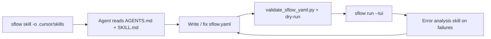

`sflow` ships **AI agent skills** so coding assistants (Cursor, Claude Code, GitHub Copilot, and any agent that reads `AGENTS.md`) can write sflow YAML and debug workflows without you having to explain the schema each time.

The skills are packaged with sflow and exported on demand with the [`sflow skill`](/docs/user/cli) command — they are the same content shown on this page, so what an agent runs locally matches what you read here.

:::tip For agents
If you are an AI agent: read the [Agent guidelines (AGENTS.md)](./agents-guidelines.md) first, then the relevant skill. To install the skills into a project, run `sflow skill -o .cursor/skills` (or `.claude/skills`). See [Setup](./setup.md).
:::

## What ships

| Skill | Use it when | Open |
|-------|-------------|------|
| **Writing sflow YAML** | creating or modifying an `sflow.yaml`, configuring backends/operators/probes/replicas, setting up inference serving | [skill](./writing-sflow-yaml/index.md) |
| **Error analysis** | an sflow run fails, you paste an error, or you need to triage logs and task failures | [skill](./sflow-error-analysis/index.md) |
| **AGENTS.md** | the step-by-step authoring workflow + hard rules every agent should follow | [guidelines](./agents-guidelines.md) |

Each skill also bundles helper scripts (`validate_sflow_yaml.py`, `check_gpu_plan.py`, `parse_sflow_errors.py`, `summarize_run.py`) that the agent can run. Those scripts are copied into your project by `sflow skill`; see [Setup](./setup.md).

## How agents use them

## Next

- [Set up the skills in your editor / project](./setup.md)
- [Writing sflow YAML](./writing-sflow-yaml/index.md)
- [Error analysis](./sflow-error-analysis/index.md)
- [Agent guidelines (AGENTS.md)](./agents-guidelines.md)
- Not sure which feature you need? Open the [Feature Map](/feature-map).
