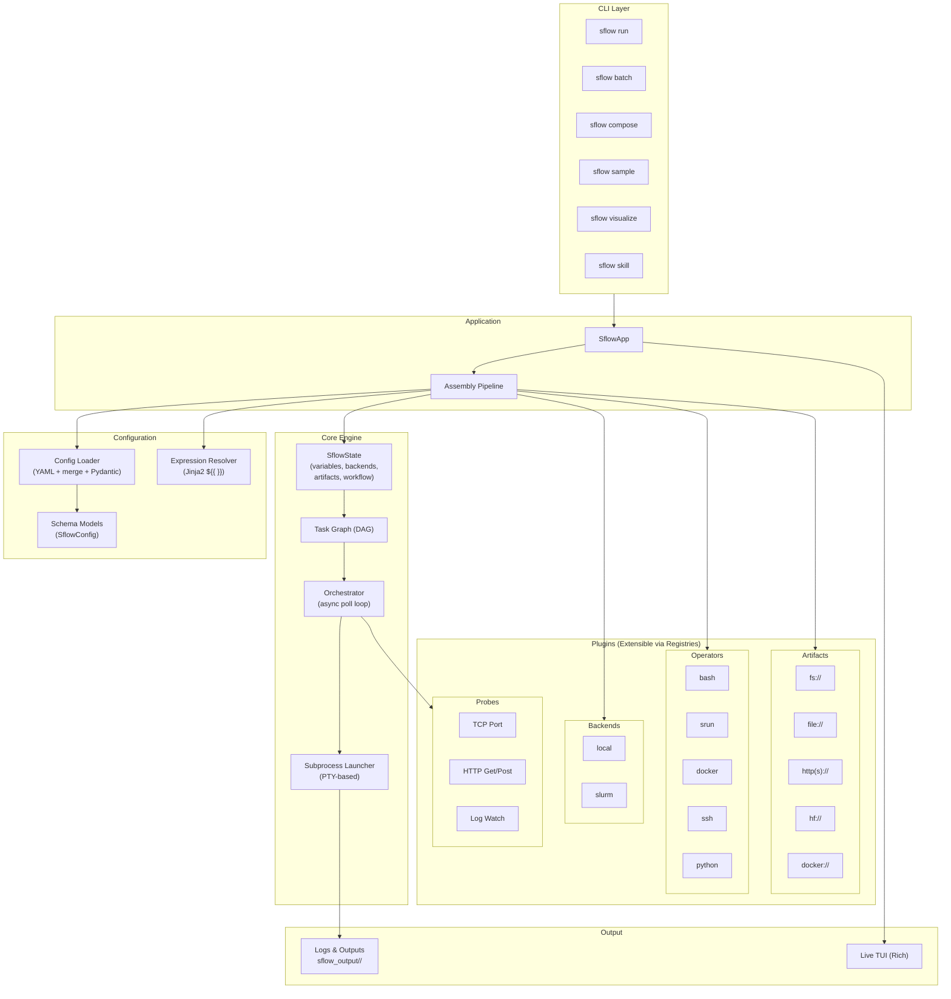
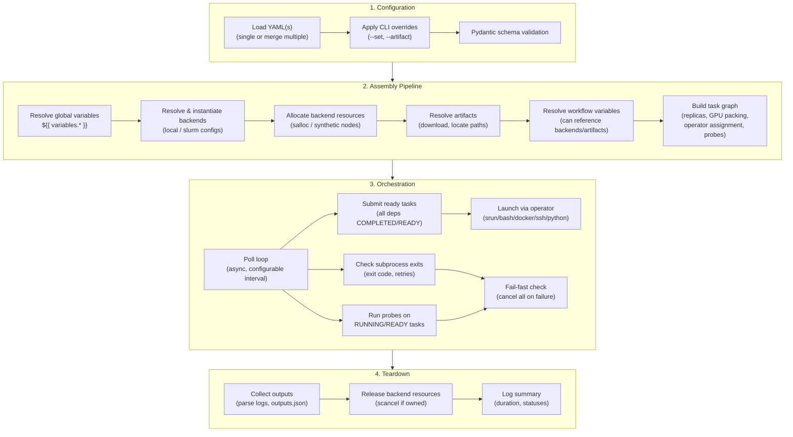
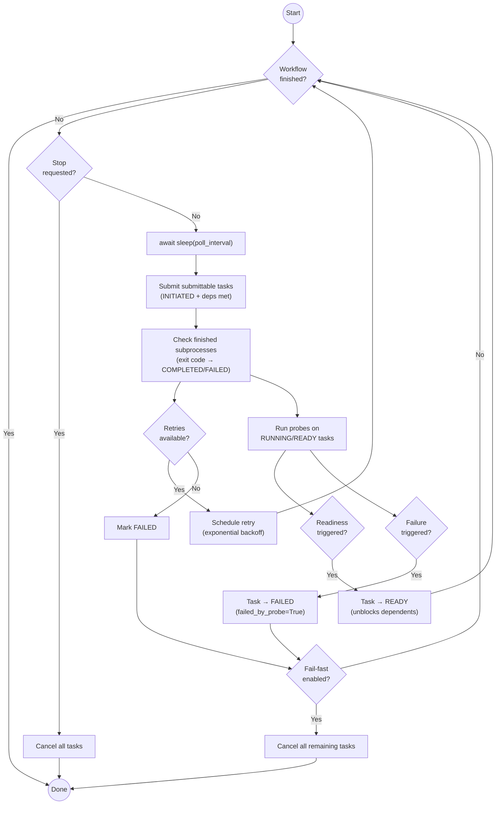
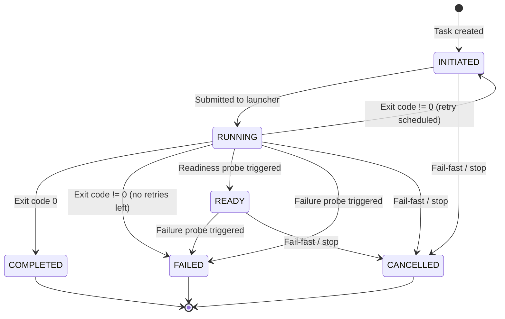

## Architecture Overview



## Execution Flow

The following diagram shows the full lifecycle of an `sflow run` invocation, from YAML loading to workflow completion:



### Assembly Pipeline Detail

The assembly pipeline (`build_state()`) transforms raw config into a ready-to-execute workflow. Each step adds more context, enabling later steps to reference earlier results:

| Step | Function | What it does |
|------|----------|-------------|
| 1 | `resolve_global_variables()` | Evaluates `${{ }}` in top-level variables (topological order for inter-variable deps) |
| 2 | `resolve_backends()` | Instantiates `Backend` objects from config, resolving backend-level expressions |
| 3 | `allocate_backends()` | Calls `backend.allocate()` — runs `salloc` for Slurm, creates synthetic nodes for local |
| 4 | `resolve_artifacts()` | Materializes artifacts: downloads HTTP, locates `fs://` paths, validates existence |
| 5 | `resolve_workflow_variables()` | Resolves workflow-scoped variables (can reference `backends.*`, `artifacts.*`) |
| 6 | `build_task_graph()` | Expands replicas, assigns GPUs/nodes, builds operators, creates probes, resolves `${{ task.* }}` expressions |

### Orchestrator Loop Detail

The orchestrator runs an async poll loop until all tasks reach a terminal state:



### Task Lifecycle



## CLI Commands

| Command | Purpose | Key Options |
|---------|---------|-------------|
| **`sflow run`** | Execute a workflow | `--dry-run`, `--tui`, `--set/-s`, `--artifact/-a`, `--missable-tasks/-M`, `--extra-args`, `--output-dir`, `--log-level` |
| **`sflow batch`** | Generate Slurm sbatch scripts | `--submit`, `--bulk-input` (CSV sweeps), `--nodes`, `--partition`, `--account`, `--time`, `--resolve` |
| **`sflow compose`** | Merge multiple YAMLs into one | `--resolve`, `--validate`, `--bulk-input`, `--missable-tasks/-M`, `-o/--output` |
| **`sflow visualize`** | Render DAG as image/mermaid | `--format` (png/svg/pdf/mermaid/dot), `--show-variables`, `--set/-s`, `--artifact/-a`, `--missable-tasks/-M` |
| **`sflow sample`** | List/copy example workflows | `--list`, `--force`, `-o/--output` |
| **`sflow skill`** | Copy agent skills into project (merges into existing directory) | `--list`, `--force` (overwrite existing files), `-o/--output` |

### Multi-file Input

All commands that take input files accept multiple `-f` flags or positional args. When multiple files are provided, they are **merged** in order:
- `variables`, `artifacts`, `backends`, `operators` merge by name (later files override)
- `workflow.tasks` are concatenated (later files append)
- `--missable-tasks` removes references to tasks that don't exist in the merged result

## Plugins Reference

### Backends

Backends provide compute resources. They are registered via `@register_backend()` and selected by `type` in the YAML config.

| Backend | Type | How it allocates | Default Operator | Key Config |
|---------|------|-----------------|-----------------|------------|
| **Local** | `local` | Creates synthetic `localhost` nodes (no real allocation) | `bash` | `nodes` (count) |
| **Slurm** | `slurm` | Runs `salloc` for interactive allocation, or reuses existing `SLURM_JOB_ID` | `srun` | `account`, `partition`, `time`, `nodes`, `gpus_per_node`, `extra_args` |

When running inside an existing Slurm job (`SLURM_JOB_ID` is set), the Slurm backend reuses the allocation without calling `salloc` — and will **not** `scancel` it on teardown.

### Operators

Operators define how a task's script is launched. They are registered via `@register_operator()` and selected by `type`.

| Operator | Type | Launch Method | Container Support | Key Config |
|----------|------|--------------|-------------------|------------|
| **Bash** | `bash` | `bash -c "<script>"` | No | _(minimal)_ |
| **Srun** | `srun` | `srun [opts] bash -c "<script>"` | Yes (Pyxis) | `ntasks`, `ntasks_per_node`, `gpus`, `container_image`, `container_mounts`, `mpi`, `nodelist`, `overlap` |
| **Docker** | `docker` | `docker run --rm <image> bash -lc "<script>"` | Yes (native) | `image`, `mounts`, `gpus`, `workdir`, `extra_args` |
| **SSH** | `ssh` | `ssh user@host "bash -lc '<script>'"` | No | `host`, `user`, `port`, `identity_file` |
| **Python** | `python` | `python -c "<script>"` | No | `python_exec`, `extra_args` |

The **srun** operator is the most feature-rich, supporting:
- Multi-node parallel tasks (`ntasks`, `ntasks_per_node`)
- GPU assignment (`gpus`, `gpus_per_task`, `gres`)
- Container execution via Pyxis (`container_image`, `container_mounts`, `container_workdir`)
- MPI frameworks (`mpi: pmix | ucx | ofi`)
- Node placement (`nodelist`, `exclusive`, `constraint`)

### Probes

Probes gate task progression. Each task can have a **readiness** probe and a **failure** probe.

| Probe | Config Key | How it checks | Key Params |
|-------|-----------|--------------|------------|
| **TCP Port** | `tcp_port` | `asyncio.open_connection(host, port)` | `host`, `port`, `on_node` (`first` or `each`) |
| **HTTP GET** | `http_get` | `urlopen(url)` — success if 2xx/3xx | `url`, `headers` |
| **HTTP POST** | `http_post` | `urlopen(url, body)` — success if 2xx/3xx | `url`, `body`, `headers` |
| **Log Watch** | `log_watch` | Regex/literal match in task's log file | `match_pattern`, `match_count`, `logger` (watch another task's log) |

Common probe parameters (Kubernetes-style):

| Parameter | Default | Description |
|-----------|---------|-------------|
| `delay` | 0 | Seconds before first check |
| `timeout` | 60 | Per-check timeout |
| `interval` | 5 | Seconds between checks |
| `success_threshold` | 1 | Consecutive successes to trigger readiness |
| `failure_threshold` | 3 | Consecutive detections to trigger failure |

**Readiness probes** set the task to `READY`, which unblocks downstream tasks that `depends_on` it. **Failure probes** set the task to `FAILED` and (with fail-fast enabled) terminate the entire workflow. The orchestrator clearly distinguishes probe-terminated failures from process crashes in its logs.

### Artifacts

Artifacts are named external resources resolved by URI scheme. They are registered via `register_artifact_scheme()`.

| Scheme | Resolver | Materialization | Description |
|--------|----------|----------------|-------------|
| `fs://` | Local file | Path validation; creates empty dir if missing | Local filesystem path |
| `file://` | Local file | Inline content written to output dir | File with optional inline content |
| `http://` / `https://` | HTTP download | Downloads and caches (SHA256-keyed) | Remote file download |
| `hf://` / `huggingface://` | HuggingFace | Not yet implemented | HuggingFace model reference |
| `docker://` | Docker | Not yet implemented | Container image reference |

Artifacts are referenced in expressions as `${{ artifacts.NAME.path }}` (resolved local path) or `${{ artifacts.NAME.uri }}` (original URI).

## Replicas & Sweeps

Tasks can be replicated with the `replicas` config:

```yaml
replicas:
  count: 4
  policy: "parallel"    # or "sequential"
  variables:
    - name: BATCH_SIZE
      values: [1, 2, 4, 8]
```

- **`parallel`**: All replicas run simultaneously (e.g., prefill/decode workers)
- **`sequential`**: Replicas run one after another, chained via `depends_on` (e.g., benchmark sweeps)
- **`variables`**: Per-replica variable overrides enable parameter sweeps

Replicas are expanded at assembly time into separate tasks: `task_0`, `task_1`, etc.

## Retries

Tasks support automatic retries with exponential backoff:

```yaml
retries:
  count: 3        # number of retries after initial attempt
  interval: 30    # initial delay (seconds)
  backoff: 2.0    # multiplier per retry
```

On failure, probes are reset and the task is rescheduled. The orchestrator tracks `attempts` and `exit_code` for observability.

## Output Structure

Every run produces a structured output directory:

```
sflow_output/<run_id>/
  sflow.log                     # Orchestrator log
  <task_name>/
    <task_name>.log              # Task stdout/stderr
    outputs.json                 # Parsed outputs (if output_specs defined)
  <task_name_0>/                 # Replica 0
    <task_name_0>.log
  ...
```

## TUI (Terminal UI)

When `--tui` is enabled, sflow renders a live Rich-based dashboard:

- **Header**: Workflow name, run ID, progress bar, elapsed time
- **Task table**: Name, status (color-coded), exit code, assigned nodes
- **Backend panel**: Allocation IDs, node counts per backend
- **Log tail**: Scrolling log output with level-based coloring
