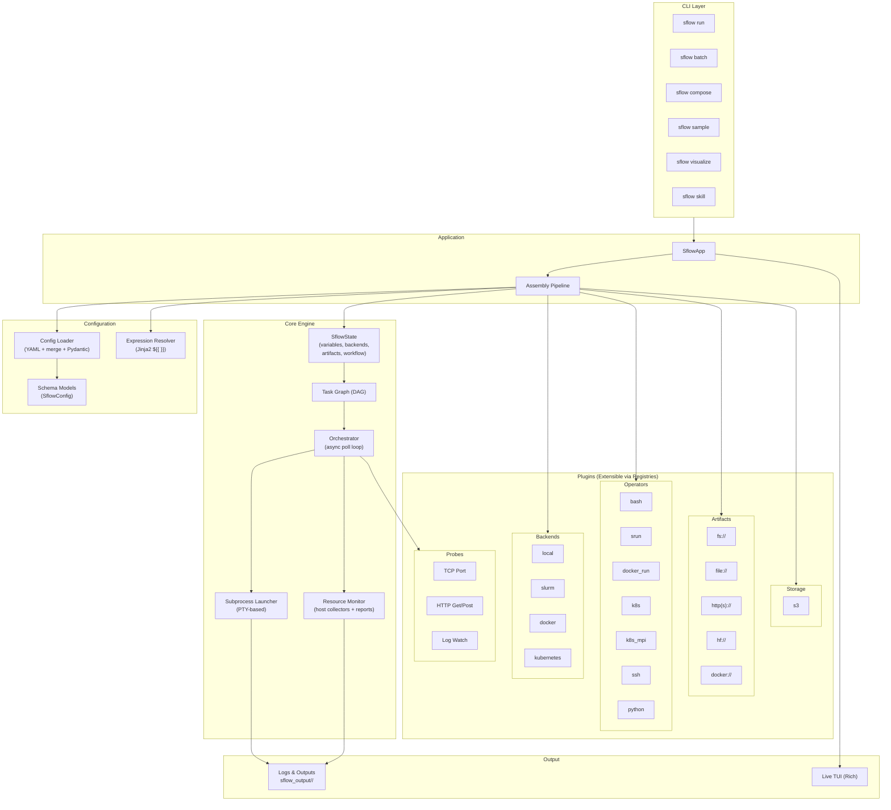
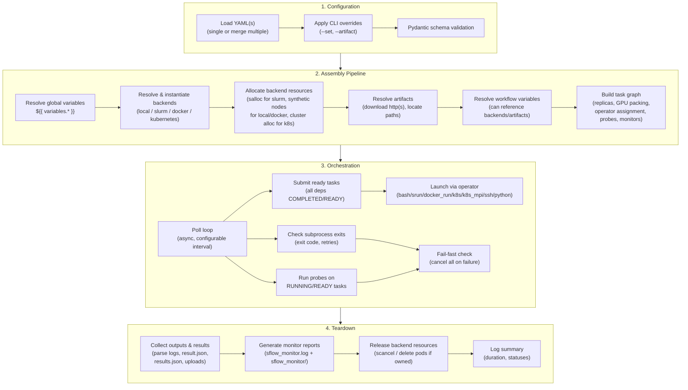
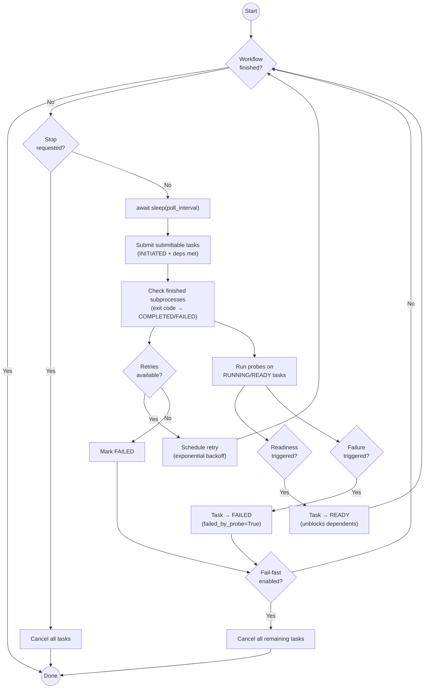
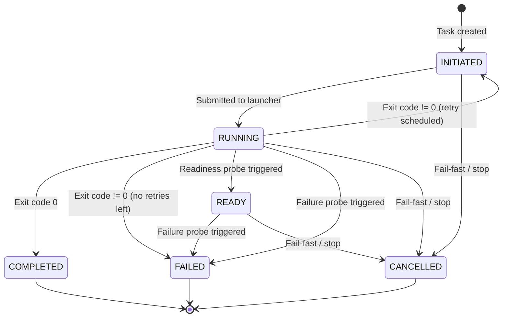

## Architecture Overview


```mermaid
graph TB
  subgraph CLI["CLI Layer"]
    run["sflow run"]
    batch["sflow batch"]
    compose["sflow compose"]
    sample["sflow sample"]
    visualize["sflow visualize"]
    skill["sflow skill"]
  end

  subgraph App["Application"]
    sflowapp["SflowApp"]
    assembly["Assembly Pipeline"]
  end

  subgraph Config["Configuration"]
    loader["Config Loader\n(YAML + merge + Pydantic)"]
    resolver["Expression Resolver\n(Jinja2 ${{ }})"]
    schema["Schema Models\n(SflowConfig)"]
  end

  subgraph Plugins["Plugins (Extensible via Registries)"]
    subgraph Backends
      local_be["local"]
      slurm_be["slurm"]
      docker_be["docker"]
      k8s_be["kubernetes"]
    end
    subgraph Operators
      bash_op["bash"]
      srun_op["srun"]
      docker_op["docker_run"]
      k8s_op["k8s"]
      k8s_mpi_op["k8s_mpi"]
      ssh_op["ssh"]
      python_op["python"]
    end
    subgraph Probes
      tcp["TCP Port"]
      http["HTTP Get/Post"]
      logwatch["Log Watch"]
    end
    subgraph Artifacts
      fs_art["fs://"]
      file_art["file://"]
      http_art["http(s)://"]
      hf_art["hf://"]
      docker_art["docker://"]
    end
    subgraph Storage
      s3_st["s3"]
    end
  end

  subgraph Core["Core Engine"]
    state["SflowState\n(variables, backends,\nartifacts, workflow)"]
    taskgraph["Task Graph (DAG)"]
    orchestrator["Orchestrator\n(async poll loop)"]
    launcher["Subprocess Launcher\n(PTY-based)"]
    monitor["Resource Monitor\n(host collectors + reports)"]
  end

  subgraph Output["Output"]
    tui["Live TUI (Rich)"]
    logs["Logs & Outputs\nsflow_output/<run_id>/"]
  end

  CLI --> sflowapp
  sflowapp --> assembly
  assembly --> loader
  assembly --> resolver
  loader --> schema
  assembly --> Backends
  assembly --> Operators
  assembly --> Artifacts
  assembly --> Storage
  assembly --> state
  state --> taskgraph
  taskgraph --> orchestrator
  orchestrator --> launcher
  orchestrator --> Probes
  orchestrator --> monitor
  launcher --> logs
  monitor --> logs
  sflowapp --> tui
```

## Execution Flow

The following diagram shows the full lifecycle of an `sflow run` invocation, from YAML loading to workflow completion:


```mermaid
flowchart TD
  subgraph Phase1["1. Configuration"]
    load["Load YAML(s)\n(single or merge multiple)"]
    override["Apply CLI overrides\n(--set, --artifact)"]
    validate["Pydantic schema validation"]
    load --> override --> validate
  end

  subgraph Phase2["2. Assembly Pipeline"]
    resolve_vars["Resolve global variables\n${{ variables.* }}"]
    resolve_be["Resolve & instantiate backends\n(local / slurm / docker / kubernetes)"]
    allocate["Allocate backend resources\n(salloc for slurm, synthetic nodes\nfor local/docker, cluster alloc for k8s)"]
    resolve_art["Resolve artifacts\n(download http(s), locate paths)"]
    resolve_wf_vars["Resolve workflow variables\n(can reference backends/artifacts)"]
    build_tg["Build task graph\n(replicas, GPU packing,\noperator assignment, probes, monitors)"]
    resolve_vars --> resolve_be --> allocate
    allocate --> resolve_art --> resolve_wf_vars --> build_tg
  end

  subgraph Phase3["3. Orchestration"]
    poll["Poll loop\n(async, configurable interval)"]
    submit["Submit ready tasks\n(all deps COMPLETED/READY)"]
    launch["Launch via operator\n(bash/srun/docker_run/k8s/k8s_mpi/ssh/python)"]
    probes["Run probes on\nRUNNING/READY tasks"]
    check_exit["Check subprocess exits\n(exit code, retries)"]
    failfast["Fail-fast check\n(cancel all on failure)"]

    poll --> submit --> launch
    poll --> check_exit
    poll --> probes
    check_exit --> failfast
    probes --> failfast
  end

  subgraph Phase4["4. Teardown"]
    collect["Collect outputs & results\n(parse logs, result.json,\nresults.json, uploads)"]
    monitor_report["Generate monitor reports\n(sflow_monitor.log + sflow_monitor/)"]
    release["Release backend resources\n(scancel / delete pods if owned)"]
    summary["Log summary\n(duration, statuses)"]
    collect --> monitor_report --> release --> summary
  end

  Phase1 --> Phase2 --> Phase3 --> Phase4
```

### Assembly Pipeline Detail

The assembly pipeline (`build_state()`) transforms raw config into a ready-to-execute workflow. Each step adds more context, enabling later steps to reference earlier results:

| Step | Function | What it does |
|------|----------|-------------|
| 1 | `resolve_global_variables()` | Evaluates `${{ }}` in top-level variables (topological order for inter-variable deps) |
| 2 | `resolve_backends()` | Instantiates `Backend` objects from config, resolving backend-level expressions |
| 3 | `allocate_backends()` | Calls `backend.allocate()` — runs `salloc` for Slurm, synthetic nodes for local/docker, reserves cluster nodes for Kubernetes |
| 4 | `resolve_artifacts()` | Materializes artifacts: downloads & caches `http(s)://`, locates `fs://` / `file://` paths (a missing `fs://` path warns rather than failing) |
| 5 | `resolve_workflow_variables()` | Resolves workflow-scoped variables (can reference `backends.*`, `artifacts.*`) |
| 6 | `build_task_graph()` | Expands replicas, assigns GPUs/nodes, builds operators, creates probes, plans monitors, resolves `${{ task.* }}` expressions |

### Orchestrator Loop Detail

The orchestrator runs an async poll loop until all tasks reach a terminal state:


```mermaid
flowchart TD
  start((Start)) --> check_finished{Workflow\nfinished?}
  check_finished -- Yes --> done((Done))
  check_finished -- No --> check_stop{Stop\nrequested?}
  check_stop -- Yes --> cancel_all["Cancel all tasks"] --> done

  check_stop -- No --> sleep["await sleep(poll_interval)"]
  sleep --> submit_tasks["Submit submittable tasks\n(INITIATED + deps met)"]
  submit_tasks --> check_exits["Check finished subprocesses\n(exit code → COMPLETED/FAILED)"]
  check_exits --> retry{Retries\navailable?}
  retry -- Yes --> schedule_retry["Schedule retry\n(exponential backoff)"]
  retry -- No --> mark_failed["Mark FAILED"]

  check_exits --> run_probes["Run probes on\nRUNNING/READY tasks"]
  run_probes --> readiness_probe{"Readiness\ntriggered?"}
  readiness_probe -- Yes --> mark_ready["Task → READY\n(unblocks dependents)"]
  run_probes --> failure_probe{"Failure\ntriggered?"}
  failure_probe -- Yes --> mark_probe_fail["Task → FAILED\n(failed_by_probe=True)"]

  mark_failed --> fail_fast_check{Fail-fast\nenabled?}
  mark_probe_fail --> fail_fast_check
  fail_fast_check -- Yes --> cancel_remaining["Cancel all remaining tasks"]
  cancel_remaining --> done
  fail_fast_check -- No --> check_finished
  schedule_retry --> check_finished
  mark_ready --> check_finished
```

### Task Lifecycle


```mermaid
stateDiagram-v2
  [*] --> INITIATED : Task created

  INITIATED --> RUNNING : Submitted to launcher
  RUNNING --> COMPLETED : Exit code 0
  RUNNING --> FAILED : Exit code != 0 (no retries left)
  RUNNING --> INITIATED : Exit code != 0 (retry scheduled)
  RUNNING --> READY : Readiness probe triggered
  RUNNING --> FAILED : Failure probe triggered
  READY --> FAILED : Failure probe triggered

  INITIATED --> CANCELLED : Fail-fast / stop
  RUNNING --> CANCELLED : Fail-fast / stop
  READY --> CANCELLED : Fail-fast / stop

  COMPLETED --> [*]
  FAILED --> [*]
  CANCELLED --> [*]
```

## CLI Commands

| Command | Purpose | Key Options |
|---------|---------|-------------|
| **`sflow run`** | Execute a workflow | `--dry-run`, `--tui`, `--bulk-input/--row`, `--set/-s`, `--artifact/-a`, `--missable-tasks/-M`, `--skip-artifact-check`, `--extra-args/-e`, `--output-dir`, `--log-level`, `--enable-workflow-monitor`, `--enable-task-monitor`, `--include-nodes/--exclude-nodes`, `--kubeconfig`, `--kube-context`, `--kube-namespace`, `--kube-node-selector`, `--kube-compute-domain-channel`, `--kube-compute-domain-create`, `--extra-kubectl-args` |
| **`sflow batch`** | Generate Slurm sbatch scripts | `--submit`, `--bulk-input` (CSV sweeps), `--bulk-submit` (YAML folders), `--row`, `--nodes`, `--partition`, `--account`, `--time`, `--resolve`, `--skip-artifact-check`, `--sflow-version`, `--enable-workflow-monitor`, `--enable-task-monitor`, `--include-nodes/--exclude-nodes` |
| **`sflow compose`** | Merge multiple YAMLs into one | `--resolve`, `--validate`, `--bulk-input`, `--row`, `--missable-tasks/-M`, `-o/--output` |
| **`sflow visualize`** | Render DAG as image/mermaid | `--format` (png/svg/pdf/mermaid/dot), `--show-variables`, `--set/-s`, `--artifact/-a`, `--missable-tasks/-M` |
| **`sflow sample`** | List/copy example workflows | `--list`, `--force`, `-o/--output` |
| **`sflow skill`** | Copy agent skills into project (merges into existing directory) | `--list`, `--force` (overwrite existing files), `-o/--output` |

### Multi-file Input

All commands that take input files accept multiple `-f` flags or positional args. When multiple files are provided, they are **merged** in order:
- `variables`, `artifacts`, `backends`, `operators` merge by name (later files override)
- `workflow.tasks` are concatenated (later files append)
- `--missable-tasks` removes references to tasks that don't exist in the merged result

## Plugins Reference

### Backends

Backends provide compute resources. They are registered via `@register_backend()` and selected by `type` in the YAML config.

| Backend | Type | How it allocates | Default Operator | Key Config |
|---------|------|-----------------|-----------------|------------|
| **Local** | `local` | Creates synthetic `localhost` nodes (no real allocation) | `bash` | `nodes` (count) |
| **Slurm** | `slurm` | Runs `salloc` for interactive allocation, or reuses existing `SLURM_JOB_ID` | `srun` | `account`, `partition`, `time`, `nodes`, `gpus_per_node`, `extra_args` |
| **Docker** | `docker` | Synthetic local allocation (or an explicit `hosts:` pool of remote Docker daemons) | `docker_run` | `image`, `nodes`, `gpus_per_node`, `hosts` |
| **Kubernetes** | `kubernetes` | Reserves real cluster nodes with placeholder pods; each task runs as scheduler-placed pod(s) | _(none — declare a `k8s` operator)_ | `namespace`, `nodes`, `gpus_per_node`, `scheduling`, `dra`, `compute_domain` |

When running inside an existing Slurm job (`SLURM_JOB_ID` is set), the Slurm backend reuses the allocation without calling `salloc` — and will **not** `scancel` it on teardown.

### Operators

Operators define how a task's script is launched. They are registered via `@register_operator()` and selected by `type`.

| Operator | Type | Launch Method | Container Support | Key Config |
|----------|------|--------------|-------------------|------------|
| **Bash** | `bash` | `bash -c "<script>"` | No | _(minimal)_ |
| **Srun** | `srun` | `srun [opts] bash -c "<script>"` | Yes (Pyxis) | `ntasks`, `ntasks_per_node`, `gpus`, `container_image`, `container_mounts`, `mpi`, `nodelist`, `overlap` |
| **Docker Run** | `docker_run` | `docker run --rm <image> bash -lc "<script>"` | Yes (native) | `image`, `mounts`, `gpus`, `workdir`, `extra_args` |
| **Kubernetes** | `k8s` | Applies pod(s) via `kubectl` (script from a ConfigMap, env from a Secret); single- or multi-node | Yes (pod `image`) | `image`, `image_pull_policy`, `node_selector`, `env`, `cpu`/`memory`, `tty` |
| **Kubernetes MPI** | `k8s_mpi` | Launcher `exec mpirun` across worker pods (MPIJob CR or raw pods) | Yes (pod `image`) | `image`, plus MPI launch settings |
| **SSH** | `ssh` | `ssh user@host "bash -lc '<script>'"` | No | `host`, `user`, `port`, `identity_file` |
| **Python** | `python` | `python -c "<script>"` | No | `python_exec`, `extra_args` |

The **srun** operator is the most feature-rich, supporting:
- Multi-node parallel tasks (`ntasks`, `ntasks_per_node`)
- GPU assignment (`gpus`, `gpus_per_task`, `gres`)
- Container execution via Pyxis (`container_image`, `container_mounts`, `container_workdir`)
- MPI frameworks (`mpi: pmix | ucx | ofi`)
- Node placement (`nodelist`, `exclusive`, `constraint`)

### Probes

Probes gate task progression. Each task can have a **readiness** probe and a **failure** probe.

| Probe | Config Key | How it checks | Key Params |
|-------|-----------|--------------|------------|
| **TCP Port** | `tcp_port` | `asyncio.open_connection(host, port)` | `host`, `port`, `on_node` (`first` or `each`) |
| **HTTP GET** | `http_get` | `urlopen(url)` — success if 2xx/3xx | `url`, `headers` |
| **HTTP POST** | `http_post` | `urlopen(url, body)` — success if 2xx/3xx | `url`, `body`, `headers` |
| **Log Watch** | `log_watch` | Regex/literal match in task's log file | `regex_pattern` (or its alias `match_pattern`), `match_count`, `logger` (watch another task's log) |

Common probe parameters:

| Parameter | Default | Applies to | Description |
|-----------|---------|------------|-------------|
| `delay` | 0 | both | Seconds before first check |
| `interval` | 5 | both | Seconds between checks |
| `each_check_timeout` | 30 | both | Per-check timeout in seconds |
| `timeout` | 1200 | readiness | Overall readiness deadline in seconds (failure probes never time out) |
| `success_threshold` | 1 | readiness | Consecutive successes to trigger readiness |
| `failure_threshold` | 3 | failure | Consecutive detections to trigger failure |

**Readiness probes** set the task to `READY`, which unblocks downstream tasks that `depends_on` it. **Failure probes** set the task to `FAILED` and (with fail-fast enabled) terminate the entire workflow. The orchestrator clearly distinguishes probe-terminated failures from process crashes in its logs.

### Artifacts

Artifacts are named external resources resolved by URI scheme. They are registered via `register_artifact_scheme()`.

| Scheme | Resolver | Materialization | Description |
|--------|----------|----------------|-------------|
| `fs://` | Local file | Path validation; creates empty dir if missing | Local filesystem path |
| `file://` | Local file | Inline content written to output dir | File with optional inline content |
| `http://` / `https://` | HTTP download | Downloads and caches (SHA256-keyed) | Remote file download |
| `hf://` / `huggingface://` | HuggingFace | Not yet implemented | HuggingFace model reference |
| `docker://` | Docker | Not yet implemented | Container image reference |

Artifacts are referenced in expressions as `${{ artifacts.NAME.path }}` (resolved local path) or `${{ artifacts.NAME.uri }}` (original URI).

### Storage (post-execution uploads)

Storage targets define **where** to upload task outputs after each task completes. Targets are registered via `@register_storage()` and selected by `type` in the YAML config.

| Storage | Type | Backend | Key Config |
|---------|------|---------|------------|
| **S3** | `s3` | boto3 default credential chain | `bucket`, `region`, `prefix`, `endpoint_url`, `storage_class` |

Each task declares per-spec uploads under `uploads:` (see [Uploads](./uploads.md)). Uploads fire when the task reaches `COMPLETED` — *before* fail-fast cancels remaining work, so partial results are preserved. Failure handling is per-spec via `on_error: warn | fail`.

## Replicas & Sweeps

Tasks can be replicated with the `replicas` config. For a **sweep**, declare a
`domain` on the variable and list its name under `replicas.variables`; sflow
expands one replica per domain value (the Cartesian product across multiple swept
variables):

```yaml
variables:
  BATCH_SIZE:
    value: 1
    domain: [1, 2, 4, 8]         # sweep values declared on the variable

workflow:
  tasks:
    - name: benchmark
      replicas:
        policy: "parallel"        # or "sequential"
        variables: [BATCH_SIZE]   # sweep BATCH_SIZE's domain -> 4 replicas
      script:
        - benchmark --batch-size ${BATCH_SIZE}
```

- **`parallel`**: All replicas run simultaneously (e.g., prefill/decode workers)
- **`sequential`**: Replicas run one after another, chained via `depends_on` (e.g., benchmark sweeps)
- **`variables`**: names of declared variables to sweep — each variable's `domain` supplies the per-replica values. Use `count:` for plain N-way replication without a sweep (if both are set, `count` must equal the sweep size).

Replicas are expanded at assembly time into separate tasks: a numeric `count`
yields `benchmark_0`, `benchmark_1`, …; a sweep names them by value
(`benchmark_1`, `benchmark_2`, `benchmark_4`, `benchmark_8`).

## Retries

Tasks support automatic retries with exponential backoff:

```yaml
retries:
  count: 3        # number of retries after initial attempt
  interval: 30    # initial delay (seconds)
  backoff: 2.0    # multiplier per retry
```

On failure, probes are reset and the task is rescheduled. The orchestrator tracks `attempts` and `exit_code` for observability.

## Output Structure

Every run produces a structured output directory:

```
sflow_output/<run_id>/
  sflow.log                     # Orchestrator log
  sflow_summary.log             # Human-readable run summary
  results.json                  # Workflow-level results index (if any task uses `result:`)
  sflow_monitor.log             # Resource-monitor overview (if `monitor:` is used)
  sflow_monitor/                # Raw samples + per-task/monitor reports (if `monitor:` is used)
  *_cmds.log                    # Command-only launch logs (bash/slurm/docker/...)
  <task_name>/
    <task_name>.log              # Task stdout/stderr
    result.json                  # Canonical per-task result (if the task uses `result:`)
    outputs.json                 # Parsed outputs (legacy `outputs:` MVP)
  <task_name_0>/                 # Replica 0
    <task_name_0>.log
  ...
```

Per-task `uploads:` and the optional `workflow.upload_all` additionally ship
selected files (or a zip of the whole run) to storage targets such as S3 — see
[Uploads](./uploads.md).

## TUI (Terminal UI)

When `--tui` is enabled, sflow renders a live Rich-based dashboard:

- **Header**: Workflow name, run ID, progress bar, elapsed time
- **Task table**: Name, status (color-coded), exit code, assigned nodes
- **Backend panel**: Allocation IDs, node counts per backend
- **Log tail**: Scrolling log output with level-based coloring
