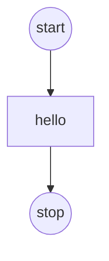
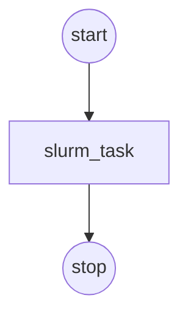

A `backend` provides compute resources for task execution. **v0.1 ships with** `local` and `slurm` backends.

## Default behavior (simplest)

If you omit `backends:` entirely, `sflow` creates a default local backend:

- backend: `local` (synthetic allocation: `localhost`, `localhost-1`, ...)
- default operator: `bash`

This is why `tests/integration/guide/sflow_minimal.yaml` works without any backend/operator config.

## Explicit local backend

This is based on `tests/integration/guide/sflow_explicit_local_backend.yaml`:

```yaml
version: "0.1"

backends:
  - name: local
    type: local
    default: true

workflow:
  name: wf
  tasks:
    - name: hello
      script:
        - echo hello
```



## Slurm backend

This is based on `tests/integration/guide/sflow_slurm_backend.yaml`:

```yaml
version: "0.1"

backends:
  - name: slurm_cluster
    type: slurm
    default: true
    account: "edmundw"
    partition: "your_slurm_partition"
    time: "00:10:00"
    nodes: 1

workflow:
  name: wf
  tasks:
    - name: slurm_task
      script:
        - echo hello
```



Notes:

- If you don't specify `task.operator`, the backend chooses its default operator:

  - local backend → `bash`
  - slurm backend → `srun`

- You can run `sflow` **asynchronously** via `sbatch`:
  - `sbatch` returns immediately with a job id; `sflow` runs inside the batch allocation.
  - In this mode, `sflow` will **reuse the current allocation** (no extra `salloc`).
  - Make sure your `--workspace-dir/--output-dir` point to a shared filesystem so you can inspect logs while it runs.

Example:

```bash
sbatch --job-name=sflow --output=sflow-%j.out --wrap "cd $SLURM_SUBMIT_DIR && sflow run --file tests/integration/guide/sflow_slurm_backend.yaml"
```

### Cluster-specific flags (`extra_args`)

Some Slurm clusters require additional flags for job submission (e.g., GPU resources, network segments, or custom policies). Use the `extra_args` section to pass these cluster-specific options:

```yaml
version: "0.1"

backends:
  - name: gpu_cluster
    type: slurm
    default: true
    account: "myproject"
    partition: "gpu"
    time: "01:00:00"
    nodes: 2
    extra_args:
      - "--gpus-per-node=8"
      - "--segment=2"
      - "--exclusive"

workflow:
  name: wf
  tasks:
    - name: gpu_task
      script:
        - nvidia-smi
        - echo "Running on GPU nodes"
```

Common cluster-specific flags include:

| Flag | Description |
|------|-------------|
| `--gpus-per-node=N` | Request N GPUs per node |
| `--segment=<name>` | Target a specific network segment or job class, usually GB200 / GB300 |
| `--exclusive` | Request exclusive node access |
| `--mem=<size>` | Memory per node (e.g., `128G`) |

:::tip
Check your cluster's documentation or run `sinfo` / `scontrol show partition` to discover available partitions, segments, and resource constraints.
:::

:::note
When using `sflow batch` mode, you can also pass extra Slurm flags directly via the `-e` flag without modifying the YAML file:

```bash
sflow batch -f workflow.yaml -e "--gpus-per-node=8" -e "--segment=2"
```

This is useful for quick adjustments or when testing different cluster configurations.
:::
