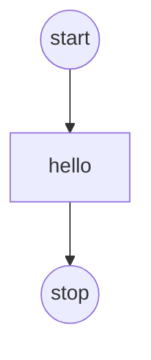
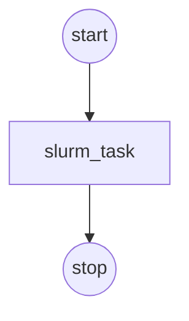

A `backend` provides compute resources for task execution. **v0.1 ships with** `local`, `slurm`, `docker`, and `kubernetes` backends.

## Default behavior (simplest)

If you omit `backends:` entirely, `sflow` creates a default local backend:

- backend: `local` (synthetic allocation: `localhost`, `localhost-1`, ...)
- default operator: `bash`

This is why a minimal workflow with just `workflow:` and `tasks:` works without any backend/operator config.

## Explicit local backend

Explicit local backend example:

```yaml
version: "0.1"

backends:
  - name: local
    type: local
    default: true

workflow:
  name: wf
  tasks:
    - name: hello
      script:
        - echo hello
```


```mermaid
flowchart TD
  start((start)) --> hello[hello]
  hello --> stop((stop))
```

## Slurm backend

Slurm backend example:

```yaml
version: "0.1"

backends:
  - name: slurm_cluster
    type: slurm
    default: true
    account: "your_slurm_account"
    partition: "your_slurm_partition"
    time: "00:10:00"
    nodes: 1
    gpus_per_node: 8        # required for sflow planning; set to 0 for CPU-only partitions

workflow:
  name: wf
  tasks:
    - name: slurm_task
      script:
        - echo hello
```

:::tip CPU-only partitions
Set `gpus_per_node: 0` to target a CPU-only Slurm partition. With zero capacity,
tasks that declare `resources.gpus` will be rejected up front with a clear error,
preventing silent CUDA failures at runtime.
:::

:::note
`gpus_per_node` describes cluster topology for sflow resource planning and GPU
index assignment. It does not add `--gpus-per-node` to `salloc`. If your cluster
requires that Slurm allocation flag, add it explicitly in backend `extra_args`.
:::


```mermaid
flowchart TD
  start((start)) --> slurm_task[slurm_task]
  slurm_task --> stop((stop))
```

Notes:

- If you don't specify `task.operator`, the backend chooses its default operator:

  - local backend → `bash`
  - slurm backend → `srun`
  - docker backend → `docker_run`
  - kubernetes backend → no default; declare an explicit `k8s` operator (the workload image lives on the operator)

- You can run `sflow` **asynchronously** via `sbatch`:
  - `sbatch` returns immediately with a job id; `sflow` runs inside the batch allocation.
  - In this mode, `sflow` will **reuse the current allocation** (no extra `salloc`).
  - Make sure your `--workspace-dir/--output-dir` point to a shared filesystem so you can inspect logs while it runs.
  - Controller-provided `SLURM_*` / `SLURMD_*` environment variables are preserved for tasks, even if workflow variables use the same names. sflow also exposes backend-agnostic aliases such as `SFLOW_BACKEND_JOB_ID` and `SFLOW_BACKEND_NODELIST`.

Example:

```bash
sbatch --job-name=sflow --output=sflow-%j.out --wrap "cd $SLURM_SUBMIT_DIR && sflow run --file sflow.yaml"
```

### Cluster-specific flags (`extra_args`)

Some Slurm clusters require additional flags for job submission (e.g., GPU resources, network segments, or custom policies). Use the `extra_args` section to pass these cluster-specific options:

```yaml
version: "0.1"

backends:
  - name: gpu_cluster
    type: slurm
    default: true
    account: "myproject"
    partition: "gpu"
    time: "01:00:00"
    nodes: 2
    gpus_per_node: 8
    extra_args:
      - "--gpus-per-node=8"
      - "--segment=2"
      - "--exclusive"

workflow:
  name: wf
  tasks:
    - name: gpu_task
      script:
        - nvidia-smi
        - echo "Running on GPU nodes"
```

Common cluster-specific flags include:

| Flag | Description |
|------|-------------|
| `--gpus-per-node=N` | Request N GPUs per node |
| `--segment=<name>` | Target a specific network segment or job class, usually GB200 / GB300 |
| `--exclusive` | Request exclusive node access |
| `--mem=<size>` | Memory per node (e.g., `128G`) |

:::tip
Check your cluster's documentation or run `sinfo` / `scontrol show partition` to discover available partitions, segments, and resource constraints.
:::

:::note
When using `sflow batch` mode, you can also pass extra Slurm flags directly via the `-e` flag without modifying the YAML file:

```bash
sflow batch -f workflow.yaml -e "--gpus-per-node=8" -e "--segment=2"
```

This is useful for quick adjustments or when testing different cluster configurations.
:::

## Docker backend

The Docker backend uses a synthetic local allocation for planning and launches tasks
through the `docker_run` operator, which invokes `docker run`:

```yaml
version: "0.1"

backends:
  - name: docker
    type: docker
    default: true
    image: ubuntu:22.04
    nodes: 1
    gpus_per_node: 0

workflow:
  name: docker_hello_world
  tasks:
    - name: hello
      script:
        - echo "hello from docker"
```

For GPU tasks, install the NVIDIA container toolkit on the Docker host and set
`gpus_per_node` to the host GPU count. When a task declares `resources.gpus`,
sflow narrows Docker `--gpus device=...` to the planned GPU slice.

### Multi-node Docker hosts

Docker can also use an explicit pool of remote Docker hosts. sflow does not
auto-discover these hosts; declare each endpoint in backend config:

```yaml
backends:
  - name: docker_cluster
    type: docker
    default: true
    image: nvcr.io/example/app:1.0
    hosts:
      - name: dgx-a
        docker_host: ssh://dgx-a
        ip_address: 10.0.0.11
        gpus_per_node: 8
      - name: dgx-b
        context: dgx-b-context
        ip_address: 10.0.0.12
        gpus_per_node: 8
```

With `resources.nodes.count: 2`, one sflow task launches one container on each
assigned Docker host and waits for all containers. The task fails if any host
container exits non-zero. Environment values are forwarded with `-e KEY` so
secrets are not embedded in the Docker command line.

For local Docker execution, sflow auto-mounts the workflow workspace and output
directories into the container at the same paths. For remote Docker daemons
(`docker_host` or `context`), sflow does **not** add those implicit local path
mounts because a controller-local path may not exist on the remote host. If your
task needs workspace or output files on remote Docker hosts, provide explicit
backend, host, or operator mounts that point at a shared filesystem available at
the same path on every Docker host.

## Kubernetes backend

The Kubernetes backend mirrors the Slurm "allocate first" model. At allocation time it
reserves real nodes with placeholder pods (one per node), discovers their node names and
InternalIPs, and exposes them via `backends.<name>.nodes[*].ip_address`. Each task then runs
as its own scheduler-placed pod(s): a single-node task is one pod; a multi-node task
(`resources.nodes`) is one pod per reserved node (leader = index 0). Pods are pinned to the
discovered nodes via a `kubernetes.io/hostname` nodeSelector.

GPUs are requested two ways, selected by the backend `scheduling` field:

- `dra` (default) — a `resource.k8s.io/v1` `ResourceClaimTemplate` from a DeviceClass
  (default `gpu.nvidia.com`). Requires Kubernetes 1.34+ with `nvidia-dra-driver-gpu`.
- `device_plugin` — the legacy `nvidia.com/gpu` device-plugin limit (gpu-operator).

Placeholder pods hold the node's GPUs as a hard reservation; when a GPU task is pinned to a
node, sflow applies the (Pending) task pod first and then deletes the placeholder
(create-before-destroy) so the freed GPUs bind to the already-queued pod with no gap. CPU-only
tasks (e.g. etcd/nats/frontend) coexist on the node without consuming GPUs.

### Connecting to the cluster

sflow runs `kubectl` on the machine where you invoke `sflow run`, so that machine must have
working kube access. The recipe stays cluster-agnostic — cluster selection and credentials
are **CLI flags on `sflow run`**, not YAML:

- `--kubeconfig PATH` — kubeconfig file (also exported as `KUBECONFIG`). Default: `$KUBECONFIG`
  or `~/.kube/config`.
- `--kube-context NAME` — context within the kubeconfig. Default: its current-context.
- `--kube-namespace NAME` — override the namespace for all kubernetes backends.
- `--extra-kubectl-args TEXT` (repeatable) — any other global kubectl flag, e.g.
  `--extra-kubectl-args=--insecure-skip-tls-verify` or `--extra-kubectl-args=--request-timeout=30s`.
  The generic `--extra-args` is also forwarded here, so `--extra-args=--request-timeout=30s` works
  too; `--extra-kubectl-args` is just the kubectl-only form and wins on a conflicting option.

They are applied to every `kubectl` call sflow makes (allocation, node discovery, the per-task
apply/logs/delete, and cleanup). Credentials always live in the kubeconfig, never in the recipe.

```bash
sflow run -f recipe.yaml \
  --kubeconfig ~/.kube/prod.config --kube-context prod-east --kube-namespace ml-team
```

On a real run (not `--dry-run`), sflow runs a fast pre-flight before allocating anything to
confirm the access is usable: it verifies the cluster is reachable and authenticated, that the
namespace exists, and — via `kubectl auth can-i` (non-mutating) — that the credentials hold the
RBAC needed for the operations sflow performs (create/delete pods, configmaps and secrets; get
pods, pod logs and nodes; plus the DRA `resourceclaimtemplates`/`deviceclasses`, and
`computedomains` when `compute_domain` is on). It fails fast with an actionable message
(missing permission, wrong namespace, or unreachable cluster) instead of leaving pods stuck.
Set `SFLOW_SKIP_K8S_PREFLIGHT=1` to bypass the check.

Kubernetes tasks do not automatically receive hostPath mounts for
`SFLOW_WORKSPACE_DIR`, `SFLOW_OUTPUT_DIR`, `SFLOW_WORKFLOW_OUTPUT_DIR`, or
`SFLOW_TASK_OUTPUT_DIR`. If environment forwarding is enabled, those variables
refer to controller-side paths and may not exist inside the pod. Use Kubernetes
storage primitives, explicit `kubectl` arguments, or image-contained assets for
files that must be visible in the pod.

Because tasks run off the controller, `fs://` artifact paths (e.g. a model directory) are
treated as **remote** paths on the cluster/image: sflow does not validate or create them
locally during pre-flight (a missing path warns instead of failing the run). Ensure they
exist inside the pod (baked into the image, or mounted via a PVC/hostPath you configure).

The task script is mounted into the pod from a ConfigMap and run as the entrypoint.
Environment variables are passed through a temporary Kubernetes Secret generated from an
env-file (mounted via `envFrom`). This avoids leaking values into the `kubectl` argv, but the
env-file format is line-oriented, so values with embedded newlines are not supported.

### Operator: k8s

A Kubernetes task must declare a `k8s` operator that carries the workload `image` (the
backend has no image of its own). The same operator handles single- and multi-node tasks —
the number of pods is decided by the planner-assigned node count, not the operator type.

```yaml
backends:
  - name: k8s
    type: kubernetes
    namespace: ml-gigas-stage   # one namespace per backend; injected into operators
    nodes: 2
    gpus_per_node: 8
    scheduling: dra             # or: device_plugin
    dra:
      gpu_device_class: gpu.nvidia.com
      compute_domain: false     # true for multi-node NVLink (IMEX)

operators:
  - {name: server_op, type: k8s, image: my/server:1.0}

workflow:
  tasks:
    - {name: prefill, operator: server_op, resources: {gpus: {count: 2}}, script: ["..."]}
```

**Where config lives:** the backend carries cluster/access info (`namespace`, `nodes`,
`gpus_per_node`, `scheduling`, `dra`, `tolerations`); the operator is the executor (`image`,
required, plus `image_pull_policy`, `restart`, `host_network`, `node_selector`, and optional
DRA `device_class` / `device_selectors`). `namespace` is backend-only and injected into
operators (setting it on an operator is rejected — use separate backends for separate
namespaces).

Multi-node tasks receive `SFLOW_TASK_NODE_INDEX` and `SFLOW_LEADER_ADDRESS` per pod (plus the
shared `SFLOW_TASK_ASSIGNED_NODE_IPS`) so peers can rendezvous; the leader pod (index 0)
determines the task exit code.

### GPU requests

When a task declares `resources.gpus.count`, the Kubernetes backend renders it per the
backend `scheduling` mode rather than planning a client-side `CUDA_VISIBLE_DEVICES` slice:

- `dra` — a per-pod `ResourceClaimTemplate` requesting `count` devices from the DeviceClass.
- `device_plugin` — a pod `resources.limits: { "nvidia.com/gpu": "<count>" }`.

For a multi-node task the count is split evenly across the assigned nodes (each pod gets
`count / nodes` GPUs), so `resources.gpus.count` must be a multiple of the node count.

GPU `resources.gpus.release_after: task_ready` cannot be honored on Kubernetes (a running
pod's GPUs cannot be shared); sflow coerces it to `task_completion` (with a warning) so a GPU
is only reused after the owning pod terminates.

```yaml
version: "0.1"

backends:
  - name: k8s
    type: kubernetes
    default: true
    namespace: default
    nodes: 1
    gpus_per_node: 8
    scheduling: dra

operators:
  - {name: gpu_op, type: k8s, image: nvcr.io/nvidia/pytorch:24.12-py3}

workflow:
  name: kubernetes_gpu
  tasks:
    - name: train
      operator: gpu_op
      resources: {gpus: {count: 2}}
      script:
        - nvidia-smi -L
```