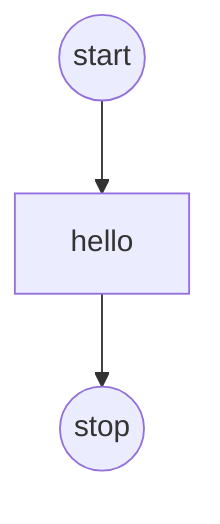
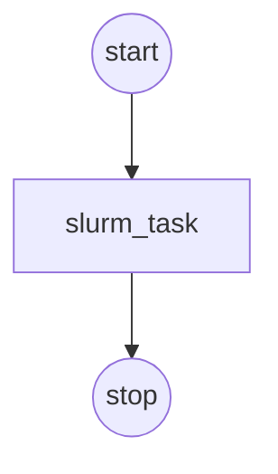

A `backend` provides compute resources for task execution. **v0.1 ships with** `local`, `slurm`, `docker`, and `kubernetes` backends.

## Default behavior (simplest)

If you omit `backends:` entirely, `sflow` creates a default local backend:

- backend: `local` (synthetic allocation: `localhost`, `localhost-1`, ...)
- default operator: `bash`

This is why a minimal workflow with just `workflow:` and `tasks:` works without any backend/operator config.

## Explicit local backend

Explicit local backend example:

```yaml
version: "0.1"

backends:
  - name: local
    type: local
    default: true

workflow:
  name: wf
  tasks:
    - name: hello
      script:
        - echo hello
```


```mermaid
flowchart TD
  start((start)) --> hello[hello]
  hello --> stop((stop))
```

## Slurm backend

Slurm backend example:

```yaml
version: "0.1"

backends:
  - name: slurm_cluster
    type: slurm
    default: true
    account: "your_slurm_account"
    partition: "your_slurm_partition"
    time: "00:10:00"
    nodes: 1
    gpus_per_node: 8        # required for sflow planning; set to 0 for CPU-only partitions

workflow:
  name: wf
  tasks:
    - name: slurm_task
      script:
        - echo hello
```

:::tip CPU-only partitions
Set `gpus_per_node: 0` to target a CPU-only Slurm partition. With zero capacity,
tasks that declare `resources.gpus` will be rejected up front with a clear error,
preventing silent CUDA failures at runtime.
:::

:::note
`gpus_per_node` describes cluster topology for sflow resource planning and GPU
index assignment. It does not add `--gpus-per-node` to `salloc`. If your cluster
requires that Slurm allocation flag, add it explicitly in backend `extra_args`.
:::


```mermaid
flowchart TD
  start((start)) --> slurm_task[slurm_task]
  slurm_task --> stop((stop))
```

Notes:

- If you don't specify `task.operator`, the backend chooses its default operator:

  - local backend → `bash`
  - slurm backend → `srun`
  - docker backend → `docker_run`
  - kubernetes backend → no default; declare an explicit `k8s` operator (the workload image lives on the operator)

- You can run `sflow` **asynchronously** via `sbatch`:
  - `sbatch` returns immediately with a job id; `sflow` runs inside the batch allocation.
  - In this mode, `sflow` will **reuse the current allocation** (no extra `salloc`).
  - Make sure your `--workspace-dir/--output-dir` point to a shared filesystem so you can inspect logs while it runs.
  - Controller-provided `SLURM_*` / `SLURMD_*` environment variables are preserved for tasks, even if workflow variables use the same names. sflow also exposes backend-agnostic aliases such as `SFLOW_BACKEND_JOB_ID` and `SFLOW_BACKEND_NODELIST`.

Example:

```bash
sbatch --job-name=sflow --output=sflow-%j.out --wrap "cd $SLURM_SUBMIT_DIR && sflow run --file sflow.yaml"
```

### Cluster-specific flags (`extra_args`)

Some Slurm clusters require additional flags for job submission (e.g., GPU resources, network segments, or custom policies). Use the `extra_args` section to pass these cluster-specific options:

```yaml
version: "0.1"

backends:
  - name: gpu_cluster
    type: slurm
    default: true
    account: "myproject"
    partition: "gpu"
    time: "01:00:00"
    nodes: 2
    gpus_per_node: 8
    extra_args:
      - "--gpus-per-node=8"
      - "--segment=2"
      - "--exclusive"

workflow:
  name: wf
  tasks:
    - name: gpu_task
      script:
        - nvidia-smi
        - echo "Running on GPU nodes"
```

Common cluster-specific flags include:

| Flag | Description |
|------|-------------|
| `--gpus-per-node=N` | Request N GPUs per node |
| `--segment=<name>` | Target a specific network segment or job class, usually GB200 / GB300 |
| `--exclusive` | Request exclusive node access |
| `--mem=<size>` | Memory per node (e.g., `128G`) |

:::tip
Check your cluster's documentation or run `sinfo` / `scontrol show partition` to discover available partitions, segments, and resource constraints.
:::

:::note
When using `sflow batch` mode, you can also pass extra Slurm flags directly via the `-e` flag without modifying the YAML file:

```bash
sflow batch -f workflow.yaml -e "--gpus-per-node=8" -e "--segment=2"
```

This is useful for quick adjustments or when testing different cluster configurations.
:::

## Selecting or excluding nodes (all backends)

Restrict which cluster nodes a run may use with two backend-agnostic controls that
apply to **every** backend:

- CLI flags on `sflow run` and `sflow batch`: `--include-nodes` and
  `--exclude-nodes`. Both accept comma-separated lists, quoted whitespace-separated
  lists, and/or repeated flags (`--exclude-nodes a,b`, `--exclude-nodes "a b"`,
  `--exclude-nodes a --exclude-nodes b`).
- YAML fields on any backend: `include_nodes` and `exclude_nodes`. CLI values are
  unioned over the recipe's values.

`include_nodes` restricts the candidate pool to the listed hosts; `exclude_nodes`
removes the listed hosts. A host may not appear in both.

```bash
# Keep this run off two flaky nodes, across whatever backend the recipe uses.
sflow run -f workflow.yaml --exclude-nodes gpu-07,gpu-16

# Pin an experiment to specific hosts.
sflow run -f workflow.yaml --include-nodes gpu-01,gpu-02
```

```yaml
backends:
  - name: gpu_cluster
    type: slurm
    account: myproject
    partition: gpu
    time: "01:00:00"
    nodes: 2
    gpus_per_node: 8
    exclude_nodes: [gpu-07, gpu-16]
```

Each backend translates the lists to its native node selection:

| Backend | `include_nodes` | `exclude_nodes` |
|---------|-----------------|-----------------|
| Slurm | `salloc`/`#SBATCH --nodelist=` (reused allocations are filtered in-process) | `salloc`/`#SBATCH --exclude=` |
| Kubernetes | `kubernetes.io/hostname` `In` nodeAffinity on the reservation pods | `kubernetes.io/hostname` `NotIn` nodeAffinity |
| Docker (with `hosts:`) | keep only matching hosts in the pool | drop matching hosts from the pool |
| Local / Docker without `hosts:` | ignored (single machine) with a warning | ignored with a warning |

:::note
Complex Slurm hostlist expressions (e.g. `node[01-05]`) should be passed through
Slurm's own flags via `extra_args` / `-e`; `--include-nodes` / `--exclude-nodes`
take plain hostnames.
:::

## Docker backend

The Docker backend uses a synthetic local allocation for planning and launches tasks
through the `docker_run` operator, which invokes `docker run`:

```yaml
version: "0.1"

backends:
  - name: docker
    type: docker
    default: true
    image: ubuntu:22.04
    nodes: 1
    gpus_per_node: 0

workflow:
  name: docker_hello_world
  tasks:
    - name: hello
      script:
        - echo "hello from docker"
```

For GPU tasks, install the NVIDIA container toolkit on the Docker host and set
`gpus_per_node` to the host GPU count. When a task declares `resources.gpus`,
sflow narrows Docker `--gpus device=...` to the planned GPU slice.

### Multi-node Docker hosts

Docker can also use an explicit pool of remote Docker hosts. sflow does not
auto-discover these hosts; declare each endpoint in backend config:

```yaml
backends:
  - name: docker_cluster
    type: docker
    default: true
    image: nvcr.io/example/app:1.0
    hosts:
      - name: dgx-a
        docker_host: ssh://dgx-a
        ip_address: 10.0.0.11
        gpus_per_node: 8
      - name: dgx-b
        context: dgx-b-context
        ip_address: 10.0.0.12
        gpus_per_node: 8
```

With `resources.nodes.count: 2`, one sflow task launches one container on each
assigned Docker host and waits for all containers. The task fails if any host
container exits non-zero. Environment values are forwarded with `-e KEY` so
secrets are not embedded in the Docker command line.

For local Docker execution, sflow auto-mounts the workflow workspace and output
directories into the container at the same paths. For remote Docker daemons
(`docker_host` or `context`), sflow does **not** add those implicit local path
mounts because a controller-local path may not exist on the remote host. If your
task needs workspace or output files on remote Docker hosts, provide explicit
backend, host, or operator mounts that point at a shared filesystem available at
the same path on every Docker host.

## Kubernetes backend

The Kubernetes backend mirrors the Slurm "allocate first" model. At allocation time it
reserves real nodes with placeholder pods (one per node), discovers their node names and
InternalIPs, and exposes them via `backends.<name>.nodes[*].ip_address`. Each task then runs
as its own scheduler-placed pod(s): a single-node task is one pod; a multi-node task
(`resources.nodes`) is one pod per reserved node (leader = index 0). Pods are pinned to the
discovered nodes via a `kubernetes.io/hostname` nodeSelector.

GPUs are requested two ways, selected by the backend `scheduling` field:

- `dra` (default) — a `resource.k8s.io/v1` `ResourceClaimTemplate` from a DeviceClass
  (default `gpu.nvidia.com`). Requires Kubernetes 1.34+ with `nvidia-dra-driver-gpu`.
- `device_plugin` — the legacy `nvidia.com/gpu` device-plugin limit (gpu-operator).

Placeholder pods hold the node's GPUs as a hard reservation; when a GPU task is pinned to a
node, sflow applies the (Pending) task pod first and then deletes the placeholder
(create-before-destroy) so the freed GPUs bind to the already-queued pod with no gap. CPU-only
tasks (e.g. etcd/nats/frontend) coexist on the node without consuming GPUs.

### Connecting to the cluster

sflow runs `kubectl` on the machine where you invoke `sflow run`, so that machine must have
working kube access. The recipe stays cluster-agnostic — cluster selection and credentials
are **CLI flags on `sflow run`**, not YAML:

- `--kubeconfig PATH` — kubeconfig file (also exported as `KUBECONFIG`). Default: `$KUBECONFIG`
  or `~/.kube/config`.
- `--kube-context NAME` — context within the kubeconfig. Default: its current-context.
- `--kube-namespace NAME` — override the namespace for all kubernetes backends.
- `--extra-kubectl-args TEXT` (repeatable) — any other global kubectl flag, e.g.
  `--extra-kubectl-args=--insecure-skip-tls-verify` or `--extra-kubectl-args=--request-timeout=30s`.
  The generic `--extra-args` is also forwarded here, so `--extra-args=--request-timeout=30s` works
  too; `--extra-kubectl-args` is just the kubectl-only form and wins on a conflicting option.

They are applied to every `kubectl` call sflow makes (allocation, node discovery, the per-task
apply/logs/delete, and cleanup). Credentials always live in the kubeconfig, never in the recipe.

```bash
sflow run -f recipe.yaml \
  --kubeconfig ~/.kube/prod.config --kube-context prod-east --kube-namespace ml-team
```

On a real run (not `--dry-run`), sflow runs a fast pre-flight before allocating anything to
confirm the access is usable: it verifies the cluster is reachable and authenticated, that the
namespace exists, and — via `kubectl auth can-i` (non-mutating) — that the credentials hold the
RBAC needed for the operations sflow performs (create/delete pods, configmaps and secrets; get
pods, pod logs and nodes; plus the DRA `resourceclaimtemplates`/`deviceclasses`, and
`computedomains` when `dra.create_compute_domain` is on). It fails fast with an actionable message
(missing permission, wrong namespace, or unreachable cluster) instead of leaving pods stuck.
Set `SFLOW_SKIP_K8S_PREFLIGHT=1` to bypass the check.

### Readiness probes run in-cluster (probe pod)

Network readiness/failure probes (`tcp_port`, `http_get`, `http_post`) target the workload's
pod/node IPs. The machine running `sflow run` often cannot route to the cluster pod network,
which would make those probes fail even though the service is healthy. To avoid this, the
Kubernetes backend runs TCP/HTTP probes **from inside the cluster**: it creates one small
per-allocation *probe pod* in the backend namespace, and the driver runs each check by
`kubectl exec`-ing `curl` in that pod. `kubectl exec` tunnels through the API server, so the
driver only needs the kube access it already has — no direct pod-network route.

This is on by default and requires no configuration. Notes:

- **Lifecycle.** The probe pod is created lazily on the **first** TCP/HTTP check and then
  lives until the allocation is released (deleted with the rest of the allocation, since it is
  labeled with it). A workflow with no network probes — e.g. `log_watch`-only or probe-less
  batch jobs — never creates one. Individual readiness probes still stop once they trigger
  (the shared pod just serves any remaining probes, including failure probes on `READY`
  services, until the run ends).
- The probe pod only needs `curl`. Its image defaults to `curlimages/curl:latest` and is
  configurable per backend via `probe_pod_image` (point it at a mirror for air-gapped
  registries). It inherits the backend `namespace`, `image_pull_policy`, `node_selector`, and
  `tolerations`; it requests no GPUs.
- `log_watch` probes are unaffected (they read the task's local `<task>.log`).
- To disable in-cluster probing and probe directly from the `sflow run` host instead, set
  `SFLOW_K8S_PROBE_VIA_POD=0`.

```yaml
backends:
  - name: k8s_cluster
    type: kubernetes
    # Optional: override only for air-gapped/mirror registries.
    probe_pod_image: my-registry.example.com/curlimages/curl:8.11.1
```

Kubernetes tasks do not automatically receive hostPath mounts for
`SFLOW_WORKSPACE_DIR`, `SFLOW_OUTPUT_DIR`, `SFLOW_WORKFLOW_OUTPUT_DIR`, or
`SFLOW_TASK_OUTPUT_DIR`. If environment forwarding is enabled, those variables
refer to controller-side paths and may not exist inside the pod. Use Kubernetes
storage primitives, explicit `kubectl` arguments, or image-contained assets for
files that must be visible in the pod.

Because tasks run off the controller, `fs://` artifact paths (e.g. a model directory) are
treated as **remote** paths on the cluster/image: sflow does not validate or create them
locally during pre-flight (a missing path warns instead of failing the run). Ensure they
exist inside the pod (baked into the image, or mounted via a PVC/hostPath you configure).

The task script is mounted into the pod from a ConfigMap and run as the entrypoint.
Environment variables are passed through a temporary Kubernetes Secret generated from an
env-file (mounted via `envFrom`). This avoids leaking values into the `kubectl` argv, but the
env-file format is line-oriented, so values with embedded newlines are not supported.

### Volumes: PVCs and emptyDir

Backend-wide `volumes:` are mounted into **every** task pod of the backend (each becomes a pod
volume + a container `volumeMount` at `mount_path`). Set exactly one source per entry:

- `claim:` — an existing `PersistentVolumeClaim` (the PVC and its data must already exist in the
  namespace; sflow only references it). Use for shared data such as a model on RWX/ROX storage.
  Defaults to **read-only**, which is also required to share one PVC across pods on multiple nodes.
- `empty_dir:` — an ephemeral, per-pod scratch volume (Kubernetes `emptyDir`): writable by any
  container user (no PVC/NFS ownership or root-squash issues), created empty per pod, and deleted
  with the pod. Defaults to **writable**. Options: `medium: Memory` (tmpfs/RAM instead of node
  disk — avoid for large caches) and `size_limit` (e.g. `50Gi`).

A writable PVC entry (`read_only: false`) can also set `ensure_writable: true`. A `subPath` mount
is created **root-owned** by the kubelet, so a non-root container can't write it; `ensure_writable`
injects a small **root initContainer** that `mkdir -p` + `chmod 0777`s the mounted path (the subPath
dir, or the mount root) before the workload runs. It's best-effort — on a root-squashed / read-only
backing volume it can't help — but for a normal writable RWX PVC it makes a persistent cache "just
work" without any manual `chmod`.

```yaml
volumes:
  # Shared model store (read-only PVC).
  - name: model-store
    claim: my-model-pvc
    mount_path: /models
    read_only: true
  # Writable scratch for a JIT/kernel cache (ephemeral; recompiled each run).
  - name: kernel-cache
    empty_dir: {}
    mount_path: /cache
  # ...or PERSIST the cache on a writable RWX PVC (kernels reused across runs):
  # - name: kernel-cache
  #   claim: my-rwx-cache-pvc
  #   mount_path: /cache
  #   sub_path: sflow-kernel-cache
  #   read_only: false
  #   ensure_writable: true   # fix the root-owned subPath so non-root can write
```

Why this matters: a `subPath` mount of a PVC is created **root-owned**, so a non-root container (or
a root-squashed NFS export) often can't write it, and pod `fsGroup` is both ineffective on many NFS
drivers and dangerous on a large shared model PVC (recursive chown). Use `empty_dir` for scratch
that needn't persist, or a writable RWX PVC with `ensure_writable: true` for cross-run persistence.

### Operator: k8s

A Kubernetes task must declare a `k8s` operator that carries the workload `image` (the
backend has no image of its own). The same operator handles single- and multi-node tasks —
the number of pods is decided by the planner-assigned node count, not the operator type.

```yaml
backends:
  - name: k8s
    type: kubernetes
    namespace: ml-gigas-stage   # one namespace per backend; injected into operators
    nodes: 2
    gpus_per_node: 8
    scheduling: dra             # or: device_plugin
    dra:
      gpu_device_class: gpu.nvidia.com
      # Join an existing IMEX ComputeDomain for cross-node NVLink (MNNVL). Name its
      # channel, or `auto` to claim the sole existing one; sflow does NOT create one
      # by default (set create_compute_domain: true for that admin op).
      use_compute_domain_channel: auto   # or a channel name, or off (default)

operators:
  - {name: server_op, type: k8s, image: my/server:1.0}

workflow:
  tasks:
    - {name: prefill, operator: server_op, resources: {gpus: {count: 2}}, script: ["..."]}
```

**Where config lives:** the backend carries cluster/access info (`namespace`, `nodes`,
`gpus_per_node`, `scheduling`, `dra`, `tolerations`); the operator is the executor (`image`,
required, plus `image_pull_policy`, `restart`, `host_network`, `node_selector`, and optional
DRA `device_class` / `device_selectors`). `namespace` is backend-only and injected into
operators (setting it on an operator is rejected — use separate backends for separate
namespaces).

Multi-node tasks receive `SFLOW_TASK_NODE_INDEX` and `SFLOW_LEADER_ADDRESS` per pod (plus the
shared `SFLOW_TASK_ASSIGNED_NODE_IPS`) so peers can rendezvous; the leader pod (index 0)
determines the task exit code.

### GPU requests

When a task declares `resources.gpus.count`, the Kubernetes backend renders it per the
backend `scheduling` mode rather than planning a client-side `CUDA_VISIBLE_DEVICES` slice:

- `dra` — a per-pod `ResourceClaimTemplate` requesting `count` devices from the DeviceClass.
- `device_plugin` — a pod `resources.limits: { "nvidia.com/gpu": "<count>" }`.

For a multi-node task the count is split evenly across the assigned nodes (each pod gets
`count / nodes` GPUs), so `resources.gpus.count` must be a multiple of the node count.

GPU `resources.gpus.release_after: task_ready` cannot be honored on Kubernetes (a running
pod's GPUs cannot be shared); sflow coerces it to `task_completion` (with a warning) so a GPU
is only reused after the owning pod terminates.

```yaml
version: "0.1"

backends:
  - name: k8s
    type: kubernetes
    default: true
    namespace: default
    nodes: 1
    gpus_per_node: 8
    scheduling: dra

operators:
  - {name: gpu_op, type: k8s, image: nvcr.io/nvidia/pytorch:24.12-py3}

workflow:
  name: kubernetes_gpu
  tasks:
    - name: train
      operator: gpu_op
      resources: {gpus: {count: 2}}
      script:
        - nvidia-smi -L
```

### RDMA / InfiniBand networking

At allocation time the backend probes a reservation pod for the node's RDMA HCAs
(e.g. `mlx5_0`) and routable interface, then runs an RDMA **provider chain** to
decide how task GPU pods get verbs access. The matching provider grants the pods
`CAP_IPC_LOCK` and pins the control interface (`NCCL_SOCKET_IFNAME` /
`GLOO_SOCKET_IFNAME` on the routable NIC), so NIXL/UCX KV transfer and NCCL run
over RDMA. **UCX device selection is always left to the library** (sflow never
sets `UCX_NET_DEVICES`). `NCCL_IB_HCA` is pinned only for a *partial-node* pod
(one that shares its node with sibling pods) to keep it off the NICs granted to
those siblings; a pod that owns **all** the node's NICs (a merged/full-node pod)
is left unpinned so NCCL auto-selects. Force-pinning every HCA without the GKE
gIB NCCL tuning is avoided because it drove an unstable all-NIC RDMA config that
reset the node. Auto priority order:

- **GKE** — one `networking.gke.io.networks/rdma-N` extended resource per NIC.
  For **multi-node** NCCL, sflow also hostPath-mounts the GKE gIB libs and sources
  `set_nccl_env.sh` (which sets `NCCL_NET=gIB` + the RoCE tuning). This requires the
  **`nccl-rdma-installer` DaemonSet** deployed on the cluster — it installs
  `/home/kubernetes/bin/gib` (+ `/home/kubernetes/bin/nvidia/lib64`) and is **not** a
  default GKE path. If the installer is absent, sflow tolerates it (the gIB source
  is skipped via an `[ -f … ]` guard) and NCCL falls back to its built-in IB
  transport over RoCE.
- **shared device plugin** — a single shared `rdma/*` extended resource
  (k8s-rdma-shared-dev-plugin / NVIDIA Network Operator) grants access to the
  node's HCAs.
- **host device** — generic bare-metal fallback with no device plugin: hostPath
  mount `/dev/infiniband` + `CAP_IPC_LOCK` (requires `host_network: true`).

When none applies, sflow falls back to pinning UCX/NCCL/gloo to the routable TCP
interface (sockets, not RDMA) and only exposes the detected HCAs via
`SFLOW_RDMA_HCAS`.

#### GPU ↔ NIC affinity

Because the GPU is requested by *count* (`nvidia.com/gpu` or a DRA claim), the
device plugin / DRA driver — not sflow — chooses the physical GPU. Pinning a NIC
at manifest-build time therefore risks pairing a GPU with a NIC on a different
PCIe root (slow GPUDirect-RDMA), or worse, pinning an RDMA device that is not
actually usable in the pod (UCX then aborts NIXL with `NIXL_ERR_BACKEND` instead
of degrading to TCP). sflow addresses this two ways:

- **Runtime selection (device-plugin / host-device / shared plugin).** For
  providers where the pod sees every node HCA, task pods run a small preamble
  before the workload, controlled by the `SFLOW_RDMA_AFFINITY` pod env:
  - `auto` (default) — **expose every NIC and let the libraries choose.** Leaves
    `NCCL_IB_HCA` unset (NCCL needs every rank to see every NIC to compute a
    consistent topology-aware solution) and sets `UCX_NET_DEVICES=all` +
    `UCX_MAX_RNDV_RAILS=1` so UCX/NIXL use each GPU's closest NIC (implicit
    GPUDirect RDMA). This is NVIDIA's recommended setup and needs no per-GPU
    mapping from sflow.
  - `explicit` — pin each GPU to the NIC on its PCIe root (`nvidia-smi` bus id →
    sysfs `pcieRoot`). Use when auto-detection mispairs because sysfs distance
    isn't representative (e.g. GB300 Data-Direct sub-interfaces, SR-IOV VFs).
  - `off` — inject nothing; the recipe controls device selection.

  In all modes the preamble first verifies RDMA is usable in the pod (`rdma_cm` +
  a verbs node + an `ACTIVE` port); if not, it pins the routable TCP interface and
  sets `NCCL_IB_DISABLE=1`, so the workload always comes up instead of aborting on
  a dead HCA.
- **DRA topology co-allocation (`scheduling: dra`, opt-in).** Set
  `dra.rdma_device_class` to co-request a NIC in the *same* `ResourceClaim` as
  the GPU with a `matchAttribute` constraint (default
  `resource.kubernetes.io/pcieRoot`), so the scheduler places the GPU and NIC on
  the same PCIe root complex. Requires a NIC DRA driver that publishes the match
  attribute (e.g. NVIDIA `rdma.nvidia.com`, DRANET `dra.net`). Note: on
  GB300/Vera Rubin/Fractal the NIC's matching root is its Data-Direct
  sub-interface root, which some NIC DRA drivers do not yet expose — override
  `dra.rdma_match_attribute` per cluster if co-allocation finds no candidates.

Config (all optional — the common case needs none of these):

- `rdma` — `auto` (default) runs the provider chain then exposes all NICs for the
  libs to auto-select; `off` disables RDMA; or force one provider with `gke`,
  `shared_device_plugin`, or `host_device` (e.g. to opt out of the privileged-ish
  host-device path on PodSecurity-restricted namespaces).
- `dra.rdma_device_class` — NIC DeviceClass to co-allocate with each GPU (DRA
  topology alignment; unset = off).
- `dra.rdma_match_attribute` — attribute the GPU + NIC must share (default
  `resource.kubernetes.io/pcieRoot`).
- `host_ipc` — share the node IPC namespace (pod `hostIPC`) + a shared hostPath
  `/dev/shm` across task pods (default `false`). This lets co-located prefill/decode
  pods do **cross-pod CUDA IPC**, so same-node NIXL/UCX KV transfer can use **NVLink
  (`cuda_ipc`)** instead of TCP. On GB200/GB300 the NVLink KV path is Multi-Node
  NVLink (MNNVL) fabric handles, which additionally need `UCX_CUDA_IPC_ENABLE_MNNVL=y`
  (task env), vLLM VMM allocation (`--enable-cumem-allocator`), and an IMEX domain
  (`nvidia-imex`, or `scheduling: dra` + `dra.create_compute_domain: true`, or joining
  an existing one via `dra.use_compute_domain_channel`). Privileged, so opt-in.
- `merge_colocated_gpu_pods` — merge GPU tasks the planner assigns to the **same
  physical node** into **one pod / one container** requesting the union of their
  GPUs. Tri-state (`auto`/`on`/`off` or a bool), **default `auto` (enabled)**: merging
  is sflow-owned pod topology — it enables intra-node NVLink between co-located
  workers *and* guarantees one IMEX-channel-claiming pod per node. Set `off` to opt
  out. Cross-pod GPU isolation means separate pods (even with
  `host_ipc`) can't `cuda_ipc` to each other's GPUs; putting the co-located tasks
  in one container that holds every node GPU is what makes intra-node **NVLink**
  work between them. Each task keeps its own `<task>.log`, probes, readiness, and
  dependents: the tasks run as concurrent background processes in the shared
  container. Every task sees **all** the container's GPUs (its own listed first in
  `CUDA_VISIBLE_DEVICES` so it uses that as `cuda:0`) — exposing the peers' GPUs is
  what lets cross-task `cuda_ipc`/NVLink P2P work; each task still gets its own env,
  and the driver demuxes the single container log stream back into per-task logs. Only
  **single-node GPU tasks** co-located on a node merge (CPU-only infra and
  multi-node tasks keep their own pods); merged tasks must be concurrent (a
  completion-before-start dependency between two members is rejected). This is the
  node-local counterpart to IB/RDMA: on a real multi-node IB cluster UCX already
  auto-selects RDMA, but for same-node disaggregation NVLink needs the tasks in one
  pod. Privileged-adjacent (pairs naturally with `host_ipc`), so opt-in.

Per-pod NIC selection is further tunable at runtime via the `SFLOW_RDMA_AFFINITY`
pod env (`auto` | `explicit` | `off`); see *GPU ↔ NIC affinity* above.

```yaml
backends:
  - name: k8s
    type: kubernetes
    default: true
    nodes: 2
    gpus_per_node: 8
    host_network: true
    scheduling: device_plugin
    rdma: auto                       # auto-detect + expose all NICs (or: off / a provider)
    # host_ipc: true                 # cross-pod CUDA IPC (same-node NVLink KV)
    # merge_colocated_gpu_pods: off  # opt OUT of merging same-node GPU tasks (default auto)

  # DRA topology co-allocation: schedule each GPU with a PCIe-root-aligned NIC.
  - name: k8s-dra
    type: kubernetes
    nodes: 2
    gpus_per_node: 8
    scheduling: dra
    dra:
      gpu_device_class: gpu.nvidia.com
      rdma_device_class: rdma.nvidia.com          # NIC DRA driver's DeviceClass
      # rdma_match_attribute: resource.kubernetes.io/pcieRoot
```

### Interconnect priority (NVLink → IB/RDMA → TCP)

sflow picks the **highest reachable interconnect tier** for GPU↔GPU / KV transfer and
claims only the resources it owns for it; it stays **transport-neutral** (it never pins
`UCX_TLS`, so UCX/NCCL still auto-select). The tier depends on the cluster's **NVLink
domain scope**:

- **node-scope** (e.g. B200, H100/H200): NVLink/NVSwitch reaches GPUs **within one node**
  only. Cross-node needs IB/RDMA, else TCP.
- **rack-scope** (GB200/GB300 NVL72): NVLink also reaches **across nodes** via MNNVL —
  but only with an IMEX ComputeDomain channel (and fabric/VMM KV memory in the app).

sflow **detects** the scope at preflight/allocate from the GPU product label
(`nvidia.com/gpu.product`) + the ComputeDomain CRD presence. Override with
`nvlink_domain: auto` (default) | `node` | `rack` | `off`.

**Ownership:**

- **sflow owns (auto):** pod layout (`merge_colocated_gpu_pods`, default `auto`),
  interconnect *detection*, and *claiming* what it controls — the ComputeDomain **channel
  claim** on every GPU pod (when a channel is configured/detected) and **RDMA device
  grants** (when IB is up).
- **recipe/app owns:** the framework's KV-memory mode (VMM / vLLM `--enable-sleep-mode`)
  and transport env like `UCX_CUDA_IPC_ENABLE_MNNVL=y`. sflow only *hints* (app-agnostically).
- **cluster admin owns:** ComputeDomain **creation**. sflow **detects** an existing
  domain/channel and hints; it does not create one unless `dra.create_compute_domain: true`.

**ComputeDomain / MNNVL config (under `dra:`):**

- `use_compute_domain_channel` — the channel ResourceClaimTemplate **every GPU pod claims**
  to join an existing IMEX ComputeDomain. A **name**, or `auto` (claim the sole existing
  domain — skips + hints on zero/many), or `off`/empty (default). *(Renamed from
  `compute_domain_channel`, still accepted as a deprecated alias.)*
- `create_compute_domain` — **create** a ComputeDomain CR (admin op; needs `computedomains`
  RBAC). Default `false` — the default path is detect + hint. *(Renamed from
  `compute_domain`, still accepted as a deprecated alias.)*
- `nvlink_domain_label_key` — node label key (e.g. `nvidia.com/gpu.clique`) used for
  **placement + validation only** on clusters with **multiple** NVLink domains (redundant
  on a single NVL72 rack): reservation pods get a `podAffinity` on this key so all reserved
  nodes share one domain, and a post-schedule check warns if they straddle domains.

**KV-memory rule (name the vLLM knob only as an example):**

- **Same-node** KV + regular memory: classic `cuda_ipc` over intra-node NVLink — no IMEX,
  no VMM (cheapest). Enable it with `merge_colocated_gpu_pods` (default) and/or `host_ipc`.
- **Cross-node** KV on **rack-scope**: needs an IMEX ComputeDomain **channel**
  (`use_compute_domain_channel`) **and** the app's fabric/VMM KV memory (vLLM
  `--enable-sleep-mode`) **and** `UCX_CUDA_IPC_ENABLE_MNNVL=y`. On **node-scope**, cross-node
  KV must use IB, else TCP.
- Enabling VMM (`--enable-sleep-mode`) **without** an IMEX channel forces the KV transfer
  onto **slow TCP** even intra-node — so keep it off unless you have the channel.

```yaml
backends:
  - name: k8s
    type: kubernetes
    nodes: 2
    gpus_per_node: 8
    # nvlink_domain: auto              # auto|node|rack|off (default auto = detect)
    dra:
      # use_compute_domain_channel: auto   # join sole existing IMEX domain (or a name)
      # nvlink_domain_label_key: nvidia.com/gpu.clique  # multi-domain clusters only
```