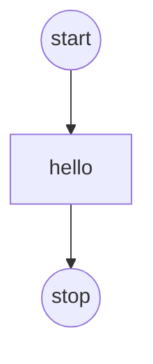
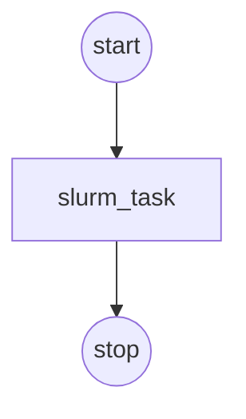
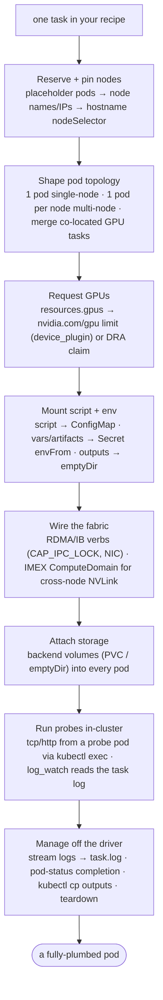
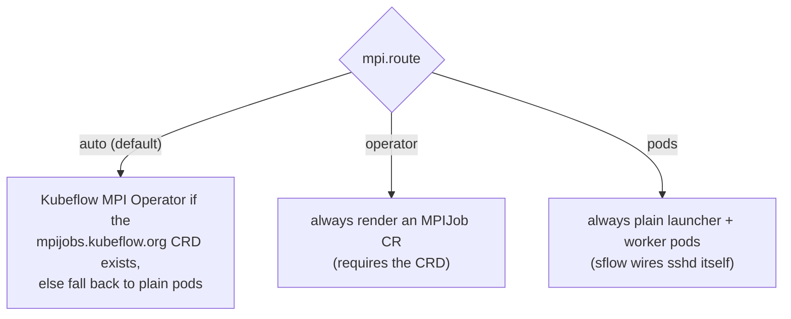

A `backend` provides compute resources for task execution. **v0.1 ships with** `local`, `slurm`, `docker`, and `kubernetes` backends.

## Default behavior (simplest)

If you omit `backends:` entirely, `sflow` creates a default local backend:

- backend: `local` (synthetic allocation: `localhost`, `localhost-1`, ...)
- default operator: `bash`

This is why a minimal workflow with just `workflow:` and `tasks:` works without any backend/operator config.

## Explicit local backend

Explicit local backend example:

```yaml
version: "0.1"

backends:
  - name: local
    type: local
    default: true

workflow:
  name: wf
  tasks:
    - name: hello
      script:
        - echo hello
```


```mermaid
flowchart TD
  start((start)) --> hello[hello]
  hello --> stop((stop))
```

The local backend can also **simulate multiple nodes** on one machine: set
`nodes: N` (default `1`) and sflow synthesizes hosts `localhost`, `localhost-1`, …
so you can rehearse multi-node placement locally. Like the other bare-host backends
it honors `offload_task_logs` (default `true`) to write each task's `<task>.log`
directly instead of streaming through the driver.

## Slurm backend

Slurm backend example:

```yaml
version: "0.1"

backends:
  - name: slurm_cluster
    type: slurm
    default: true
    account: "your_slurm_account"
    partition: "your_slurm_partition"
    time: "00:10:00"
    nodes: 1
    gpus_per_node: 8        # required for sflow planning; set to 0 for CPU-only partitions

workflow:
  name: wf
  tasks:
    - name: slurm_task
      script:
        - echo hello
```

:::tip CPU-only partitions
Set `gpus_per_node: 0` to target a CPU-only Slurm partition. With zero capacity,
tasks that declare `resources.gpus` will be rejected up front with a clear error,
preventing silent CUDA failures at runtime.
:::

:::note
`gpus_per_node` describes cluster topology for sflow resource planning and GPU
index assignment. It does not add `--gpus-per-node` to `salloc`. If your cluster
requires that Slurm allocation flag, add it explicitly in backend `extra_args`.
:::


```mermaid
flowchart TD
  start((start)) --> slurm_task[slurm_task]
  slurm_task --> stop((stop))
```

Notes:

- If you don't specify `task.operator`, the backend chooses its default operator:

  - local backend → `bash`
  - slurm backend → `srun`
  - docker backend → `docker_run`
  - kubernetes backend → no default; declare an explicit `k8s` operator (the workload image lives on the operator)

- You can run `sflow` **asynchronously** via `sbatch`:
  - `sbatch` returns immediately with a job id; `sflow` runs inside the batch allocation.
  - In this mode, `sflow` will **reuse the current allocation** (no extra `salloc`).
  - Make sure your `--workspace-dir/--output-dir` point to a shared filesystem so you can inspect logs while it runs.
  - Controller-provided `SLURM_*` / `SLURMD_*` environment variables are preserved for tasks, even if workflow variables use the same names. sflow also exposes backend-agnostic aliases such as `SFLOW_BACKEND_JOB_ID` and `SFLOW_BACKEND_NODELIST`.

Example:

```bash
sbatch --job-name=sflow --output=sflow-%j.out --wrap "cd $SLURM_SUBMIT_DIR && sflow run --file sflow.yaml"
```

Besides the common fields shown above (`account`, `partition`, `time`, `nodes`,
`gpus_per_node`, `extra_args`, `include_nodes`/`exclude_nodes`), the Slurm backend
also accepts:

| Field | Default | Description |
|-------|---------|-------------|
| `job_name` | workflow name | `salloc --job-name`. Falls back to the backend name, then is set to the workflow name at resolve time. |
| `offload_task_logs` | `true` | Have `srun` write each task's `<task>.log` on the compute side (via `--output`) instead of streaming every line through the driver. Auto-falls back to streaming on an interactive TTY / `--tui`. Also toggled by `--offload-task-logs` / `--no-offload-task-logs` or `SFLOW_OFFLOAD_TASK_LOGS`. |

> `time` accepts either an `"HH:MM:SS"` string or an integer number of minutes.

### Cluster-specific flags (`extra_args`)

Some Slurm clusters require additional flags for job submission (e.g., GPU resources, network segments, or custom policies). Use the `extra_args` section to pass these cluster-specific options:

```yaml
version: "0.1"

backends:
  - name: gpu_cluster
    type: slurm
    default: true
    account: "myproject"
    partition: "gpu"
    time: "01:00:00"
    nodes: 2
    gpus_per_node: 8
    extra_args:
      - "--gpus-per-node=8"
      - "--segment=2"
      - "--exclusive"

workflow:
  name: wf
  tasks:
    - name: gpu_task
      script:
        - nvidia-smi
        - echo "Running on GPU nodes"
```

Common cluster-specific flags include:

| Flag | Description |
|------|-------------|
| `--gpus-per-node=N` | Request N GPUs per node |
| `--segment=<name>` | Target a specific network segment or job class, usually GB200 / GB300 |
| `--exclusive` | Request exclusive node access |
| `--mem=<size>` | Memory per node (e.g., `128G`) |

:::tip
Check your cluster's documentation or run `sinfo` / `scontrol show partition` to discover available partitions, segments, and resource constraints.
:::

:::note
When using `sflow batch` mode, you can also pass extra Slurm flags directly via the `-e` flag without modifying the YAML file:

```bash
sflow batch -f workflow.yaml -e "--gpus-per-node=8" -e "--segment=2"
```

This is useful for quick adjustments or when testing different cluster configurations.
:::

## Selecting or excluding nodes (all backends)

Restrict which cluster nodes a run may use with two backend-agnostic controls that
apply to **every** backend:

- CLI flags on `sflow run` and `sflow batch`: `--include-nodes` and
  `--exclude-nodes`. Both accept comma-separated lists, quoted whitespace-separated
  lists, and/or repeated flags (`--exclude-nodes a,b`, `--exclude-nodes "a b"`,
  `--exclude-nodes a --exclude-nodes b`).
- YAML fields on any backend: `include_nodes` and `exclude_nodes`. CLI values are
  unioned over the recipe's values.

`include_nodes` restricts the candidate pool to the listed hosts; `exclude_nodes`
removes the listed hosts. A host may not appear in both.

```bash
# Keep this run off two flaky nodes, across whatever backend the recipe uses.
sflow run -f workflow.yaml --exclude-nodes gpu-07,gpu-16

# Pin an experiment to specific hosts.
sflow run -f workflow.yaml --include-nodes gpu-01,gpu-02
```

```yaml
backends:
  - name: gpu_cluster
    type: slurm
    account: myproject
    partition: gpu
    time: "01:00:00"
    nodes: 2
    gpus_per_node: 8
    exclude_nodes: [gpu-07, gpu-16]
```

Each backend translates the lists to its native node selection:

| Backend | `include_nodes` | `exclude_nodes` |
|---------|-----------------|-----------------|
| Slurm | `salloc`/`#SBATCH --nodelist=` (reused allocations are filtered in-process) | `salloc`/`#SBATCH --exclude=` |
| Kubernetes | `kubernetes.io/hostname` `In` nodeAffinity on the reservation pods | `kubernetes.io/hostname` `NotIn` nodeAffinity |
| Docker (with `hosts:`) | keep only matching hosts in the pool | drop matching hosts from the pool |
| Local / Docker without `hosts:` | ignored (single machine) with a warning | ignored with a warning |

:::note
Complex Slurm hostlist expressions (e.g. `node[01-05]`) should be passed through
Slurm's own flags via `extra_args` / `-e`; `--include-nodes` / `--exclude-nodes`
take plain hostnames.
:::

## Docker backend

The Docker backend uses a synthetic local allocation for planning and launches tasks
through the `docker_run` operator, which invokes `docker run`:

```yaml
version: "0.1"

backends:
  - name: docker
    type: docker
    default: true
    image: ubuntu:22.04
    nodes: 1
    gpus_per_node: 0

workflow:
  name: docker_hello_world
  tasks:
    - name: hello
      script:
        - echo "hello from docker"
```

For GPU tasks, install the NVIDIA container toolkit on the Docker host and set
`gpus_per_node` to the host GPU count. When a task declares `resources.gpus`,
sflow narrows Docker `--gpus device=...` to the planned GPU slice.

Docker backend fields beyond `image`/`nodes`/`gpus_per_node`:

| Field | Default | Description |
|-------|---------|-------------|
| `mounts` | — | Bind mounts (`host:container[:ro]`) applied to **every** container this backend runs. |
| `workdir` | — | Working directory inside every container. |
| `extra_args` | — | Extra raw `docker run` args for every container. |
| `offload_task_logs` | `true` | Write each task's `<task>.log` on the container side instead of streaming through the driver (auto-streams on a TTY / `--tui`). |

### Multi-node Docker hosts

Docker can also use an explicit pool of remote Docker hosts. sflow does not
auto-discover these hosts; declare each endpoint in backend config:

```yaml
backends:
  - name: docker_cluster
    type: docker
    default: true
    image: nvcr.io/example/app:1.0
    hosts:
      - name: dgx-a
        docker_host: ssh://dgx-a
        ip_address: 10.0.0.11
        gpus_per_node: 8
      - name: dgx-b
        context: dgx-b-context
        ip_address: 10.0.0.12
        gpus_per_node: 8
```

Each host entry accepts `name`, `docker_host` (or `context`), `ip_address`,
`gpus_per_node`, and — per host — `mounts` and `extra_args` (merged with the
backend-wide `mounts`/`extra_args`).

With `resources.nodes.count: 2`, one sflow task launches one container on each
assigned Docker host and waits for all containers. The task fails if any host
container exits non-zero. Environment values are forwarded with `-e KEY` so
secrets are not embedded in the Docker command line.

**Local daemon vs. remote host — implicit mounts differ:**

| Target | Implicit workspace/output mounts | Node filtering (`include_nodes`/`exclude_nodes`) |
|--------|----------------------------------|--------------------------------------------------|
| Local daemon (no `docker_host`/`context`) | Auto-mounted at the same paths (`auto_mount_runtime_dirs`, on by default) | Ignored with a warning (single machine) |
| Remote (`docker_host` / `context`) | **Not** added — a controller-local path may not exist remotely | Applied against the declared `hosts:` pool |

If a task needs workspace or output files on remote Docker hosts, provide explicit
backend, host, or operator mounts that point at a shared filesystem available at
the same path on every Docker host.

## Kubernetes backend

The Kubernetes backend mirrors the Slurm "allocate first" model. At allocation time it
reserves real nodes with placeholder pods (one per node), discovers their node names and
InternalIPs, and exposes them via `backends.<name>.nodes[*].ip_address`. Each task then runs
as its own scheduler-placed pod(s): a single-node task is one pod; a multi-node task
(`resources.nodes`) is one pod per reserved node (leader = index 0). Pods are pinned to the
discovered nodes via a `kubernetes.io/hostname` nodeSelector.

### What the backend does (recipe → pod)

You write the **same portable recipe** you'd run on Slurm — tasks with a `script:`,
`resources`, `probes`, and `artifacts`, plus logical operators — and the Kubernetes backend
**translates those semantics into a fully-plumbed pod**, so you never hand-write a Pod or Job
manifest or wire up the cluster plugins yourself.


```mermaid
flowchart TD
  T["one task in your recipe"] --> R["Reserve + pin nodes<br/>placeholder pods → node names/IPs → hostname nodeSelector"]
  R --> S["Shape pod topology<br/>1 pod single-node · 1 pod per node multi-node · merge co-located GPU tasks"]
  S --> G["Request GPUs<br/>resources.gpus → nvidia.com/gpu limit (device_plugin) or DRA claim"]
  G --> M["Mount script + env<br/>script → ConfigMap · vars/artifacts → Secret envFrom · outputs → emptyDir"]
  M --> F["Wire the fabric<br/>RDMA/IB verbs (CAP_IPC_LOCK, NIC) · IMEX ComputeDomain for cross-node NVLink"]
  F --> V["Attach storage<br/>backend volumes (PVC / emptyDir) into every pod"]
  V --> P["Run probes in-cluster<br/>tcp/http from a probe pod via kubectl exec · log_watch reads the task log"]
  P --> E["Manage off the driver<br/>stream logs → task.log · pod-status completion · kubectl cp outputs · teardown"]
  E --> POD(["a fully-plumbed pod"])
```

For each task it:

- **Reserves and pins nodes** — holds real nodes with placeholder pods, discovers their
  names/InternalIPs, and pins the task pod(s) to them (`kubernetes.io/hostname` nodeSelector),
  with a GPU handoff (default `reservation.handoff: auto`) so a queued task pod takes the
  freed GPUs with no gap — see [Node reservation](#node-reservation-reservation).
- **Shapes the pod topology from `resources`** — one pod for a single-node task, one pod per
  reserved node (leader = index 0) for a multi-node task, and (by default) merges co-located
  GPU tasks into a single pod so same-node workers can share NVLink.
- **Requests GPUs** — turns `resources.gpus.count` into an `nvidia.com/gpu` device-plugin limit
  (default) or a DRA `ResourceClaimTemplate` (`scheduling: dra`).
- **Mounts your script and env** — the task `script:` is mounted from a **ConfigMap** and run as
  the pod entrypoint; resolved `variables`/`artifacts` env is injected via a generated **Secret**
  (`envFrom`) so values never land in the `kubectl` argv; `file://` artifact content is mounted
  from a ConfigMap; and `SFLOW_*` output dirs resolve to a writable `emptyDir` inside the pod.
- **Wires up the fabric** — auto-detects RDMA/InfiniBand and grants the pod verbs access
  (`CAP_IPC_LOCK`, NIC resources, control-interface pinning), and joins/creates an IMEX
  ComputeDomain channel for cross-node NVLink (MNNVL) — so NIXL/UCX KV transfer and NCCL run
  over the fastest available interconnect instead of falling back to TCP.
- **Attaches storage** — mounts the backend's `volumes:` (existing PVCs / `emptyDir`) into every
  task pod.
- **Runs the probes in-cluster** — `tcp_port`/`http_get`/`http_post` readiness/failure probes run
  from an in-cluster probe pod (via `kubectl exec`) so the driver needs no route to the pod
  network; `log_watch` reads the task log.
- **Manages execution off the driver** — streams pod logs into `<task>.log`, determines
  completion from authoritative pod status, syncs node-local output files back to the driver
  (`kubectl cp`), and deletes the pods/reservations on teardown.

The rest of this section is the detail behind each of these steps.

:::note Kubernetes support status (v0.3.0)
Kubernetes support is new in v0.3.0. Current scope and limitations:

- **Interactive `sflow run` only.** Every task runs as a plain pod managed by the live
  `sflow run` driver process (it reserves nodes, streams logs, and collects outputs via
  `kubectl`), so the driver must stay attached for the whole run. A detached `sflow batch`
  mode for Kubernetes is planned for a later release — for now, run Kubernetes workflows
  interactively with `sflow run`.
- **Built-in `monitor:` not fully supported yet.** The declarative hardware `monitor:` is
  not fully supported on the Kubernetes backend yet, so `monitor:` blocks are skipped on
  k8s targets (no DCGM/DaemonSet collector).
- **Tested environments.** Kubernetes support has been validated on vanilla bare-metal
  Kubernetes and Google GKE. Other environments are untested, so expect some tuning —
  please [open an issue](https://github.com/NVIDIA/nv-sflow/issues) if it does not work on
  your cluster.
:::

GPUs are requested two ways, selected by the backend `scheduling` field:

- `device_plugin` (default) — the `nvidia.com/gpu` device-plugin limit (gpu-operator); the
  widely-available mechanism sflow uses unless you opt into DRA. Override the resource name
  with `gpu_resource_name` for clusters that expose GPUs under a different name (a MIG
  profile like `nvidia.com/mig-1g.5gb`, or another vendor/plugin).
- `dra` — a `resource.k8s.io/v1` `ResourceClaimTemplate` from a DeviceClass
  (default `gpu.nvidia.com`). Requires Kubernetes 1.34+ with `nvidia-dra-driver-gpu`.
  **DRA GPU allocation is a work in progress**; opt in explicitly with `scheduling: dra`.

On `device_plugin` clusters sflow **checks `gpus_per_node` against the nodes' real GPU
capacity at preflight**: leave it unset and it's derived from the candidate nodes'
`allocatable`; set it higher than a node provides and you get a clear warning up front
(instead of a placeholder stuck `Pending`). A value **below** node capacity is a valid
partial-node reservation and is left as-is.

Placeholder pods hold the node's GPUs as a hard reservation; when a GPU task is pinned to a
node, sflow hands the GPUs over using `reservation.handoff` (default `auto`): normally it
applies the (Pending) task pod first and then deletes the placeholder (create-before-destroy)
so the freed GPUs bind to the already-queued pod with no gap, but it switches to
destroy-before-create when a GPU `ResourceQuota` is enforced (holding both at once would
exceed quota) — see [Node reservation](#node-reservation-reservation). CPU-only tasks (e.g.
etcd/nats/frontend) coexist on the node without consuming GPUs.

### Connecting to the cluster

sflow runs `kubectl` on the machine where you invoke `sflow run`, so that machine must have
working kube access. The recipe stays cluster-agnostic — cluster selection and credentials
are **CLI flags on `sflow run`**, not YAML:

- `--kubeconfig PATH` — kubeconfig file (also exported as `KUBECONFIG`). Default: `$KUBECONFIG`
  or `~/.kube/config`.
- `--kube-context NAME` — context within the kubeconfig. Default: its current-context.
- `--kube-namespace NAME` — override the namespace for all kubernetes backends.
- `--kube-node-selector KEY=VALUE` (repeatable / comma-separated) — node-selector label(s) merged
  into (and overriding) every kubernetes backend's `node_selector`, keeping node-pool identity
  (e.g. a `tenant` label) out of the recipe.
- `--kube-compute-domain-channel NAME|auto|disable` — override `compute_domain.channel` (Multi-Node
  NVLink / IMEX) for all kubernetes backends: a channel template name (join it), `auto` (join the
  sole existing ComputeDomain), or `disable` (legacy `off`; no MNNVL). Lets you tune MNNVL per run
  without editing the recipe.
- `--kube-compute-domain-create` / `--no-kube-compute-domain-create` — override
  `compute_domain.create`. When on **and** no channel is joined, sflow stands up its own
  ComputeDomain CR (named `sflow-cd-<backend>-<alloc-id>`, keyed to the run) and injects the
  generated channel into every GPU pod; it deletes only the domain it created on cleanup. Combine
  with `--kube-compute-domain-channel disable` to force sflow-owned creation over a recipe's named
  channel.
- `--extra-kubectl-args TEXT` (repeatable) — any other global kubectl flag, e.g.
  `--extra-kubectl-args=--insecure-skip-tls-verify` or `--extra-kubectl-args=--request-timeout=30s`.
  The generic `--extra-args` is also forwarded here, so `--extra-args=--request-timeout=30s` works
  too; `--extra-kubectl-args` is just the kubectl-only form and wins on a conflicting option.

They are applied to every `kubectl` call sflow makes (allocation, node discovery, the per-task
apply/logs/delete, and cleanup). Credentials always live in the kubeconfig, never in the recipe.

```bash
sflow run -f recipe.yaml \
  --kubeconfig ~/.kube/prod.config --kube-context prod-east --kube-namespace ml-team
```

On a real run (not `--dry-run`), sflow runs a fast pre-flight before allocating anything to
confirm the access is usable: it verifies the cluster is reachable and authenticated, that the
namespace exists, and — via `kubectl auth can-i` (non-mutating) — that the credentials hold the
RBAC needed for the operations sflow performs (create/delete pods, configmaps and secrets; get
pods, pod logs and nodes; plus the DRA `resourceclaimtemplates`/`deviceclasses`, and
`computedomains` when `compute_domain.create` is on). It fails fast with an actionable message
(missing permission, wrong namespace, or unreachable cluster) instead of leaving pods stuck.
Set `SFLOW_SKIP_K8S_PREFLIGHT=1` to bypass the check.

### Host namespaces (`host_network`, `host_ipc`) — privileged

Two backend toggles place task pods in the **node's** namespaces. Both are
**privileged** (the pod steps outside its own sandbox), so they require a
**permissive PodSecurity level** — pods that set them are rejected by the
PodSecurity `baseline`/`restricted` profiles. On a dedicated GPU cluster they are
safe and frequently necessary; on a locked-down or multi-tenant cluster, keep them
off (per-option guidance below).

- **`host_network`** (pod `hostNetwork`, **default `true`**) — the pod shares the
  node's network namespace, so **pod IP == node IP**. sflow defaults it on because
  the allocate-first model hands peers the node **InternalIPs** returned by
  reservation: etcd/NATS/frontend registration and the NIXL/UCX KV **side-channel
  host** are advertised at those IPs (mirroring the Slurm path), while readiness
  probes run from an in-cluster probe pod. **Trade-offs:** pods on one node share the
  host's ports (two pods can't bind the same `hostPort`) and the pod sees the node's
  interfaces. **Turn it off (`host_network: false`)** on a CNI-routable cluster where
  you want pod-network isolation and the driver/probe pod can reach pod IPs — peers
  are then addressed by pod IP instead of node IP.
- **`host_ipc`** (pod `hostIPC`, **default `false`**) — the pod shares the node's
  **IPC namespace** and mounts a shared hostPath **`/dev/shm`** (instead of a private,
  RAM-backed `emptyDir` sized by `shm_size`). This provides the IPC + shared-memory
  channel that **cross-pod CUDA IPC** needs, so same-node NIXL/UCX KV transfer between
  **separate** prefill/decode pods can use **NVLink (`cuda_ipc`)** instead of falling
  back to TCP. **Trade-offs:** the pod can read the node's System V IPC + POSIX shared
  memory (a compromised container can snoop other workloads or exhaust node
  IPC/`/dev/shm`), the shared `/dev/shm` can collide across unrelated same-node jobs
  and leaves stale shm files on the node, and you lose the per-pod `shm_size` cap.
  **Leave it off unless you run prefill/decode as distinct same-node pods that must
  `cuda_ipc`:** the default `merge_colocated_gpu_pods: auto` already co-locates GPU
  tasks in **one** pod (shared IPC *and* shared GPUs), which is the preferred path for
  intra-node NVLink — cross-pod GPU isolation means separate pods can't `cuda_ipc` to
  each other's GPUs on `host_ipc` alone (see `merge_colocated_gpu_pods` under *RDMA /
  InfiniBand networking*). Recipes that run prefill/decode as distinct same-node pods
  opt in with `host_ipc: true` (e.g.
  `examples/self_contained/kubernetes/dynamo_trtllm_disagg.yaml`).

### Readiness probes run in-cluster (probe pod)

Network readiness/failure probes (`tcp_port`, `http_get`, `http_post`) target the workload's
pod/node IPs. The machine running `sflow run` often cannot route to the cluster pod network,
which would make those probes fail even though the service is healthy. To avoid this, the
Kubernetes backend runs TCP/HTTP probes **from inside the cluster**: it creates one small
per-allocation *probe pod* in the backend namespace, and the driver runs each check by
`kubectl exec`-ing `curl` in that pod. `kubectl exec` tunnels through the API server, so the
driver only needs the kube access it already has — no direct pod-network route.

This is on by default and requires no configuration. Notes:

- **Lifecycle.** The probe pod is created lazily on the **first** TCP/HTTP check and then
  lives until the allocation is released (deleted with the rest of the allocation, since it is
  labeled with it). A workflow with no network probes — e.g. `log_watch`-only or probe-less
  batch jobs — never creates one. Individual readiness probes still stop once they trigger
  (the shared pod just serves any remaining probes, including failure probes on `READY`
  services, until the run ends).
- The probe pod only needs `curl`. Its image defaults to `curlimages/curl:latest` and is
  configurable per backend via `probe_pod_image` (point it at a mirror for air-gapped
  registries). It inherits the backend `namespace`, `image_pull_policy`, `node_selector`, and
  `tolerations`; it requests no GPUs.
- `log_watch` probes are unaffected (they read the task's local `<task>.log`).
- To disable in-cluster probing and probe directly from the `sflow run` host instead, set
  `SFLOW_K8S_PROBE_VIA_POD=0`.

```yaml
backends:
  - name: k8s_cluster
    type: kubernetes
    # Optional: override only for air-gapped/mirror registries.
    probe_pod_image: my-registry.example.com/curlimages/curl:8.11.1
```

Kubernetes tasks do not automatically receive hostPath mounts for
`SFLOW_WORKSPACE_DIR`, `SFLOW_OUTPUT_DIR`, `SFLOW_WORKFLOW_OUTPUT_DIR`, or
`SFLOW_TASK_OUTPUT_DIR`. If environment forwarding is enabled, those variables
refer to controller-side paths and may not exist inside the pod. Use Kubernetes
storage primitives, explicit `kubectl` arguments, or image-contained assets for
files that must be visible in the pod.

Because tasks run off the controller, `fs://` artifact paths (e.g. a model directory) are
treated as **remote** paths on the cluster/image: sflow does not validate or create them
locally during pre-flight (a missing path warns instead of failing the run). Ensure they
exist inside the pod (baked into the image, or mounted via a PVC/hostPath you configure).

The task script is mounted into the pod from a ConfigMap and run as the entrypoint.
Environment variables are passed through a temporary Kubernetes Secret generated from an
env-file (mounted via `envFrom`). This avoids leaking values into the `kubectl` argv, but the
env-file format is line-oriented, so values with embedded newlines are not supported.

### Volumes: PVCs and emptyDir

Backend-wide `volumes:` are mounted into **every** task pod of the backend (each becomes a pod
volume + a container `volumeMount` at `mount_path`). Set exactly one source per entry:

- `claim:` — an existing `PersistentVolumeClaim` (the PVC and its data must already exist in the
  namespace; sflow only references it). Use for shared data such as a model on RWX/ROX storage.
  Defaults to **read-only**, which is also required to share one PVC across pods on multiple nodes.
- `empty_dir:` — an ephemeral, per-pod scratch volume (Kubernetes `emptyDir`): writable by any
  container user (no PVC/NFS ownership or root-squash issues), created empty per pod, and deleted
  with the pod. Defaults to **writable**. Options: `medium: Memory` (tmpfs/RAM instead of node
  disk — avoid for large caches) and `size_limit` (e.g. `50Gi`).

A writable PVC entry (`read_only: false`) can also set `ensure_writable: true`. A `subPath` mount
is created **root-owned** by the kubelet, so a non-root container can't write it; `ensure_writable`
injects a small **root initContainer** that `mkdir -p` + `chmod 0777`s the mounted path (the subPath
dir, or the mount root) before the workload runs. It's best-effort — on a root-squashed / read-only
backing volume it can't help — but for a normal writable RWX PVC it makes a persistent cache "just
work" without any manual `chmod`.

```yaml
volumes:
  # Shared model store (read-only PVC).
  - name: model-store
    claim: my-model-pvc
    mount_path: /models
    read_only: true
  # Writable scratch for a JIT/kernel cache (ephemeral; recompiled each run).
  - name: kernel-cache
    empty_dir: {}
    mount_path: /cache
  # ...or PERSIST the cache on a writable RWX PVC (kernels reused across runs):
  # - name: kernel-cache
  #   claim: my-rwx-cache-pvc
  #   mount_path: /cache
  #   sub_path: sflow-kernel-cache
  #   read_only: false
  #   ensure_writable: true   # fix the root-owned subPath so non-root can write
```

Why this matters: a `subPath` mount of a PVC is created **root-owned**, so a non-root container (or
a root-squashed NFS export) often can't write it, and pod `fsGroup` is both ineffective on many NFS
drivers and dangerous on a large shared model PVC (recursive chown). Use `empty_dir` for scratch
that needn't persist, or a writable RWX PVC with `ensure_writable: true` for cross-run persistence.

:::note Skipping PVCs for debugging (`--kube-skip-pvc`)
On a cluster that lacks the recipe's PVCs, `sflow run --kube-skip-pvc` drops every PVC-backed volume
(a `volumes:` entry with a `claim`) from all kubernetes backends for that run, keeping `empty_dir`
volumes. Pods then schedule without editing the recipe volume-by-volume. The PVC data (e.g. a model
cache) is **not** mounted, so real workloads that need it will fail — use it for quick
scheduling/plumbing checks, not for functional runs.
:::

### Operator: k8s

A Kubernetes task must declare a `k8s` operator that carries the workload `image` (the
backend has no image of its own). The same operator handles single- and multi-node tasks —
the number of pods is decided by the planner-assigned node count, not the operator type.

```yaml
backends:
  - name: k8s
    type: kubernetes
    namespace: my-namespace   # one namespace per backend; injected into operators
    nodes: 2
    gpus_per_node: 8
    scheduling: device_plugin   # default (nvidia.com/gpu); DRA is a WIP — opt in with `scheduling: dra`
    # gpu_resource_name: nvidia.com/gpu   # device-plugin GPU resource name (override for MIG/other plugins)
    # dra:                      # only used with `scheduling: dra` (Kubernetes 1.34+, nvidia-dra-driver-gpu)
    #   gpu_device_class: gpu.nvidia.com
    # Advanced per-cluster overrides (rarely needed; default to NVIDIA/GKE conventions):
    #   gpu_product_label_key: nvidia.com/gpu.product   # node label read for NVLink-scope detection
    #   gib_installer_namespace: kube-system            # where the GKE gIB (nccl-rdma-installer) DaemonSet lives
    #   collect_grace_seconds: 120                      # grace window (s) for copying node-local outputs back
    # Multi-Node NVLink (IMEX ComputeDomain) is a top-level block, independent of
    # `scheduling` (works with device_plugin or dra). Join an existing domain for
    # cross-node NVLink (MNNVL): name its channel, or `auto` to claim the sole
    # existing one; sflow does NOT create one by default (set `create: true` for
    # that admin op).
    compute_domain:
      channel: auto   # or a channel name, or off (default)

operators:
  - {name: server_op, type: k8s, image: my/server:1.0}

workflow:
  tasks:
    - {name: prefill, operator: server_op, resources: {gpus: {count: 2}}, script: ["..."]}
```

**Where config lives:** the backend carries cluster/access info (`namespace`, `nodes`,
`gpus_per_node`, `scheduling`, `dra`, `tolerations`); the operator is the executor (`image`,
required, plus `image_pull_policy`, `restart`, `host_network`, `node_selector`, and optional
DRA `device_class` / `device_selectors`). `namespace` is backend-only and injected into
operators (setting it on an operator is rejected — use separate backends for separate
namespaces).

**Live progress bars (`tty`):** set `tty: true` on a `k8s` operator to allocate a pod TTY
(container `stdin`+`tty`) so tools that redraw a line with `\r` — aiperf, `pip`, `docker
pull` — stream **live** to `<task>.log` via `kubectl logs`. Without a TTY the container
runtime batches newline-less output, so a long-running progress bar only surfaces in large
chunks (or all at once at the end). Trade-off: a TTY merges stderr into stdout and keeps raw
`\r`/ANSI control bytes in the log. Applies to single-pod container tasks; ignored for
merge/co-located pods and the `k8s_mpi` route.

**Additional pod/container fields.** Beyond the knobs above, a `k8s` operator maps common
`v1.Container` / `v1.PodSpec` fields, plus two raw escape hatches for anything else:

| Field | Maps to | Notes |
|-------|---------|-------|
| `run_as_root` | `securityContext.runAsUser/Group=0` | Default `false`. Force root even if the image's default `USER` is non-root — needed to write a root-owned NFS/ceph PVC or bootstrap MPI over SSH (sshd host keys, `/run/sshd`, `~/.ssh`). |
| `pass_envs` | env Secret | Default `true`. When `false`, the per-task env Secret is not created/mounted. |
| `shm_size` | `/dev/shm` size cap | Default `null` → a tmpfs bounded by node RAM. Set e.g. `64Gi`; the K8s 64Mi default is too small for MPI/NCCL and segfaults multi-GPU jobs. |
| `cpu` / `memory` | container `resources.requests` | Optional per-pod CPU/memory requests (ints = cores, or quantity strings like `500m`/`16Gi`). |
| `cpu_limit` / `memory_limit` | container `resources.limits` | Optional hard caps. Unset → requests-only (CPU shared, never CFS-throttled). |
| `env` | container `env` | Raw `EnvVar` list — the only way to use `valueFrom` (fieldRef / secretKeyRef / configMapKeyRef). Merged after backend env; on a name clash the user entry wins. Plain values are better set via workflow `variables`. |
| `working_dir` | container `workingDir` | |
| `security_context` | container `securityContext` | Deep-merged over sflow's managed root / `IPC_LOCK`; user keys win. `capabilities.add`/`drop` are **union-merged** with sflow's caps (so `IPC_LOCK` is always kept). |
| `ports` | container `ports` | Informational only. |
| `lifecycle` | container `lifecycle` | `postStart` / `preStop` handlers. |
| `image_pull_secrets` | `imagePullSecrets` | List of secret names (private registries). |
| `service_account` | `serviceAccountName` | RBAC / cloud workload identity. |
| `runtime_class` | `runtimeClassName` | |
| `priority_class` | `priorityClassName` | Scheduling priority / preemption. |
| `termination_grace_period` | `terminationGracePeriodSeconds` | |
| `labels` / `annotations` | pod `metadata` | sflow's own task/allocation labels always win. |
| `pod_security_context` | pod `securityContext` | `fsGroup` / `supplementalGroups` / `sysctls`; deep-merged. |
| `container_overrides` | container (raw dict) | Deep-merged **last** — wins over everything. |
| `pod_overrides` | `pod.spec` (raw dict) | Deep-merged **last** — wins over everything. |

Precedence: sflow-managed manifest → curated fields → `*_overrides` (win). Avoid using the
overrides to change sflow-managed keys (container `command`, `resources.claims`, artifact
`volumeMounts`, the env-secret `envFrom`, the hostname `nodeSelector` pin) — that can break
task execution. For `k8s_mpi`, these apply on the `pods` route (base render); the `MPIJob`
CR route does not consume them.

**Merge semantics for lists.** When a user value and an sflow value collide on the same
key, dicts merge key-by-key and **lists are replaced** by the user's (a warning is logged
naming the overridden key). The exception is `capabilities.add`/`drop`, which are
**union-merged + de-duped** so sflow's required caps (e.g. `IPC_LOCK`) are never dropped.
The curated `env` field is also merged by variable **name** (not replaced). So to *extend*
an sflow-populated list elsewhere, re-include sflow's entries in your value.

### Operator: k8s_mpi (MPI workloads)

For **any MPI workload** (launched with `mpirun` — e.g. TRT-LLM `trtllm-llmapi-launch`,
multi-GPU tensor/pipeline-parallel serving), use `type: k8s_mpi` instead of `k8s` and write
the `mpirun -np N ... <workload>` command **explicitly** in the task script. sflow reads that
command to stand up the correct MPI world for **both single-node and multi-node** — a lone
launcher pod when the job fits one node, launcher + worker pods when it spans nodes — so the
same recipe scales from `-np 8` (1 node) to `-np 16` (2 nodes) unchanged. Your recipe writes a
plain `mpirun` with **no SSH glue** — sflow injects the SSH keypair, hostfile, and `sshd` /
launcher wiring. It **inherits every `k8s` operator field** (image, resources, security,
overrides, ...) and adds an `mpi:` block. Reserve plain `k8s` for non-MPI, single-pod workloads.

sflow bootstraps the job one of two ways, chosen by `mpi.route`:


```mermaid
flowchart TD
  R{"mpi.route"}
  R -->|"auto (default)"| AU["Kubeflow MPI Operator if the<br/>mpijobs.kubeflow.org CRD exists,<br/>else fall back to plain pods"]
  R -->|operator| OP["always render an MPIJob CR<br/>(requires the CRD)"]
  R -->|pods| PO["always plain launcher + worker pods<br/>(sflow wires sshd itself)"]
```

```yaml
operators:
  - name: trtllm_mpi
    type: k8s_mpi
    image: my/trtllm:1.0
    run_as_root: true          # sshd host keys / ~/.ssh need root
    shm_size: 64Gi
    mpi:
      route: auto              # auto | operator | pods
      slots_per_worker: 8      # default: per-node GPU count
      ssh_port: 2222
      omp_num_threads: 8       # injected OMP_NUM_THREADS per rank (null/0 = image default)

workflow:
  tasks:
    - name: train
      operator: trtllm_mpi
      resources: { nodes: { count: 2 }, gpus: { count: 16 } }
      script:
        - mpirun -np 16 python train.py
```

`mpi:` block fields:

| Field | Default | Description |
|-------|---------|-------------|
| `route` | `auto` | `auto` (detect the CRD) / `operator` (MPIJob CR) / `pods` (plain-pods bootstrap). |
| `slots_per_worker` | per-node GPU count | Slots advertised per worker in the hostfile. |
| `run_launcher_as_worker` | `true` | The launcher pod also runs a rank. |
| `launcher_creation_policy` | `WaitForWorkersReady` | `AtStartup` or `WaitForWorkersReady`. |
| `ssh_port` | `2222` | Port for the injected `sshd`. |
| `mpi_implementation` | `OpenMPI` | `OpenMPI` / `Intel` / `MPICH` — selects hostfile/env conventions. |
| `ensure_sshd` | `true` | Install `openssh-server` at startup if the image lacks `sshd`. |
| `forward_env_prefixes` | `[]` | Extra env-namespace prefixes forwarded to remote ranks (additive to sflow's defaults). |
| `omp_num_threads` | `8` | Injected `OMP_NUM_THREADS` per rank; `null`/`0` keeps the image default. |
| `cpu_bind` | `core` | Per-rank CPU binding, injected **only when several ranks share a pod** (and never over a binding the recipe already passes). `core` gives each rank an isolated core slice — the tightest cap on the LLVM/OpenMP thread pools that `OMP_NUM_THREADS` alone doesn't reach; `numa` binds one rank per NUMA domain (only partitions when the cpuset spans >1 domain); `none` injects nothing. |
| `cpu_bind_cores_per_rank` | `8` | Upper bound on the cores bound to each rank under `cpu_bind: core`. The launch-time value is `min(cores-in-cpuset / ranks-per-pod, this)`, so a small cpuset still gets a smaller slice, and if the cpuset has fewer cores than ranks the binding is skipped rather than failing the launch. Raise it for CPU-heavy workloads; `0` = no cap. |

> The `pods` route consumes the curated/override operator fields (base render); the
> `MPIJob` CR route (`operator`) does not.

### Node reservation (`reservation`)

Before running GPU tasks, the Kubernetes backend **reserves and pins nodes** with
placeholder pods so the whole workflow lands on a stable, co-scheduled set of nodes
(and so multi-node MPI ranks are actually adjacent). Tune it with a backend-level
`reservation:` block:

```yaml
backends:
  - name: k8s
    type: kubernetes
    nodes: 2
    gpus_per_node: 8
    reservation:
      timeout: 600          # max seconds to wait for every placeholder to schedule
      handoff: auto         # auto | create_before_destroy | destroy_before_create
      # placeholder_image: my-registry.example.com/bash:5   # air-gapped/mirror override
```

| Field | Default | Description |
|-------|---------|-------------|
| `timeout` | `600` | Max seconds to wait for all placeholder pods to reach `Running` before giving up. |
| `handoff` | `auto` | How GPUs pass from the placeholder to the real task pod (see below). |
| `placeholder_image` | `bash:5` | Image for the reservation/placeholder pods (a lightweight sleeper that holds the node + its GPUs until the task pod swaps in; it never runs the workload). Override for air-gapped clusters / private-registry mirrors that can't pull from Docker Hub. |

**GPU handoff** — how a node's GPUs transfer from the reservation placeholder to the
task pod depends on whether the namespace enforces a GPU `ResourceQuota`:

| `handoff` | Order | Use when |
|-----------|-------|----------|
| `create_before_destroy` | Apply task pod (Pending) → delete placeholder → GPUs bind to the task | No GPU quota — safest against losing the node to another scheduler. |
| `destroy_before_create` | Delete placeholder first → then apply the task pod | A GPU `ResourceQuota` is enforced (holding both at once would exceed quota). |
| `auto` | Picks `destroy_before_create` **iff** a `requests.nvidia.com/gpu` quota is detected in the namespace, else `create_before_destroy` | Default — let sflow detect the quota. |

> The heartbeat log while waiting for placeholders is throttled by
> `SFLOW_K8S_WAIT_HEARTBEAT_SECS` (advanced).

### Output directories inside pods (`SFLOW_*`)

`SFLOW_OUTPUT_DIR` / `SFLOW_WORKFLOW_OUTPUT_DIR` / `SFLOW_TASK_OUTPUT_DIR` point at the
**driver host** output dir — which a remote K8s pod can't see, so a task script that `cd`s
or writes there would error. Instead of rewriting those variables, sflow **mounts a
writable `emptyDir` at the resolved `SFLOW_OUTPUT_DIR` path inside the pod** (the
`WORKFLOW`/`TASK` dirs live under it) and `mkdir -p`s the per-task subdir before your
script runs. So `$SFLOW_TASK_OUTPUT_DIR` etc. keep the **same values everywhere** (portable
recipes) yet resolve to a real, writable location in the pod. This covers **`k8s`,
`k8s_mpi`** (the unchanged env is forwarded to worker ranks via `mpirun -x`, which get the
same mount), and **merged/co-located pods** (one shared mount covers every member). The
`emptyDir` is pod-local node scratch (auto-discarded when the pod ends) — it is **not** the
driver's disk, so files are brought back via output collection (below).

**Output collection.** A single-pod `k8s` task's node-local output is **synced back to the
driver host via `kubectl cp`**: sflow arms a shell `EXIT` trap *before* your script, so
*however the script ends* (normal completion, a failure, or an explicit `exit` in the
recipe), *if the pod created any files* it scans the **whole `$SFLOW_WORKFLOW_OUTPUT_DIR`
subtree** (the per-task `$SFLOW_TASK_OUTPUT_DIR` *plus* any workflow-level dirs a task
writes, e.g. aiperf's `aiperf_concurrency_*`), stages them (up to the size cap) into one
`tar.gz` on the pod, keeps the container alive, and the driver copies that archive out and
unpacks the files **missing on the host** into the real workflow output folder — so
`result.json`, CSVs, plots, aiperf artifacts, etc. land locally and file-based `result:`
works. File **bytes never transit the log** (this avoids Kubernetes' 16 KiB log-line
splitting, which corrupts large payloads, and keeps the console clean). An **empty output
dir is skipped**. Collected files **never overwrite files already on the driver** — each
task's own `<task>.log`, the sflow logs, and injected artifacts are kept, not clobbered. The task log
records a `N output file(s) staged … awaiting driver copy` line and a driver-side
`collected N file(s) … kept K existing driver file(s) (not overwritten)` summary. Files
larger than `collect_max_file_size` are **skipped with a warning** — sync those via
`uploads:` (S3) or a mounted PVC. `collect_max_file_size` (default **10 MiB**; bytes or a
size string like `"50Mi"`; `0` disables) can be set **per operator or as a backend default**
(`collect_max_file_size:` on the `kubernetes` backend applies to every `k8s`/`k8s_mpi` task
unless the operator overrides it). The container waits up to ~120 s for the driver's copy
before exiting on its own (so a slow/dead driver can never hang the pod), and the pod image
must have `tar` (used by `kubectl cp`). Automatic output collection runs for **single-pod
`k8s`** only: `k8s_mpi` launchers `exec mpirun` (no post-run hook) and merged members are
typically long-running servers — for those, persist outputs with `uploads:` / a PVC.

```yaml
operators:
  - name: server_op
    type: k8s
    image: my/server:1.0
    image_pull_secrets: [my-regcred]
    service_account: my-service-account
    labels: { team: my-team }
    env:
      - name: POD_IP
        valueFrom: { fieldRef: { fieldPath: status.podIP } }
    security_context:
      capabilities: { add: [SYS_PTRACE] }
    pod_overrides:                 # escape hatch for any un-mapped field
      hostAliases:
        - ip: "10.0.0.10"
          hostnames: [head.local]
```

Multi-node tasks receive `SFLOW_TASK_NODE_INDEX` and `SFLOW_LEADER_ADDRESS` per pod (plus the
shared `SFLOW_TASK_ASSIGNED_NODE_IPS`) so peers can rendezvous; the leader pod (index 0)
determines the task exit code.

### GPU requests

When a task declares `resources.gpus.count`, the Kubernetes backend renders it per the
backend `scheduling` mode rather than planning a client-side `CUDA_VISIBLE_DEVICES` slice:

- `dra` — a per-pod `ResourceClaimTemplate` requesting `count` devices from the DeviceClass.
- `device_plugin` — a pod `resources.limits: { "nvidia.com/gpu": "<count>" }`.

For a multi-node task the count is split evenly across the assigned nodes (each pod gets
`count / nodes` GPUs), so `resources.gpus.count` must be a multiple of the node count.

GPU `resources.gpus.release_after: task_ready` cannot be honored on Kubernetes (a running
pod's GPUs cannot be shared); sflow coerces it to `task_completion` (with a warning) so a GPU
is only reused after the owning pod terminates.

```yaml
version: "0.1"

backends:
  - name: k8s
    type: kubernetes
    default: true
    namespace: default
    nodes: 1
    gpus_per_node: 8
    scheduling: device_plugin   # default (nvidia.com/gpu); use `dra` for DRA (WIP)

operators:
  - {name: gpu_op, type: k8s, image: nvcr.io/nvidia/pytorch:24.12-py3}

workflow:
  name: kubernetes_gpu
  tasks:
    - name: train
      operator: gpu_op
      resources: {gpus: {count: 2}}
      script:
        - nvidia-smi -L
```

### RDMA / InfiniBand networking

At allocation time the backend probes a reservation pod for the node's RDMA HCAs
(e.g. `mlx5_0`) and routable interface, then runs an RDMA **provider chain** to
decide how task GPU pods get verbs access. The matching provider grants the pods
`CAP_IPC_LOCK` and pins the control interface (`NCCL_SOCKET_IFNAME` /
`GLOO_SOCKET_IFNAME` on the routable NIC), so NIXL/UCX KV transfer and NCCL run
over RDMA. **NIC device selection is always left to the libraries** — sflow sets
neither `UCX_NET_DEVICES` nor `NCCL_IB_HCA`. NCCL/gIB and UCX pick each GPU's
PCIe-local NIC by topology; sflow's job is only to make sure the pod *owns* those
NICs. That ownership is guaranteed by a pod holding the **whole node** (a
merged/full-node pod). A *partial-node* pod (one sharing its node) cannot guarantee
it — the GPU device plugin picks the physical GPUs independently of the `rdma-N`
grant, so they can land on the opposite PCIe side — which is why co-located GPU
tasks are **merged into one full-node pod** (the default). Auto priority order:

- **GKE** — one `networking.gke.io.networks/rdma-N` extended resource per NIC.
  GKE gIB (GPUDirect-RDMA NCCL) requires the **`nccl-rdma-installer` DaemonSet**
  deployed on the cluster — it installs `/home/kubernetes/bin/gib` and drops the gIB
  NCCL plugins (net + tuner) into `/home/kubernetes/bin/nvidia/lib64`; it is **not** a
  default GKE path. sflow **probes for the installer** during reservation and treats
  gIB as **workload-agnostic cluster infra**: because the device plugin injects that
  driver dir into `/usr/local/nvidia/lib64` on **every** GPU pod, NCCL auto-loads the
  gIB plugins everywhere — and they **abort NCCL init** unless `NCCL_CONF_FILE` is set
  (via `set_nccl_env.sh`). So whenever the installer is detected, sflow mounts the gIB
  libs and sources `set_nccl_env.sh` on **every** GPU pod (single-node, merged, and
  multi-node) — not gated on node count. The mounts include `/home/kubernetes/bin/nvidia`
  → `/usr/local/nvidia` (the driver path), so bind-mounting a missing host dir there
  would mask `libcuda.so.1`; they therefore use hostPath `type: Directory` (require
  existence). If the installer is absent, sflow logs a one-line hint, emits **no** lib
  mounts / gIB config, and NCCL falls back to its built-in IB transport over RoCE.

  sflow **never pins `NCCL_IB_HCA`** — NIC selection is left to NCCL/gIB (which pairs
  each GPU with its PCIe-local NIC). Correct pairing comes from the pod owning the
  whole node (merged / full-node); a grant-based pin could otherwise force a pod's
  GPUs onto far NICs, since the GPU and RDMA device plugins choose independently.
- **shared device plugin** — a single shared `rdma/*` extended resource
  (k8s-rdma-shared-dev-plugin / NVIDIA Network Operator) grants access to the
  node's HCAs.
- **host device** — generic bare-metal fallback with no device plugin: hostPath
  mount `/dev/infiniband` + `CAP_IPC_LOCK` (requires `host_network: true`).

When none applies, sflow falls back to pinning UCX/NCCL/gloo to the routable TCP
interface (sockets, not RDMA) and only exposes the detected HCAs via
`SFLOW_RDMA_HCAS`.

#### GKE (Google Cloud) GPUDirect-RDMA (gIB) — per Google's own docs

On A3 Ultra / A4 nodes, GKE exposes RDMA through Google's **GPUDirect-RDMA (gIB)** stack.
sflow's GKE provider deliberately mirrors Google's documented setup — the prerequisites,
paths, and constraints below are **Google-documented**, and they are *why* sflow behaves the
way it does:

- **Prerequisites you provision (sflow assumes them).** Google requires a supported GKE
  version (A4: `1.32.2-gke.1475000`+; A3 Ultra: `1.31.4-gke.1183000`+), **Container-Optimized
  OS** nodes (Ubuntu/Windows node images are unsupported), and the **`nccl-rdma-installer`
  DaemonSet** deployed on the cluster. That installer places the RDMA binaries in
  `/home/kubernetes/bin/gib` and the NCCL library in `/home/kubernetes/bin/nvidia/lib64` on
  each VM. sflow **probes for the installer** at reservation and, when present, wires gIB in;
  when absent it emits no gIB mounts and NCCL falls back to its built-in IB transport over
  RoCE. See [Create a custom A4/A3 Ultra GKE cluster](https://cloud.google.com/ai-hypercomputer/docs/create/gke-ai-hypercompute-custom).
- **The mounts + NCCL tuning sflow injects are exactly Google's.** Google's reference JobSet
  manifests hostPath-mount `/home/kubernetes/bin/gib` → `/usr/local/gib` and
  `/home/kubernetes/bin/nvidia` → `/usr/local/nvidia`, and `source /usr/local/gib/scripts/set_nccl_env.sh`
  before the workload (it sets `NCCL_CONF_FILE` and the gIB NCCL tuning; the auto-loaded gIB
  plugin **aborts NCCL init** without it). sflow injects the same mounts and sources the same
  script on every GPU pod when the installer is detected. See
  [Run NCCL on custom A4/A3 Ultra GKE clusters](https://cloud.google.com/ai-hypercomputer/docs/nccl/test-gke-custom).
- **One RDMA-NIC resource per interface.** An A3 Ultra / A4 node advertises its 8 RDMA NICs as
  `networking.gke.io.networks/rdma-0 … rdma-7` (one per `eth2…eth9`); sflow requests one
  extended resource per NIC, sized to the pod's GPU count.
- **Why sflow merges co-located GPU tasks into one whole-node pod.** Google's GPUDirect-RDMA
  *Requirements* state, verbatim: *"Your GKE workload must use all available GPUs and your Pod
  must use all available secondary network interface cards (NICs) on a single GKE node.
  Multiple Pods can't share RDMA on a single GKE node."* It follows that a partial-node pod
  (one not claiming every GPU + NIC) cannot use RDMA on GKE — so sflow packs co-located GPU
  tasks into a single full-node pod that owns every GPU and every `rdma-N` NIC. (This is also
  what keeps GPU↔NIC affinity correct — see below.) Source: the *Requirements* section of
  [Create a custom A4/A3 Ultra GKE cluster](https://cloud.google.com/ai-hypercomputer/docs/create/gke-ai-hypercompute-custom).

> These are Google Cloud requirements, quoted from Google's documentation; verify the exact
> version/OS thresholds against the linked pages for your machine family, as GKE revs them.

#### GPU ↔ NIC affinity

Because the GPU is requested by *count* (`nvidia.com/gpu` or a DRA claim), the
device plugin / DRA driver — not sflow — chooses the physical GPU. Pinning a NIC
at manifest-build time therefore risks pairing a GPU with a NIC on a different
PCIe root (slow GPUDirect-RDMA), or worse, pinning an RDMA device that is not
actually usable in the pod (UCX then aborts NIXL with `NIXL_ERR_BACKEND` instead
of degrading to TCP). sflow addresses this two ways:

- **Runtime selection (device-plugin / host-device / shared plugin).** For
  providers where the pod sees every node HCA, task pods run a small preamble
  before the workload, controlled by the `SFLOW_RDMA_AFFINITY` pod env:
  - `auto` (default) — **expose every NIC and let the libraries choose.** Leaves
    `NCCL_IB_HCA` unset (NCCL needs every rank to see every NIC to compute a
    consistent topology-aware solution) and leaves `UCX_NET_DEVICES` unset (sflow
    never pins UCX devices), setting only `UCX_MAX_RNDV_RAILS=1` so UCX/NIXL keep
    each GPU transfer on its single closest NIC (implicit GPUDirect RDMA). This is
    NVIDIA's recommended setup and needs no per-GPU mapping from sflow.
  - `explicit` — pin each GPU to the NIC on its PCIe root (`nvidia-smi` bus id →
    sysfs `pcieRoot`). Use when auto-detection mispairs because sysfs distance
    isn't representative (e.g. GB300 Data-Direct sub-interfaces, SR-IOV VFs).
  - `off` — inject nothing; the recipe controls device selection.

  In all modes the preamble first verifies RDMA is usable in the pod (`rdma_cm` +
  a verbs node + an `ACTIVE` port). If not, sflow does **not** force a transport
  fallback — doing so (`NCCL_IB_DISABLE=1` / `NCCL_NET_PLUGIN=none` /
  `NCCL_IBEXT_DISABLE=1`) would also suppress the rack-scale NVLink (MNNVL) path
  that NCCL/UCX auto-detect on GB200/GB300, and "no `ACTIVE` IB port" is the
  *normal* state on a pure-MNNVL rack. Instead it prints a hint and leaves
  transport selection to the libraries (they pick `cuda_ipc`/NVLink, MNNVL, RDMA,
  or TCP from topology). If your cluster genuinely has no NVLink fabric **and** an
  external IB plugin aborts on dead HCAs, set those envs yourself (recipe env /
  `-s`) or use `rdma: disable` (below) to disable RDMA cleanly in one knob — you
  own that decision because only you know the cluster's real fabric.
- **DRA topology co-allocation (`scheduling: dra`, opt-in).** Set
  `dra.rdma_device_class` to co-request a NIC in the *same* `ResourceClaim` as
  the GPU with a `matchAttribute` constraint (default
  `resource.kubernetes.io/pcieRoot`), so the scheduler places the GPU and NIC on
  the same PCIe root complex. Requires a NIC DRA driver that publishes the match
  attribute (e.g. NVIDIA `rdma.nvidia.com`, DRANET `dra.net`). Note: on
  GB300/Vera Rubin/Fractal the NIC's matching root is its Data-Direct
  sub-interface root, which some NIC DRA drivers do not yet expose — override
  `dra.rdma_match_attribute` per cluster if co-allocation finds no candidates.

Config (all optional — the common case needs none of these):

- `rdma` — `auto` (default) runs the provider chain then exposes all NICs for the
  libs to auto-select; `disable` **cleanly disables RDMA** by forcing NCCL onto its
  socket net (`NCCL_IB_DISABLE=1`, `NCCL_IBEXT_DISABLE=1`, `NCCL_NET_PLUGIN=none`)
  so it never probes IB/RoCE HCAs and the external IB plugin can't abort on a dead
  HCA — the explicit one-knob kill switch (`auto` never force-disables, it only
  hints). It is named `disable` rather than `off` so an unquoted YAML value isn't
  coerced to the boolean `false`. Or force one provider with `gke`,
  `shared_device_plugin`, or `host_device` (e.g. to opt out of the privileged-ish
  host-device path on PodSecurity-restricted namespaces).
- `dra.rdma_device_class` — NIC DeviceClass to co-allocate with each GPU (DRA
  topology alignment; unset = off).
- `dra.rdma_match_attribute` — attribute the GPU + NIC must share (default
  `resource.kubernetes.io/pcieRoot`).
- `dra.device_selectors` — optional list of CEL expressions that narrow which GPU
  devices are eligible (advanced; unset = any device in the class). A `k8s` operator can
  override the backend `device_class` / `device_selectors` per task.
- `host_ipc` — share the node IPC namespace (pod `hostIPC`) + a shared hostPath
  `/dev/shm` across task pods for **cross-pod CUDA IPC** (default `false`, **privileged
  — see *Host namespaces* above** for the trade-offs and when to enable it). On
  GB200/GB300 the NVLink KV path is Multi-Node NVLink (MNNVL) fabric handles, which
  additionally need `UCX_CUDA_IPC_ENABLE_MNNVL=y` (task env), vLLM VMM allocation
  (`--enable-cumem-allocator`), and an IMEX domain (`nvidia-imex`, or
  `compute_domain.create: true`, or joining an existing one via
  `compute_domain.channel`).
- `merge_colocated_gpu_pods` — merge GPU tasks the planner assigns to the **same
  physical node** into **one pod / one container** requesting the union of their
  GPUs. Tri-state (`auto`/`on`/`off` or a bool), **default `auto` (enabled)**: merging
  is sflow-owned pod topology — it enables intra-node NVLink between co-located
  workers *and* guarantees one IMEX-channel-claiming pod per node. Set `off` to opt
  out. Cross-pod GPU isolation means separate pods (even with
  `host_ipc`) can't `cuda_ipc` to each other's GPUs; putting the co-located tasks
  in one container that holds every node GPU is what makes intra-node **NVLink**
  work between them. Each task keeps its own `<task>.log`, probes, readiness, and
  dependents: the tasks run as concurrent background processes in the shared
  container. Every task sees **all** the container's GPUs (its own listed first in
  `CUDA_VISIBLE_DEVICES` so it uses that as `cuda:0`) — exposing the peers' GPUs is
  what lets cross-task `cuda_ipc`/NVLink P2P work; each task still gets its own env,
  and the driver demuxes the single container log stream back into per-task logs. Only
  **single-node GPU tasks** co-located on a node merge (CPU-only infra and
  multi-node tasks keep their own pods). **Intra-group dependencies are honored by
  gating:** when merged task B depends on merged task A, B's process blocks (inside
  the pod) until A is *met* — A COMPLETED (batch) or A READY (service, its readiness
  probe passed) — then runs. That is the same "dependency satisfied" rule the DAG
  uses everywhere: COMPLETED is detected from A's in-pod exit-code file, and READY
  reuses the same `kubectl exec` channel sflow already uses for probes (no extra
  RBAC). A dependency reached only *through* a non-merged task in between is still
  rejected (it would deadlock the pod). This is the
  node-local counterpart to IB/RDMA: on a real multi-node IB cluster UCX already
  auto-selects RDMA, but for same-node disaggregation NVLink needs the tasks in one
  pod. Privileged-adjacent (pairs naturally with `host_ipc`), so opt-in.
- `cpu_per_gpu` / `cpu_request` — **opt-in** CPU **requests** for task pods. Both are
  **unset by default**, so sflow injects **no CPU request** and pods run **BestEffort**
  (no limit, no floor) — matching a stock pod manifest. Set `cpu_per_gpu` to give GPU
  task pods `cpu_per_gpu x per-pod GPUs` cores and/or `cpu_request` to give pods without
  GPUs that many cores. This is a **requests-only** policy (sflow never sets a CPU
  limit): the request is a cgroup-weight floor so a CPU-hungry pod (e.g. an aiperf
  client driving thousands of streams) isn't starved as BestEffort (`cpu.shares ~2`)
  under contention, while any pod still bursts into idle CPU and nothing is
  CFS-throttled. A value of `0` also injects no request. Override per task with the
  operator `cpu` field (see below).

Per-pod NIC selection is further tunable at runtime via the `SFLOW_RDMA_AFFINITY`
pod env (`auto` | `explicit` | `off`); see *GPU ↔ NIC affinity* above.

Per-task CPU/memory override — the `k8s` / `k8s_mpi` operator takes flat
`cpu`/`memory`/`cpu_limit`/`memory_limit` fields (still requests-only unless you set a
limit). `cpu` wins over the backend `cpu_per_gpu`/`cpu_request` policy. These are the
pod's *container* resources, distinct from `task.resources` (the planner's node/GPU
request):

```yaml
operators:
  - name: benchmark
    type: k8s
    image: ...
    cpu: 16            # cpu request (cores, or "500m"); default: none unless the
                       #   backend sets cpu_per_gpu / cpu_request
    memory: 32Gi       # optional memory request (default: unset)
    cpu_limit: 24      # optional hard CPU cap (default: unset -> no throttle)
    memory_limit: 48Gi
```

```yaml
backends:
  - name: k8s
    type: kubernetes
    default: true
    nodes: 2
    gpus_per_node: 8
    host_network: true               # privileged (default true): pod IP == node IP; see "Host namespaces"
    scheduling: device_plugin
    rdma: auto                       # auto-detect + expose all NICs (or: disable / a provider)
    # cpu_per_gpu: 8                 # opt-in CPU cores/GPU request (default: none -> BestEffort)
    # cpu_request: 4                 # opt-in CPU cores request for pods without GPUs (default: none)
    # collect_max_file_size: 10Mi    # default cap for syncing pod output files back to the driver (0 disables)
    # host_ipc: true                 # privileged: cross-pod CUDA IPC (same-node NVLink KV); see "Host namespaces"
    # merge_colocated_gpu_pods: disable  # opt OUT of merging same-node GPU tasks (default auto)

  # DRA topology co-allocation: schedule each GPU with a PCIe-root-aligned NIC.
  - name: k8s-dra
    type: kubernetes
    nodes: 2
    gpus_per_node: 8
    scheduling: dra
    dra:
      gpu_device_class: gpu.nvidia.com
      rdma_device_class: rdma.nvidia.com          # NIC DRA driver's DeviceClass
      # rdma_match_attribute: resource.kubernetes.io/pcieRoot
```

### Interconnect priority (NVLink → IB/RDMA → TCP)

sflow picks the **highest reachable interconnect tier** for GPU↔GPU / KV transfer and
claims only the resources it owns for it; it stays **transport-neutral** (it never pins
`UCX_TLS`, so UCX/NCCL still auto-select). The tier depends on the cluster's **NVLink
domain scope**:

- **node-scope** (e.g. B200, H100/H200): NVLink/NVSwitch reaches GPUs **within one node**
  only. Cross-node needs IB/RDMA, else TCP.
- **rack-scope** (GB200/GB300 NVL72): NVLink also reaches **across nodes** via MNNVL —
  but only with an IMEX ComputeDomain channel (and fabric/VMM KV memory in the app).

sflow **detects** the scope at preflight/allocate from the GPU product label
(`nvidia.com/gpu.product`) + the ComputeDomain CRD presence.

:::note `nvlink_domain` is advisory only
Leave `nvlink_domain` at its default `auto` in almost all recipes. It is **not** the
Multi-Node NVLink switch — cross-node NVLink (MNNVL) is enabled by
`compute_domain.channel`, not by this field, and setting it does **not** pin NCCL/UCX
transport, inject env, or change GPU scheduling. Its only effects are **advisory and
warn-only**: the resolved scope selects the cross-node interconnect-priority hint above
and, together with `dra.nvlink_domain_label_key`, the multi-domain pod co-location below.
Set `nvlink_domain: node` | `rack` | `disable` **only** to correct a wrong auto-detection
(e.g. the ComputeDomain-CRD probe lacks RBAC).
:::

**Ownership** — who is responsible for each layer of the fast-fabric path:

| Owner | Responsible for |
|-------|-----------------|
| **sflow (auto)** | Pod layout (`merge_colocated_gpu_pods`, default `auto`), interconnect *detection*, and *claiming* what it controls — the ComputeDomain **channel claim** on every GPU pod (when a channel is configured/detected) and **RDMA device grants** (when IB is up). |
| **recipe / app** | The framework's KV-memory mode (VMM / vLLM `--enable-sleep-mode`) and transport env like `UCX_CUDA_IPC_ENABLE_MNNVL=y`. sflow only *hints* (app-agnostically). |
| **cluster admin** | ComputeDomain **creation**, the GPU/RDMA/DRA drivers, and quotas. sflow **detects** an existing domain/channel and hints; it does not create one unless `compute_domain.create: true`. |

**ComputeDomain / MNNVL config (top-level `compute_domain:`, independent of GPU scheduling):**

The IMEX ComputeDomain is a capability of the NVIDIA DRA driver that is **independent of
DRA GPU allocation**, so it is a **top-level `compute_domain:` block** (not under `dra:`)
and works with `scheduling: device_plugin` **or** `dra`.

- `compute_domain.channel` — the channel ResourceClaimTemplate **every GPU pod claims**
  to join an existing IMEX ComputeDomain. A **name**, or `auto` (claim the sole existing
  domain — skips + hints on zero/many), or `disable`/empty (default).
- `compute_domain.create` — **create** a ComputeDomain CR (admin op; needs `computedomains`
  RBAC). Default `false` — the default path is detect + hint.
- `dra.nvlink_domain_label_key` — (stays under `dra:`) node label key (e.g. `nvidia.com/gpu.clique`) used for
  **placement + validation only** on clusters with **multiple** NVLink domains (redundant
  on a single NVL72 rack): reservation pods get a `podAffinity` on this key so all reserved
  nodes share one domain, and a post-schedule check warns if they straddle domains.

**KV-memory rule (name the vLLM knob only as an example):**

- **Same-node** KV + regular memory: classic `cuda_ipc` over intra-node NVLink — no IMEX,
  no VMM (cheapest). Enable it with `merge_colocated_gpu_pods` (default) and/or `host_ipc`.
- **Cross-node** KV on **rack-scope**: needs an IMEX ComputeDomain **channel**
  (`compute_domain.channel`) **and** the app's fabric/VMM KV memory (vLLM
  `--enable-sleep-mode`) **and** `UCX_CUDA_IPC_ENABLE_MNNVL=y`. On **node-scope**, cross-node
  KV must use IB, else TCP.
- Enabling VMM (`--enable-sleep-mode`) **without** an IMEX channel forces the KV transfer
  onto **slow TCP** even intra-node — so keep it off unless you have the channel.

```yaml
backends:
  - name: k8s
    type: kubernetes
    nodes: 2
    gpus_per_node: 8
    # nvlink_domain: auto              # auto|node|rack|disable (default auto = detect)
    # Multi-Node NVLink (IMEX ComputeDomain) -- top-level, independent of scheduling:
    # compute_domain:
    #   channel: auto                  # join sole existing IMEX domain (or a name)
    dra:
      # nvlink_domain_label_key: nvidia.com/gpu.clique  # multi-domain clusters only
```