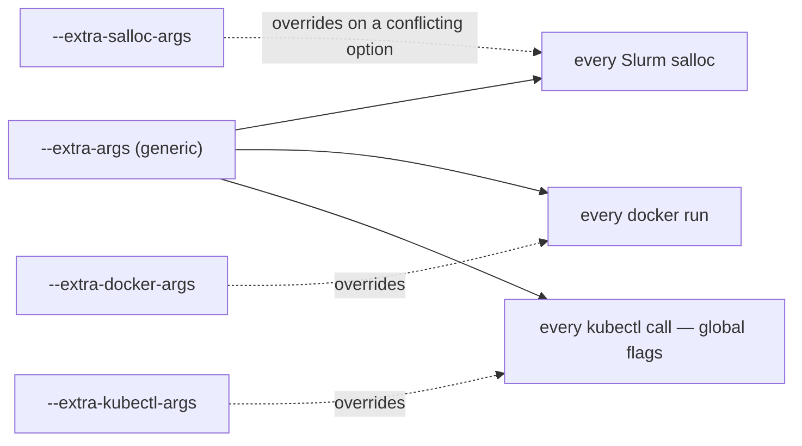

`sflow` currently exposes these CLI commands:

- `sflow run` – Run a workflow
- `sflow compose` – Compose multiple YAML files into a single config
- `sflow batch` – Generate sbatch script for Slurm batch mode
- `sflow visualize` – Visualize workflow DAG
- `sflow sample` – List and copy sample workflows
- `sflow skill` – Copy bundled AI-agent skills for writing and debugging sflow YAML

> Note: `--resume` / `--task` are currently marked as not implemented in code and will error immediately. (`--skip-dependencies` is a companion flag to `--task`, so it is inert until `--task` lands.)

Global option:

- `sflow --version` / `sflow -V`: print executable/runtime details, including package version, binary path, Python path, install mode, source label, repo path when known, and git branch/commit when available

## sflow run

```bash
sflow run --file sflow.yaml
```

Common options:

- Positional files or `--file, -f <path>`: workflow YAML file(s). Multiple files are merged the same way as `sflow compose`.
- `--dry-run`: validate + print execution plan, without running tasks
- `--tui`: enable Rich TUI (left: tasks + backends, right: auto-tail logs)
- `--set, -s KEY=VALUE`: override variables (repeatable); variable must already exist in `variables`
- `--artifact, -a NAME=URI`: override artifacts (repeatable); artifact must already exist in `artifacts`
- `--skip-artifact-check`: do not fail when an `fs://` artifact path does not exist locally — warn and continue. For paths that only exist where the task runs (e.g. on the Slurm compute nodes). The path is also left alone rather than created as an empty directory. No effect under `--dry-run`, which already only warns; off-host backends (Kubernetes) already skip this check automatically.
- `--missable-tasks, -M <pattern>`: task names or glob patterns (e.g. `prefill_*`) that may be absent when composing multiple files. Missing missable tasks are removed from `depends_on` and probes with a warning. Only valid with multiple input files. Repeatable.
- `--extra-args, -e <arg>`: generic, backend-agnostic extra args. They are forwarded to whichever backend the recipe uses — merged into each **Slurm** backend's `salloc`, each **docker** backend's `docker run`, and every **kubectl** call's global flags. Deduplicated by option (CLI wins over the recipe; a more specific `--extra-salloc-args` / `--extra-docker-args` / `--extra-kubectl-args` wins over `--extra-args` on a conflicting option). Repeatable
- `--extra-salloc-args <arg>`: like `--extra-args` but **Slurm only** — merged into each Slurm backend's `salloc` (e.g. `--gpus-per-node=4`). In a multi-backend recipe it applies to every Slurm backend's `salloc`
- `--extra-docker-args <arg>`: like `--extra-args` but **docker only** — merged into each docker backend's `docker run` (e.g. `--shm-size=16g`)
- `--include-nodes <names>` / `--exclude-nodes <names>`: restrict every backend to (or away from) named nodes. Accepts comma-separated (`a,b`), a quoted whitespace list (`"a b"`), and/or repeated flags; unioned into each backend's `include_nodes` / `exclude_nodes`
- `--bulk-input, -b <csv>`: resolve workflow files and overrides from one CSV row
- `--row <selector>`: required with `--bulk-input`; `sflow run` accepts exactly one row selector
- `--workspace-dir <dir>`: workspace root directory (default: current directory)
- `--output-dir <dir>`: output root directory (default: `<workspace-dir>/sflow_output`)
- `--kubeconfig <path>`: kubeconfig file for kubernetes backends (also exported as `KUBECONFIG`; default: `$KUBECONFIG` or `~/.kube/config`)
- `--kube-context <name>`: kubeconfig context for kubernetes backends (default: current-context)
- `--kube-namespace <name>`: override the namespace for all kubernetes backends
- `--kube-node-selector <k=v>`: node-selector label(s) merged into every kubernetes backend's nodeSelector; comma-separated and/or repeatable
- `--kube-compute-domain-channel <name|auto|disable>`: override `compute_domain.channel` for all kubernetes backends (tune Multi-Node NVLink / IMEX per run without editing the recipe; legacy `off` still accepted)
- `--kube-compute-domain-create / --no-kube-compute-domain-create`: override `compute_domain.create`; when on (and no channel is joined), sflow stands up its own ComputeDomain CR named after the run and injects the channel into every GPU pod
- `--kube-skip-pvc`: skip all PVC-backed volume mounts (a backend `volumes:` entry with a `claim`) in every kubernetes backend for this run, keeping `empty_dir` volumes. Debug aid for clusters that lack the recipe's PVCs — pods schedule without editing the recipe volume-by-volume. The PVC data (e.g. a model cache) is **not** mounted, so workloads that need it will fail; use for quick scheduling/plumbing checks
- `--extra-kubectl-args <flag>`: extra global kubectl flag applied to every kubectl call (e.g. `--extra-kubectl-args=--insecure-skip-tls-verify`); repeatable
- `--extra-kubectl-apply-args <flag>`: extra flag for the `kubectl apply` **subcommand** (e.g. `--extra-kubectl-apply-args=--validate=false`, `=--server-side`, `=--force-conflicts`); repeatable. kubectl takes global flags *before* the verb and subcommand flags *after* it, so an apply-only flag cannot go through `--extra-kubectl-args` (`kubectl --validate=false apply` is an unknown flag, and it would break every other kubectl call too). Applies to every apply sflow issues, including the allocate-time reservation objects
- `--enable-workflow-monitor`: enable a default workflow-level hardware monitor (GPU/CPU utilization) for the run without editing the recipe
- `--enable-task-monitor <names>`: enable a default hardware monitor bound to the named task(s); accepts a comma- or space-separated list and is repeatable (e.g. `--enable-task-monitor prefill_server,decode_server`)
- `--offload-task-logs` / `--no-offload-task-logs`: force per-task log offload on or off, overriding each backend's `offload_task_logs`. On by default for local/docker/slurm when non-interactive (auto-falls back to streaming on a TTY/`--tui`); no effect on `k8s` (always offloads its pod log to file) or `ssh`/`python` (always stream through the driver). Use `--no-offload-task-logs` to force live streaming through the driver
- `--wait-for-gpus <seconds>` (**docker backend only**): when the local docker backend can't reserve enough free GPUs, wait for them to free up instead of failing fast. The flag always takes a value: a positive number bounds the wait (e.g. `--wait-for-gpus 600`), while `0` or an empty value waits indefinitely (`--wait-for-gpus ""`) — the same meaning `0` has in the backend's `wait_for_gpus` field, which this flag overrides. Omit the flag entirely to fail fast. A non-numeric or negative value is rejected at parse time. The flag works by setting `SFLOW_WAIT_FOR_GPUS`, which you can also export directly — but note that *any* accepted value there (empty included) turns waiting on, so `unset` it to get fail-fast back, and a malformed exported value is only caught at the first GPU task rather than at parse time. No effect on other backends. See [Docker GPU reservation](backends.md#gpu-reservation-local-concurrent-runs)
- `--tui-refresh <fps>`: TUI refresh rate in frames per second (default: `2`, minimum: `1`)
- `--log-level <level>`: `debug|info|warning|error|critical` (default: `info`)
- `--verbose, -v`: enable verbose output

#### `--extra-args` precedence

Extra backend args stack from least- to most-specific, and each backend de-dups by option (CLI always wins over the recipe):

Precedence, low → high: `recipe extra_args` → `--extra-args` (generic) → `--extra-<type>-args` (channel-specific).



For example, `--extra-args '--gres=gpu:4'` replaces a recipe's `gpu:8` on that option rather than passing both.

Notes:

- `--tui` is ignored in `--dry-run` mode.
- In `--tui` mode, logs are captured and rendered in the right pane (to avoid interleaving console logs with the live UI).
- Each run logs the same executable/runtime details shown by `sflow --version`, which helps identify whether a local editable checkout, branch build, or release package is running.
- CSV paths in `sflow_config_file` are resolved relative to the CSV file. CLI `-f` files are prepended to the row's files and deduplicated by resolved path.
- `--row=-1` selects the last CSV row, `--row=-2` the second-to-last, etc. Use the `--row=N` form for negative rows so Typer does not treat the value as a flag.

Output structure (non dry-run):

- `<output-dir>/<run_id>/sflow.log`: global log
- `<output-dir>/<run_id>/sflow_summary.log`: live execution summary, updated during the run and finalized on completion or failure
- `<output-dir>/<run_id>/*_cmds.log`: command-only launch logs, grouped by command family when commands are executed
- `<output-dir>/<run_id>/<task>/<task>.log`: per-task log

## sflow visualize

```bash
sflow visualize --file sflow.yaml --format mermaid
```

Common options:

- `--file, -f <path>`: config file path
- `--format <fmt>`: `mermaid|dot|png|svg|pdf`
- `--output, -o <path>`: output file path; if omitted, writes to `<output-dir>/<run_id>/<workflow>.<ext>`
- `--show-variables`: include variables in output (as comments)
- `--set, -s KEY=VALUE`: override variables (repeatable) — so the rendered DAG reflects your overrides
- `--artifact, -a NAME=URI`: override artifacts (repeatable)
- `--missable-tasks, -M <pattern>`: same as `run` — task names/globs that may be absent when composing multiple files (only valid with multiple input files)
- `--workspace-dir <dir>` / `--output-dir <dir>`: same as `run`

Notes:

- `png/svg/pdf` output requires Graphviz `dot`. Otherwise use `--format mermaid` or `--format dot`.

## sflow compose

Compose multiple sflow YAML files into a single valid workflow config. Supports single-file passthrough or multi-file merging.

```bash
# Compose and print to stdout
sflow compose backends.yaml workflow.yaml tasks.yaml

# Compose and write to file
sflow compose -f backends.yaml -f tasks.yaml -o merged.yaml

# Compose with variable overrides
sflow compose backends.yaml tasks.yaml --set SLURM_NODES=4 -o merged.yaml

# Compose and resolve all variables to literal values
sflow compose backends.yaml tasks.yaml --resolve -o resolved.yaml

# Bulk compose: generate one composed YAML per CSV row
sflow compose --bulk-input jobs.csv -o output_dir

# Bulk compose with common files prepended to each CSV row
sflow compose common.yaml --bulk-input jobs.csv -o output_dir

# Bulk compose with validation
sflow compose --bulk-input jobs.csv --validate -o output_dir
```

Common options:

- File inputs (positional or `--file, -f`): workflow YAML files to merge
- `--output, -o <path>`: output file path (default: stdout)
- `--set, -s KEY=VALUE`: override variable values (repeatable)
- `--artifact, -a NAME=URI`: override artifact URIs (repeatable)
- `--resolve, -r`: resolve all resolvable variables to literal values inline and remove them from the variables section. Without this flag, variables are kept as `${{ }}` expressions for flexibility.
- `--validate, -vl`: run dry-run validation on each composed config to check for resource issues (e.g. GPU over-subscription)
- `--missable-tasks, -M <pattern>`: task names or glob patterns that may be absent when composing multiple files (repeatable). Missing references are removed with a warning. Only valid with multiple input files or `--bulk-input`.
- `--bulk-input, -b <csv>`: CSV file for bulk compose (one YAML per row). Supports a `missable_tasks` column for per-row missable task patterns.
- `--row`: process specific CSV rows. Supports single rows, repeated flags, comma lists, Python-style slices with exclusive end (`--row 1:4` -> rows 1, 2, 3), open-ended slices, and negative row indices (`--row=-1`).
- `--log-level`: logging level (default: `info`)
- `--verbose, -v`: enable verbose output

Notes:

- A single file is accepted (useful for `--resolve` to inline variables)
- The composed config is validated against the sflow schema before output
- Variable expressions (`${{ }}`) support chained references (e.g. `NODES_PER_WORKER` can reference `GPUS_PER_WORKER`)
- `--resolve` preserves variables used by `replicas.variables` (sweep variables) since their value changes per replica. Runtime-dependent expressions (e.g. backend node IPs) are also kept.

## sflow batch

Generate sbatch scripts for running sflow in Slurm batch mode. Supports three modes:

> Note: `sflow batch` targets **Slurm** — it generates/submits an sbatch script that runs sflow inside the allocation. Kubernetes runs are driver-attached (interactive `sflow run`); a detached batch mode for Kubernetes is planned for a later release.

1. **Single-job mode** (default): generate one sbatch script from config files
2. **Bulk-input mode** (`--bulk-input`): CSV-driven, one job per row with per-row overrides
3. **Bulk-submit mode** (`--bulk-submit`): file/folder-driven, each YAML is a standalone job

```bash
# Single-job mode
sflow batch workflow.yaml -N 2 -G 4 -p gpu -A myaccount -o run.sh --submit

# Bulk-input mode (CSV-driven)
sflow batch --bulk-input jobs.csv -G 4 -p gpu -A myaccount --submit

# Bulk-submit mode (folder of self-contained configs)
sflow batch --bulk-submit ./examples/ -G 4 -p gpu -A myaccount --submit

# Bulk-submit with specific files
sflow batch -B sglang_agg.yaml -B vllm_agg.yaml -G 4 -p gpu --submit

# Bulk-submit with glob pattern
sflow batch --bulk-submit 'examples/self_contained/slurm/*' -G 4 -p gpu -A myaccount --submit
```

Common options:

- `--file, -f <path>`: config file path (default: `sflow.yaml`)
- `--sbatch-path, -o <path>`: write sbatch script to file (required for `--submit` in single-job mode)
- `--submit`: submit the job immediately after generating the script
- `--partition, -p <name>`: Slurm partition (auto-detected if not specified)
- `--account, -A <name>`: Slurm account (auto-detected if not specified)
- `--time <limit>`: time limit (e.g., `02:00:00`)
- `--nodes, -N <count>`: number of nodes. If omitted, single-job and bulk-submit modes derive it from the config's Slurm backend `nodes` field. Bulk-input mode requires either this flag or a CSV node-count column (`SLURM_NODES`, `NUM_SLURM_NODES`, or `NUM_NODES`).
- `--gpus-per-node, -G <count>`: number of GPUs per node for cluster topology. Config `gpus_per_node` wins when present. Applied to sflow validation and planning only, not as a Slurm directive. Use `-e '--gpus-per-node=N'` for `sflow batch`, or backend `extra_args` for `sflow run`, if your cluster requires the Slurm allocation flag.
- `--job-name, -J <name>`: Slurm job name (default: `sflow`)
- `--set, -s KEY=VALUE`: override variables (repeatable)
- `--artifact, -a NAME=URI`: override artifacts (repeatable)
- `--enable-workflow-monitor` / `--enable-task-monitor <names>`: same monitor conveniences as `sflow run` — enable a default hardware monitor at the workflow level or bound to specific task(s) without editing the recipe
- `--skip-artifact-check`: same as `sflow run`, and forwarded to the `sflow run` inside the submitted job — which is where the check actually runs, so this is the flag to use when an `fs://` path exists only on the compute nodes.
- `--missable-tasks, -M <pattern>`: task names or glob patterns that may be absent when composing modular configs (repeatable). Missing references are removed with a warning. Only valid with multiple input files or `--bulk-input`/`--bulk-submit`.
- `--include-nodes <names>` / `--exclude-nodes <names>`: same node-restriction flags as `sflow run` — unioned into every backend's `include_nodes` / `exclude_nodes`.
- `--sflow-venv-path, -v <path>` (note the short alias `-v` — in `sflow batch`, `-v` means venv-path, **not** verbose): parent directory under which **each Slurm job creates its own fresh, disposable per-job venv** (`.sflow_venv-<job id>/`) and installs sflow into it, then removes it when the job exits. This is the venv *parent* dir, not an existing venv to reuse. The venv is built on the compute node with a resolved system `python3`, so it always matches the node architecture (x86/arm). Defaults to compute-node-local scratch resolved at run time (`${TMPDIR:-/tmp}/sflow_compute_node_venv`); pass a shared-filesystem path to override. The per-job dirs are auto-removed on normal exit and on Slurm cancel/timeout, but a hard `SIGKILL`/node crash can leave `.sflow_venv-<job id>`/`.sflow_src-<job id>` behind under a shared path (node-local scratch is reclaimed by the cluster).
- `--sflow-version <ref>`: Git branch, tag, or ref to install in generated batch scripts. If omitted, scripts try to reuse the currently installed sflow git ref/version before falling back to `main`. Mutually exclusive with `--sflow-source-path`. When `--sflow-index-url` is set, this is instead interpreted as a **PyPI version specifier** (see below).
- `--sflow-index-url <url>`: install sflow from a **private PyPI index** (e.g. an Artifactory registry such as `https://<host>/artifactory/api/pypi/<repo>/simple`) instead of from git. When set, `--sflow-version` becomes a PyPI version specifier: a bare version is pinned (`0.2.1` → `sflow==0.2.1`), an operator spec is passed through (`>=0.2,<0.3`), and omitting it installs the latest available. The index is added with uv's `--extra-index-url`, so sflow's dependencies still resolve from the default index. Credentials must be available on the compute node via `~/.netrc` or a credential helper; URLs containing embedded credentials are rejected. Mutually exclusive with `--sflow-source-path`.
- `--sflow-source-path <path>`: local sflow source checkout to install **editable** (`uv pip install -e ".[dev]"`) into each job's per-job venv instead of from a git ref. Each job first copies the checkout into its own per-job source dir (via `rsync`, or `tar` when `rsync` is absent) so concurrent editable builds never race on setuptools-scm build artifacts. The path must be readable from the compute node. Mutually exclusive with `--sflow-version`.
- `--sbatch-extra-args, -e <arg>`: additional `#SBATCH` directives (repeatable). Supports `${{ variables.X }}` and shorthand `${{ X }}` expressions resolved from config defaults, `--set`, and CSV row values.
- `--sbatch-output, -O <pattern>`: Slurm stdout pattern (default: `sflow_output/%j-sflow-submit.out`)
- `--sbatch-error, -E <pattern>`: Slurm stderr pattern (default: `sflow_output/%j-sflow-submit.err`)

### Bulk-input mode (`--bulk-input`)

- `--bulk-input, -b <csv>`: CSV file with a required `sflow_config_file` column and optional `job_name` column. Space-separated YAML paths in `sflow_config_file` are merged for that row. All other columns are matched to variable or artifact names.
- `--row`: process specific rows. Supports the same selectors as `sflow compose --row`.
- `--resolve, -r`: resolve variables in the generated merged YAML configs (same as `sflow compose --resolve`)
- Override precedence: CLI `--set` overrides CSV values; CLI `--artifact` overrides CSV values.
- Generates both `.sh` (sbatch script) and `.yaml` (merged config) files per row.
- Always writes a `results.csv` with job IDs, output directories, and status.
- Reserved CSV column `missable_tasks`: space-separated task names or glob patterns per row. Merged with CLI `--missable-tasks`. Allows mixed disagg/agg rows in the same CSV where different rows have different absent tasks. Columns that only exist in some row configs (e.g. `NUM_AGG_SERVERS` for agg rows, `NUM_CTX_SERVERS` for disagg rows) are automatically handled.
- If `job_name` is blank or absent, sflow derives a name from unique config-file stems, node count, and differing short CSV values, then appends a row suffix such as `_001`.

### Bulk-submit mode (`--bulk-submit`)

- `--bulk-submit, -B <path>`: file paths, folder paths, or glob patterns. Folders are scanned for `*.yaml`/`*.yml` files with a `version` key.
- Each YAML is processed as a self-contained workflow (no merging).
- CLI flags (`--set`, `--artifact`, etc.) are applied to every config. Warns when `--set` overrides a variable already defined in a config.
- Node count is auto-detected from the config's slurm backend.
- Always writes a `results.csv` with job IDs and status. With `--resolve`, the results include the generated composed YAML path.

### Notes

- A dry-run validation is performed before generating each sbatch script. CLI `--nodes` and `--gpus-per-node` are applied directly to the slurm backend during validation; `--gpus-per-node` still only describes topology unless also passed as an explicit sbatch extra arg.
- Sbatch stdout/stderr logs are automatically copied into the sflow workflow output directory at the end of each generated script.
- Without `--submit`, a hint is shown to remind you to add `--submit` for actual submission.

## sflow sample

List available sample workflows or copy a sample to your project. Supports both single-file samples and modular folder samples.

```bash
# List all available samples (includes modular folders)
sflow sample --list
sflow sample

# Copy a self-contained sample
sflow sample self_contained/slurm/dynamo_trtllm_agg

# Copy a modular sample folder
sflow sample modular/inference_x_v2

# Copy with custom output path
sflow sample self_contained/local/hello_world --output my_workflow.yaml

# Overwrite existing file/folder
sflow sample modular/inference_x_v2 --force
```

Available sample categories (run `sflow sample --list` for the full, live list):

- **Self-contained** (`self_contained/<backend>/<name>`, one file each): e.g. `self_contained/local/hello_world`, `self_contained/docker/sglang_qwen3`, `self_contained/slurm/dynamo_trtllm_agg`, `self_contained/kubernetes/hello_world`. Backends: `local`, `docker`, `slurm`, `kubernetes`.
- **Modular** (`modular/inference_x_v2/`): a folder of composable YAML files (slurm_config, common_workflow, framework-specific prefill/decode, benchmarks, plus `composed_recipes/`).

See [Sample Workflows](./samples.md#sample-catalog) for the full catalog.

### Modular samples

Modular samples are folders containing multiple YAML files designed to be composed together. When you copy a modular sample, the entire folder is copied:

```bash
sflow sample modular/inference_x_v2
```

After copying, you get usage hints showing two workflows:

- **Option A (Bulk batch)**: Use `sflow batch --bulk-input <folder>/bulk_input.csv` to generate and submit jobs from a CSV
- **Option B (Compose + Submit)**: Use `sflow compose` to merge files into a complete config, then `sflow run` or `sflow batch` to execute

Common options:

- `<name>`: sample name or folder name
- `--output, -o <path>`: output path (default: `./<sample_name>`)
- `--force, -f`: overwrite existing file/folder if it exists
- `--list, -l`: list all available samples

## sflow skill

Copy bundled AI-agent skills into a project. These skills help coding agents write sflow YAML and diagnose workflow errors.

```bash
# List available skills
sflow skill --list

# Copy skills to ./skills
sflow skill

# Copy to a custom skills directory
sflow skill --output .cursor/skills

# Overwrite existing bundled skill files
sflow skill --force
```

Common options:

- `--output, -o <dir>`: output directory (default: `./skills`)
- `--force, -f`: overwrite existing files when merging into an existing directory
- `--list, -l`: list available bundled skills

## sflow upgrade

Upgrade sflow in the environment you are currently running it from. `sflow update` is
an alias for the same command.

With no flags it installs the **`main` branch of the public OSS GitHub repo**:

```bash
sflow upgrade
# -> uv pip install ... 'sflow @ git+https://github.com/NVIDIA/nv-sflow.git@main'
```

> This default differs from `sflow batch`, which installs whatever ref your *current*
> environment came from. `sflow upgrade` is an explicit "get me the latest" action.

Pick a different source with `--repo` / `--branch`:

```bash
# A different branch or tag of the public repo
sflow upgrade --branch v0.3.0

# A fork or an internal mirror (defaults to its main branch)
sflow upgrade --repo https://git.example.com/team/sflow.git

# Both together
sflow upgrade --repo https://git.example.com/team/sflow.git --branch develop
```

The install-route flags are the same ones [`sflow batch`](#sflow-batch) uses to pin the
version installed on a compute node, so a ref you trust in a batch job is written the
same way here:

```bash
# Equivalent to --branch develop, in the batch spelling
sflow upgrade --sflow-version develop

# repo + ref in one value
sflow upgrade --sflow-version https://git.example.com/team/sflow.git@develop

# A released wheel from a private PyPI index
sflow upgrade --sflow-index-url https://host/artifactory/api/pypi/repo/simple \
              --sflow-version '>=0.2,<0.3'

# Editable install from a local checkout
sflow upgrade --sflow-source-path ~/src/sflow
```

Options:

- `--repo <url>`: git repository to install from (default: `https://github.com/NVIDIA/nv-sflow.git`)
- `--branch <ref>`: git branch or tag (default: `main`)
- `--sflow-version <ref|repo@ref|specifier>`: same syntax as `sflow batch --sflow-version`. Mutually exclusive with `--repo`/`--branch`, which encode the same thing
- `--sflow-index-url <url>`: install from a private PyPI index; `--sflow-version` then means a PEP 440 specifier. URLs with embedded credentials are rejected — use `~/.netrc` or a credential helper
- `--sflow-source-path <dir>`: editable install from a local checkout
- `--force`: allow upgrading over an editable/dev install
- `--dry-run`: print the resolved install command and exit

Notes:

- **Dev installs are protected.** If sflow is currently an editable or source-tree
  install, `sflow upgrade` refuses rather than silently replacing your working
  checkout with a released build. Pass `--force` to override.
- `uv` is used when available (pinned to the interpreter running sflow) and `pip` is
  the fallback. Because a branch head can move without the version string changing,
  sflow is explicitly reinstalled rather than being skipped as "already satisfied".
- Run `sflow --version` afterwards to confirm what you ended up with.
