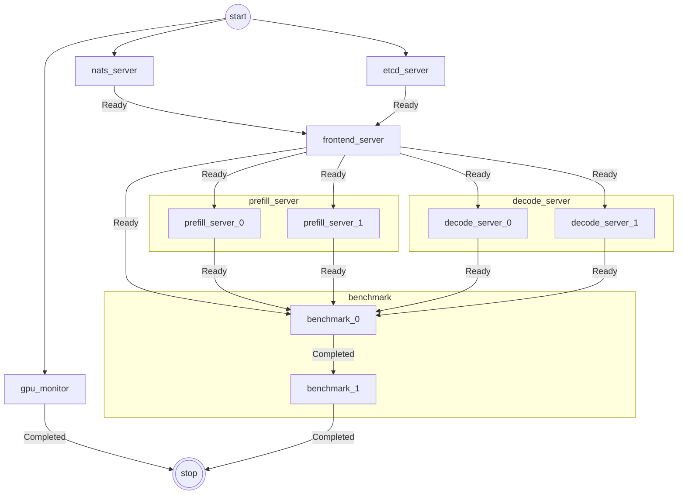

`sflow` is a **workflow orchestrator**: you describe _what to run_ in a `sflow.yaml` (tasks, dependencies, how to launch each task, and required resources). `sflow` executes the DAG in order, collects logs, and organizes outputs into a consistent directory structure.

## Who is this for?

- **Complex deployment workflow inside Slurm cluster** Sflow streamlines workflow orchestration within Slurm clusters, offering built-in features like automatic hostname/IP detection, precise workload distribution across nodes and GPUs, runtime readiness/failure checks, and seamless replica scaling. Simply define what you want to run—no more cumbersome bash scripts to manage resource placement or ensure processes are on the right nodes and GPUs, see example of dynamo PD disaggregation LLM inference service.

- **Workflow orchestration across environments**: codify "startup order + replica scale + readiness probes + log capture" in YAML and run it locally or on a cluster via a backend (e.g. Slurm).
- **Benchmarking / experiment automation**: standardize how you launch runs, capture logs/artifacts, and structure outputs so results are reproducible.
- **Local development**: use the `local` backend + `bash` operator to validate the DAG and scripts on your machine before moving to a cluster backend.

## Core concepts (minimal set)

- **workflow**: a set of tasks + a DAG (dependencies declared via `depends_on`).
- **task**: an executable unit; the key field is `script` (a list of lines joined into a bash script).
- **backend**: where compute comes from. Built-ins in v0.1:
  - `slurm`: allocates resources via `salloc`
  - `local`: no allocation; simulates nodes on the local machine
- **operator**: how a task is launched. Built-ins in v0.1: `bash` / `srun`
- **expressions**: `${{ ... }}` inside YAML to reference variables/backend info (e.g. `${{ variables.SLURM_PARTITION }}`).

## Current version boundaries (important)

The following are **explicitly not implemented** in the current CLI/implementation:

- `sflow run --resume ...`: raises `NotImplementedError`
- `sflow run --task ...`: raises `BadParameter`

This user guide is based on **actual code behavior**. Not all planned features may be available in the current release.

## Next steps

- Run a minimal local example: [Quickstart](./quickstart.md)
- Learn variables (expressions, env injection, replicas): [Variables](./variables.md)
- Learn named inputs (paths, container images, etc.): [Artifacts](./artifacts.md)
- Learn where compute comes from (local, Slurm, ...): [Backends](./backends.md)
- Learn how tasks are launched (bash/srun/container): [Operators](./operators.md)
- Learn resource placement (nodes/GPUs, CUDA_VISIBLE_DEVICES): [Resources](./resources.md)
- Learn readiness/failure gates for service workflows: [Probes](./probes.md)
- Learn where logs and outputs go: [Outputs & logs](./outputs.md)
- Learn the full `sflow.yaml` schema: [Configuration](./configuration.md)
- See CLI options: [CLI reference](./cli.md)
