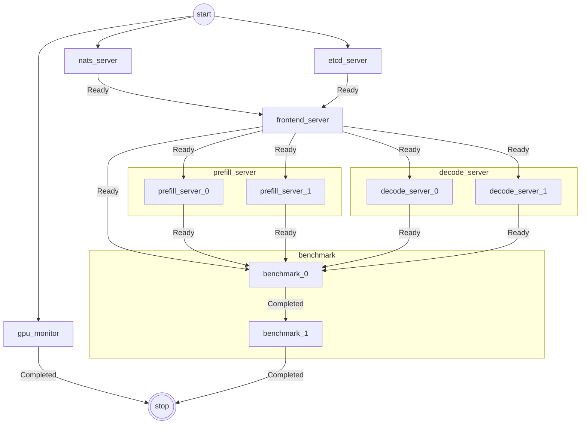
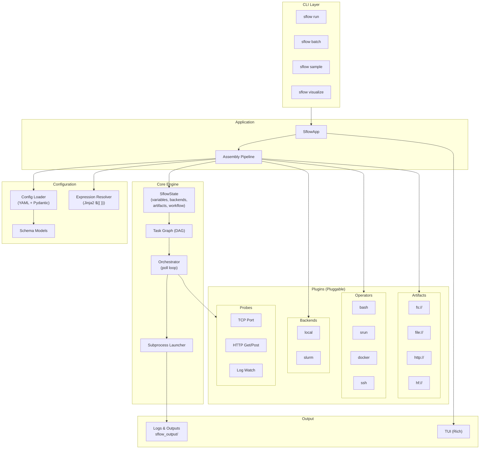
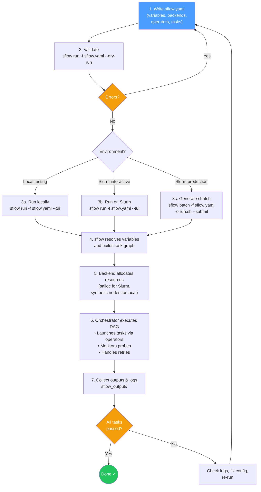

`sflow` is a **workflow orchestrator**: you describe _what to run_ in a `sflow.yaml` (tasks, dependencies, how to launch each task, and required resources). `sflow` executes the DAG in order, collects logs, and organizes outputs into a consistent directory structure.

## Use Cases

### Complex Slurm Workflows

sflow streamlines orchestration within Slurm clusters with built-in support for:

- Automatic hostname/IP detection after allocation
- Workload distribution across nodes and GPUs
- Runtime readiness and failure checks (probes)
- Replica scaling (parallel workers, sweeps)

Define what you want to run — no more hand-crafted bash scripts to manage resource placement or ensure processes land on the right nodes and GPUs. Below is an example DAG for a Dynamo PD disaggregated LLM inference service:

### Cross-Environment Orchestration

Codify startup order, replica scale, readiness probes, and log capture in YAML — then run the same file locally or on a cluster by switching the backend.

### Benchmarking & Experiment Automation

Standardize how you launch runs, capture logs/artifacts, and structure outputs so results are reproducible across teams and machines.

### Local Development & Testing

Use the `local` backend with the `bash` operator to validate your DAG and scripts on your laptop before moving to a Slurm cluster.

## Core Concepts

| Concept | Description |
|---------|-------------|
| **Workflow** | A set of tasks wired into a DAG via `depends_on`. |
| **Task** | An executable unit. The key field is `script` — a list of lines joined into a bash script. |
| **Backend** | Where compute comes from. Built-ins: `slurm` (allocates via `salloc`) and `local` (simulates nodes on the local machine). |
| **Operator** | How a task is launched. Built-ins: `bash` and `srun`. Named operators let you preset flags and reuse them across tasks. |
| **Variable** | A named value referenced as `${{ variables.NAME }}` in YAML or `${NAME}` in scripts. Override from the CLI with `--set`. |
| **Expression** | `${{ ... }}` syntax inside YAML to reference variables, backend info, task metadata, and more (e.g. `${{ backends.slurm.nodes[0].ip_address }}`). |

## Architecture

## How to Use sflow (General Workflow)

## Known Limitations

The following features are **not yet implemented** in the current release:

- `sflow run --resume` — raises `NotImplementedError`
- `sflow run --task` — raises `BadParameter`

This user guide reflects actual code behavior. Not all planned features may be available yet.

## Next Steps

| Topic | Page |
|-------|------|
| Run a minimal example | [Quickstart](./quickstart.md) |
| Variables, expressions, env injection | [Variables](./variables.md) |
| Named inputs (paths, images, etc.) | [Artifacts](./artifacts.md) |
| Compute backends (local, Slurm) | [Backends](./backends.md) |
| Task launch methods (bash, srun, containers) | [Operators](./operators.md) |
| Node/GPU placement, CUDA_VISIBLE_DEVICES | [Resources](./resources.md) |
| Readiness/failure gates for services | [Probes](./probes.md) |
| Log and output directory structure | [Outputs & Logs](./outputs.md) |
| Full sflow.yaml schema | [Configuration](./configuration.md) |
| CLI options | [CLI Reference](./cli.md) |
