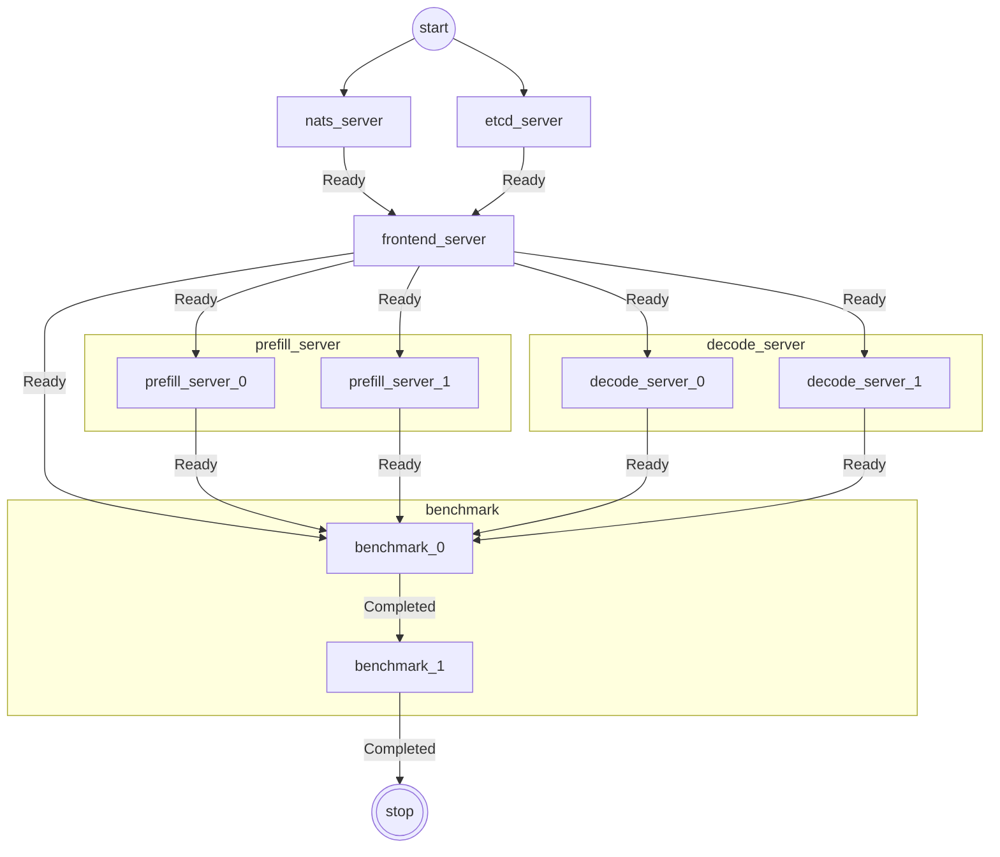
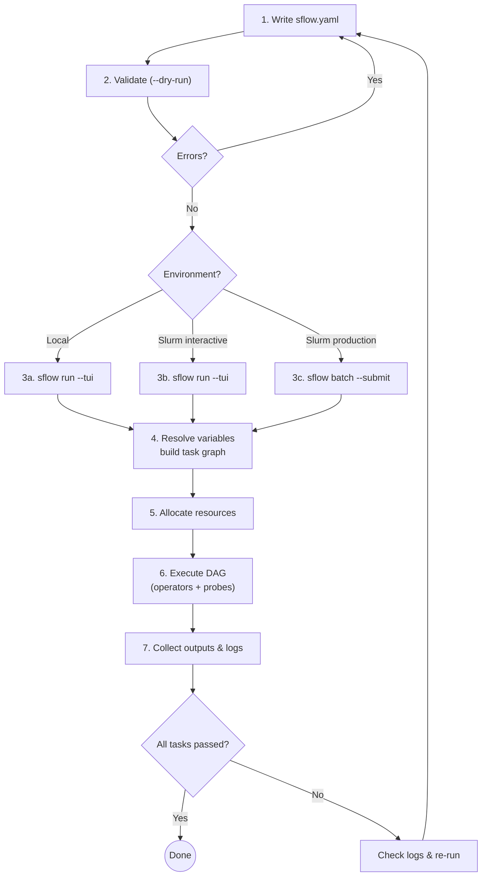
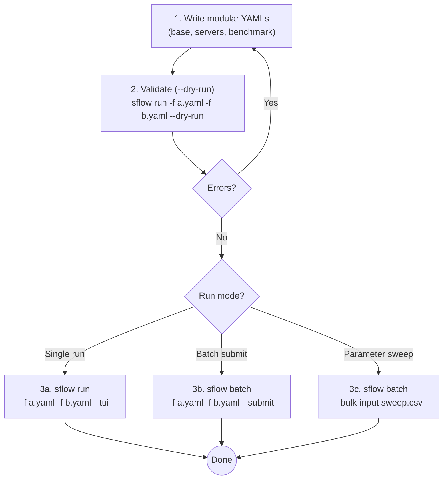

## What is sflow

A **declarative workflow descriptor for massive GPU clusters** that separates _what to deploy_ from _where to deploy it_.

:::tip Find the right feature
Not sure where to start? Open the [Feature Map](/feature-map) to choose a goal, see which sflow features apply, and jump to the relevant docs. Building with an AI coding agent? See [Agent Skills](/docs/agents/intro).
:::

**One semantic across every platform — backend agnostic by design.** A deployment's logic never changes: start etcd and NATS, launch a frontend, spin up workers, run the benchmark. Only the infrastructure glue does — and today that glue is rewritten from scratch for every platform. `sflow` consolidates it into a single portable YAML: tasks, dependencies, resources, and launch methods. The **same `sflow.yaml` runs on Docker, Slurm, and Kubernetes** — swap the backend fragment, rewrite nothing. Backends delegate to each platform's native ecosystem (`srun`/MPI, `docker run`, pods and MPI jobs) rather than reimplementing it.

**Cluster-level orchestration at scale.** Topology-aware node and GPU placement, multi-node replicas and sweeps, readiness/failure probes, and batch submission — so one descriptor drives hundreds of GPUs instead of a pile of hand-written bash.

All four backends ship today: `local`, `docker`, `slurm`, and `kubernetes` (`k8s` / `k8s_mpi`). It is light enough to write and debug a recipe on your laptop and submit that same file to the cluster.

Define _what to run_ in a `sflow.yaml` — tasks, dependencies, how to launch each task, and required resources. `sflow` executes the DAG in order, collects logs, and organizes outputs into a consistent directory structure. Example of a dynamo PD disaggregation LLM inference service workflow:

## Docs versions

The docs site version selector intentionally shows only maintained documentation streams:

- **`develop`**: verified pre-release documentation for tested features that are queued for the next release.
- **`main`**: stable documentation aligned with the latest released state.
- **`vX.Y.Z` release tags**: immutable documentation snapshots for a specific release.

Both `develop` and `main` are kept up to date. Use `main` or a release tag for production/stable behavior, and use `develop` when validating upcoming tested features before the next release.

## Use Cases

### Complex Slurm Workflows

sflow streamlines orchestration within Slurm clusters with built-in support for:

- Automatic hostname/IP detection after allocation
- Workload distribution across nodes and GPUs
- Runtime readiness and failure checks (probes)
- Replica scaling (parallel workers, sweeps)

Define what you want to run — no more hand-crafted bash scripts to manage resource placement or ensure processes land on the right nodes and GPUs. Below is an example DAG for a Dynamo PD disaggregated LLM inference service:

```mermaid
graph TD
  start((start))
  stop(((stop)))

  subgraph "prefill_server"
    prefill_server_0
    prefill_server_1
  end
  subgraph "decode_server"
    decode_server_0
    decode_server_1
  end
  subgraph "benchmark"
    benchmark_0
    benchmark_1
    benchmark_0 -- Completed --> benchmark_1
  end

  nats_server["nats_server"]
  etcd_server["etcd_server"]
  frontend_server["frontend_server"]

  start --> nats_server
  start --> etcd_server

  nats_server -- Ready --> frontend_server
  etcd_server -- Ready --> frontend_server
  frontend_server -- Ready --> prefill_server_0
  frontend_server -- Ready --> prefill_server_1
  frontend_server -- Ready --> decode_server_0
  frontend_server -- Ready --> decode_server_1
  frontend_server -- Ready --> benchmark_0
  prefill_server_0 -- Ready --> benchmark_0
  prefill_server_1 -- Ready --> benchmark_0
  decode_server_0 -- Ready --> benchmark_0
  decode_server_1 -- Ready --> benchmark_0

  benchmark_1 -- Completed --> stop

```

### Cross-Environment Orchestration

Codify startup order, replica scale, readiness probes, and log capture in YAML — then run the same file locally or on a cluster by switching the backend.

### Benchmarking & Experiment Automation

Standardize how you launch runs, capture logs/artifacts, and structure outputs so results are reproducible across teams and machines.

### Local Development & Testing

Use the `local` backend with the `bash` operator to validate your DAG and scripts on your laptop before moving to a Slurm cluster.

## Core Concepts

| Concept | Description |
|---------|-------------|
| **Workflow** | A set of tasks wired into a DAG via `depends_on`. |
| **Task** | An executable unit. The key field is `script` — a list of lines joined into a bash script. |
| **Backend** | Where compute comes from. Built-ins: `local` (simulates nodes on the local machine), `slurm` (allocates via `salloc`), `docker` (launches tasks via `docker run`), and `kubernetes` (schedules tasks as pods). |
| **Operator** | How a task is launched. Built-ins: `bash`, `srun`, `docker_run`, `k8s`, `k8s_mpi`, `ssh`, `python`. Named operators let you preset flags and reuse them across tasks. |
| **Variable** | A named value referenced as `${{ variables.NAME }}` in YAML or `${NAME}` in scripts. Override from the CLI with `--set`. |
| **Expression** | Jinja2-based `${{ ... }}` syntax inside YAML to reference variables, backend info, task metadata, and more (e.g. `${{ backends.slurm.nodes[0].ip_address }}`). Supports filters (`${{ [a, b] \| min }}`), conditionals, and list indexing. |
| **Artifact** | A named external resource (model, config, dataset) referenced by URI and resolved to a local path at runtime. |
| **Storage** | A named post-execution upload target (e.g. S3). Per-task `uploads:` specs ship logs and result files to the target when a task completes. |
| **Result** | A task's small structured outputs (metrics, scores). A `result:` entry parses them from the task log or a JSON file into a canonical `result.json` plus a workflow-level `results.json` index. |
| **Probe** | A health-check gate. Readiness probes block dependents until a service is live; failure probes terminate the workflow when a fatal condition is detected. |
| **Replica** | A task can be replicated N times (parallel or sequential) with per-replica variable overrides for sweeps. |

For detailed architecture diagrams, execution flow, assembly pipeline, orchestrator internals, plugin reference, and output structure, see [Architecture](./architecture.md).

## How to Use sflow (General Workflow)

```mermaid
flowchart TD
  write["1. Write sflow.yaml"] --> validate["2. Validate (--dry-run)"]
  validate --> errCheck{Errors?}
  errCheck -- Yes --> write
  errCheck -- No --> envChoice{Environment?}

  envChoice -- Local --> runLocal["3a. sflow run --tui"]
  envChoice -- Slurm interactive --> runSlurm["3b. sflow run --tui"]
  envChoice -- Slurm production --> runBatch["3c. sflow batch --submit"]

  runLocal --> resolve["4. Resolve variables\nbuild task graph"]
  runSlurm --> resolve
  runBatch --> resolve

  resolve --> allocate["5. Allocate resources"]
  allocate --> execute["6. Execute DAG\n(operators + probes)"]
  execute --> collect["7. Collect outputs & logs"]

  collect --> passCheck{All tasks passed?}
  passCheck -- Yes --> done(("Done"))
  passCheck -- No --> fix["Check logs & re-run"]
  fix --> write
```

## Modular Workflow

For larger projects, split config into composable modules and pass them directly to `sflow run` or `sflow batch` -- no separate compose step required. This enables framework swapping, benchmark mixing, and CSV-driven parameter sweeps. See [Modular Workflows](./modular-workflows.md) for details.

```mermaid
flowchart TD
  modules["1. Write modular YAMLs\n(base, servers, benchmark)"] --> validate["2. Validate (--dry-run)\nsflow run -f a.yaml -f b.yaml --dry-run"]
  validate --> errCheck{Errors?}
  errCheck -- Yes --> modules
  errCheck -- No --> runChoice{Run mode?}

  runChoice -- Single run --> run["3a. sflow run\n-f a.yaml -f b.yaml --tui"]
  runChoice -- Batch submit --> batch["3b. sflow batch\n-f a.yaml -f b.yaml --submit"]
  runChoice -- Parameter sweep --> bulk["3c. sflow batch\n--bulk-input sweep.csv"]

  run --> done(("Done"))
  batch --> done
  bulk --> done
```

### Config Merging Rules

When multiple YAML files are provided, they are combined with a **recursive deep merge** keyed on `name`, so a single definition can be scattered across files:

| Section | Merge Strategy |
|---------|---------------|
| `version` | Must match across all files |
| `variables` | Deep-merge by name (same-name entries merge; on a conflicting leaf value the last file wins, with a warning) |
| `artifacts` | Deep-merge by name |
| `backends` | Deep-merge by name |
| `operators` | Deep-merge by name |
| `storage` | Deep-merge by name |
| `workflow.tasks` | Deep-merge by name, preserving first-seen order (a task can be split across files; duplicate task names no longer error) |
| `workflow.name` | Last non-null wins (a differing name no longer errors — it warns) |
| `workflow.monitor` / `upload_all` | Carried across files and deep-merged |

Tasks can also wire the DAG in reverse with `required_by` (the inverse of `depends_on`): `A required_by: [B]` makes B run after A. Targets that are absent from the merged workflow are skipped silently, so modular fragments self-wire without `--missable-tasks`. See [Modular Workflows](./modular-workflows.md).

## Expression System

The `${{ ... }}` expression syntax (powered by Jinja2) provides access to the full runtime context:

| Namespace | Example | Description |
|-----------|---------|-------------|
| `variables` | `${{ variables.MODEL_NAME }}` | Resolved variable value |
| `artifacts` | `${{ artifacts.MODEL.path }}` | Artifact local path |
| `backends` | `${{ backends.slurm.nodes[0].ip_address }}` | Backend node info |
| `task` | `${{ task.assigned_nodes }}` | Current task's node assignment |
| Filters | `${{ [a, b] \| min }}` | Jinja2 filters |

Expressions are resolved in phases — variables first, then backends, then artifacts, then task-level — so later phases can reference earlier results.

## Known Limitations

The following features are **not yet implemented** in the current release:

- `sflow run --resume` — raises `NotImplementedError`
- `sflow run --task` — raises `BadParameter`
- `hf://` and `docker://` artifact materialization — raises `NotImplementedError`

This user guide reflects actual code behavior. Not all planned features may be available yet.

## Next Steps

| Topic | Page |
|-------|------|
| Architecture, execution flow, plugins | [Architecture](./architecture.md) |
| Run a minimal example | [Quickstart](./quickstart.md) |
| Variables, expressions, env injection | [Variables](./variables.md) |
| Named inputs (paths, images, etc.) | [Artifacts](./artifacts.md) |
| Compute backends (local, Slurm, Docker, Kubernetes) | [Backends](./backends.md) |
| Task launch methods (bash, srun, containers) | [Operators](./operators.md) |
| Node/GPU placement, CUDA_VISIBLE_DEVICES | [Resources](./resources.md) |
| Parallel/sequential replicas, sweeps | [Replicas](./replicas.md) |
| Composable configs, sweeps, missable tasks | [Modular Workflows](./modular-workflows.md) |
| Readiness/failure gates for services | [Probes](./probes.md) |
| Examine a finished run — where to look for what | [Understanding Run Output](./run-output.md) |
| Log and output directory structure | [Outputs & Logs](./outputs.md) |
| Capture task metrics & structured results | [Results](./results.md) |
| Hardware monitoring (GPU/CPU/memory/disk/network) | [Monitor](./monitor.md) |
| Post-execution uploads to S3 | [Uploads](./uploads.md) |
| Full sflow.yaml schema | [Configuration](./configuration.md) |
| CLI options | [CLI Reference](./cli.md) |
| Frequently asked questions | [FAQ](./faq.md) |
