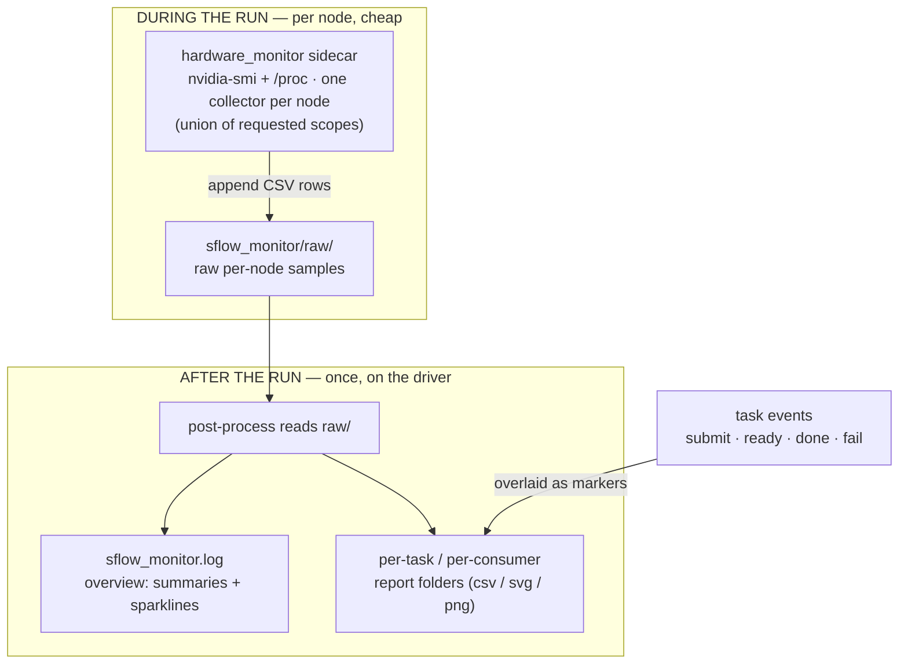

`monitor:` adds **hardware resource monitoring** (GPU / CPU / memory / disk /
network) to a workflow with zero scripting. Collectors run as lightweight
sidecars on the bare node hosts while your workload runs, and a readable report
is generated once the workflow finishes.

## Where it applies

| Scope | Key | Lifetime | Default target |
|-------|-----|----------|----------------|
| Whole pool | `workflow.monitor` | The full workflow run | All allocated nodes |
| One task | `tasks[*].monitor` | The task's process (a `READY` service is monitored until workflow teardown) | The task's own assigned nodes/GPUs |

```yaml
workflow:
  name: serve_and_bench
  monitor:                       # whole pool, full run
    interval: 5000               # default sample interval (ms)
    report:
      enabled: true
      format: [csv]
  tasks:
    - name: server
      script: [ "python -m my.server" ]
      probes:
        readiness:
          tcp_port: { port: 8000 }
    - name: aiperf
      depends_on: [server]
      script: [ "aiperf profile ..." ]
      monitor:                   # bound to aiperf
        resources:
          used_by_tasks: [server] # monitor the SERVER's GPUs during the benchmark
        scopes:
          gpu: {}
        report:
          enabled: true
```

## Config at a glance

```text
monitor:
  interval: 5000                 # default sample interval, ms (>= 100). Default 5000
  resources:                     # what to watch (defaults to the owner's resources)
    nodes:  { indices | count | exclude }
    gpus:   { count | indices }
    used_by_tasks: [taskA, ...]  # follow these tasks' nodes+GPUs (takes precedence)
  scopes:                        # omit -> ALL built-ins; listing turns on only those (+custom)
    cpu:    { enabled, interval }
    gpu:    { enabled, interval, fields: [index, ...] }
    memory: { enabled, interval }
    disk:   { enabled, interval }
    network:{ enabled, interval }
    custom: { script: [ "cmd", ... ] }
  window:                        # task monitors only; optional post-run clipping
    start: marker                # task-log marker (string or {pattern, select})
    end:   marker
  report:
    enabled: true                # default true; false -> raw CSV + overview only
    format:  [csv, svg]          # subset of {csv, svg, png}; default [csv, svg]
```

## Enable from the CLI (no recipe change)

You can turn on the default monitor (all hardware scopes) without editing the
workflow YAML, using flags on `sflow run` and `sflow batch`:

```bash
# Workflow-level monitor (whole pool, full run)
sflow run workflow.yaml --enable-workflow-monitor

# Task-level monitor(s), bound to specific tasks. Comma-separated, a quoted
# whitespace-separated list, or repeated flags all work:
sflow run workflow.yaml --enable-task-monitor aiperf,decode_server
sflow run workflow.yaml --enable-task-monitor "aiperf decode_server"
sflow run workflow.yaml --enable-task-monitor aiperf --enable-task-monitor decode_server

# Same flags work for batch submission
sflow batch -f workflow.yaml -p <part> -A <acct> --enable-workflow-monitor
```

CLI-enabled monitors use the OOTB defaults (all scopes, detailed CSV+SVG report).
They only fill gaps: a monitor already declared in the recipe is left untouched,
so app-specific monitor designs in the YAML always win. Use the recipe for
anything beyond the defaults (custom scopes, `used_by_tasks`, GPU subsets, etc.).

## Design principles

- **Bare host, no container.** Collectors run directly on the node via
  `nvidia-smi` + `/proc`, so you measure true hardware usage without
  container-introduced noise.
- **Passive.** Monitors overlap the workload and never reserve nodes or GPUs. On
  Slurm this overlap is the `srun --overlap` mechanism; local and docker backends
  launch their own bare-host collector alongside the workload.
- **Singleton per node.** At most one collector runs per physical node. When the
  workflow monitor and one or more task monitors (or overlapping `used_by_tasks`)
  cover the same node, they share a single collector that captures the **union**
  of requested scopes. GPU/scope/time-window subsets are applied when reports are
  produced — never by launching extra processes.
- **Plan-time schedule.** What to monitor and when is decided once the DAG is
  built; the orchestrator just starts/stops collectors at the right moments,
  like task submission.
- **Zero workload overhead.** Only lightweight sampling happens during the run.
  All aggregation and plotting run **once, after** the workflow finishes.



## Scopes

Omit `scopes` entirely to collect **all** built-ins. When you list `scopes`,
only the listed ones (plus `custom`) are active.

| Scope | Notes |
|-------|-------|
| `cpu` | utilization %, load averages (`/proc/stat`, `getloadavg`) |
| `gpu` | `nvidia-smi` (util, mem, power, temp, clocks). `fields:` overrides the `--query-gpu` list (must start with `index`). Degrades to an `ERROR` row when `nvidia-smi` is absent. |
| `memory` | total / available / used / swap (`/proc/meminfo`) |
| `disk` | `/` usage (`statvfs`) |
| `network` | cumulative rx/tx **bytes**, plus per-second rates for both bytes and packets (`/proc/net/dev`). Packets are reported only as rates, not cumulative counts. |
| `custom` | `script: [...]` — extra commands run on the node alongside the built-in collector |

Each built-in scope accepts `enabled` (default `true`) and `interval` (ms,
overrides `monitor.interval`).

> **`report.enabled` defaults to `true`** (it was `false` in earlier releases).
> Declaring `monitor:` is enough to get the per-task report folders (charts +
> summaries); raw CSVs and the `sflow_monitor.log` overview are written either way.
>
> Opt out with `report: { enabled: false }` on large fan-outs: a report folder is a
> per-view *copy* of the samples, so disk and post-processing scale with
> `samples x views`, not with samples. A 50-replica workflow writes 50+ timelines.

> Sampling intervals (both `monitor.interval` and a scope's `interval`) must be
> **≥ 100 ms** — smaller values are rejected at validation time because they spin
> the collector hot and bloat the logs for little extra signal.

## Targeting resources

`monitor.resources` mirrors `tasks.resources` and adds `used_by_tasks`:

```yaml
monitor:
  resources:
    nodes: { indices: [0] }      # or { count: N } / { exclude: [...] }
    gpus:  { count: 8 }          # GPU subset for the report
    used_by_tasks: [server, decode_server]  # union of those tasks' nodes + GPUs
```

`used_by_tasks` takes precedence: the monitor follows the resources assigned to
the named tasks (merged), which is the usual way to attach a benchmark's monitor
to the inference servers it is driving.

## Clip a report with log markers

A task monitor can restrict its report to a measured phase without changing when
the collector runs:

```yaml
monitor:
  resources:
    used_by_tasks: [server]
  window:
    start: WARMUP_FINISHED
    end: BENCHMARK_FINISHED
  report:
    enabled: true
```

Plain strings are case-sensitive literal substrings. Prefix a pattern with `re:`
or `regex:` for regular-expression search. Repeated markers can select `first` or
`last`, and `pattern` may be a list of alternatives:

```yaml
start:
  pattern: [WARMUP_FINISHED, 're:^warmup complete: rank \d+$']
  select: last
```

Defaults are `start:first` and `end:last`. `start` is resolved first, then `end`
is selected only from matches *after* it — so `start:last` + `end:first` means
"the last warmup, then the run that follows it". Matching uses the task owner's
final attempt and ignores sflow, srun-rank, and kubectl transport prefixes. With
`used_by_tasks`, the marker window still comes from the monitor owner while the
samples come from the referenced tasks' resources. An owner that never reaches a
terminal state (a service torn down at the end) still resolves.

If either boundary is missing, sflow keeps
the raw samples, writes `windowed/<report>/window_not_found.json`, and skips that detailed report
instead of silently falling back to the full task window.

## Outputs

| Path | Contents |
|------|----------|
| `<run>/sflow_monitor.log` | Terminal-friendly overview: a header block (workflow, nodes, scopes, interval, window, sample count), per-metric min/avg/max tables, ASCII sparkline timelines, per-monitor windows, a **GPU Collection Errors** section (de-duplicated `nvidia-smi` failures), the list of per-task reports, and a **Task Events** section (`+elapsed  iso  event  task`). Always written. Sibling to `sflow_summary.log`. |
| `<run>/sflow_monitor/raw/` | Raw per-node CSV samples (`<scope>_monitor_node_<id>_<host>.log`). |
| `…/<group>/<report>/timeline.svg` | Chart, **one line per GPU** with each device's avg/max. Node-level scopes (cpu/memory/disk/network) stay averaged. |
| `…/<group>/<report>/timeline.<hostname>.svg` | A report spanning several nodes splits into one image per node, named by the real hostname; the CSVs stay combined. |
| `<run>/sflow_monitor/lifecycle/` | Reports whose time range comes from task lifecycle events. |
| `<run>/sflow_monitor/windowed/` | Reports clipped by `monitor.window` log markers (each also carries `window.json`). |
| `…/lifecycle/workflow/` | Whole-pool aggregate for the workflow monitor (all nodes overlaid), unless `workflow.monitor.report.enabled: false`. |
| `…/<group>/<task>/` | Per-task report scoped to that task's nodes + GPUs. |
| `…/<group>/<task>_<i>/` | Per-replica report for each replica of a replicated task (its own node + GPUs). |
| `…/<group>/<B>__monitored_by__<A>/` | Cross report: task B's resources sampled over task A's window (the `used_by_tasks` case, where A's monitor watches B). |

A resolved marker report folder also contains `window.json` with the selected source
lines, timestamps, match counts, and resolution status.

Each report folder holds `timeline.csv` + `summary.csv` + `timeline.svg` (and
`timeline.png` if `png` is requested).

**Task events on the timeline.** The SVG/PNG charts overlay a vertical rule at each
workflow transition, **named in place** — no legend to decode. Events that land at nearly
the same moment (all the servers becoming `ready`, say) are merged into a single labelled
rule, so a 7-task workflow shows a handful of phase edges rather than one line per task
per change; a merged rule reads `3 tasks submit +2 more`. The label bands are split by
meaning: **`submit` sits above the plot; everything that ends a task — `ready`, `done`,
`fail`, `cancel` — sits below it**, which halves how many labels compete for any one
strip of the x axis. Line style separates the two: a **dotted** rule means something
started, a **solid** one means something ended. Rules are thin grey so they never compete
with the data lines — except `fail`, which is drawn in red so the one marker worth
reacting to stands out. `cancel` stays grey: sflow cancels still-running services at the
end of every healthy workflow, so flagging it would cry wolf. This lets
you line up a GPU-utilization dip or a network spike against exactly when a server became
`ready` or a benchmark `completed` — no manual timestamp cross-referencing. Byte-size metrics auto-scale in
tables and charts (e.g. GPU memory shows `9.9 GiB`, not `10137 MiB`; rates show `MiB/s`).

**Clock calibration.** Samples are timestamped by the *compute node*; task events and
monitor windows are timestamped by the *driver*. Every report intersects the two, so a node
whose clock is off by more than a run's length yields empty reports — the raw logs look
healthy, but no sample falls inside any window. Post-processing therefore measures the
offset from data it already has: the driver knows when it started and stopped collecting,
and the samples carry the node's own view of that same period, which bounds the offset to
about one sampling interval. When that bound clearly excludes zero, samples are shifted onto
the driver's clock **for reporting only** and a warning is emitted:

```
WARN: clock on 'node-07' is ahead of this host by 34.6..38.0s; monitor samples were
shifted by +36.3s for REPORTING only (raw logs under sflow_monitor/raw/ keep the node's
own timestamps). Windows are accurate to about the sampling interval until the clocks
are synced (NTP/chrony).
```

`sflow_monitor/raw/` always keeps the node's original timestamps. A healthy clock always
produces a bound that straddles zero, so it is never "corrected". The shift keeps reports
usable, but it is a workaround — fix NTP on the node.

**Per-task reports.** Whatever a monitor covers is broken down into one report
per task (and per replica), keyed on the resources each task actually used:

- a **workflow monitor** yields a report for *every* task that holds resources;
- a **task monitor** yields a report for just that task;
- a task shared by several monitors is emitted once (its scopes are unioned).

Tasks that share a node are separated by their GPU subset (best-effort: a task's
`CUDA_VISIBLE_DEVICES` is matched against `nvidia-smi`'s physical `index`; if they
don't line up, the report falls back to all GPUs on the node rather than emitting
an empty chart).

`report.format` defaults to `[csv, svg]` — both are produced with **only the
Python standard library** (no third-party dependencies), so charts work out of
the box. The SVG is a multi-panel line timeline that opens in any browser and
scales without quality loss.

`png` is also supported but is the only format that needs a third-party library
(`matplotlib`, the optional `sflow[monitor]` extra, which is large). Request it
with `format: [csv, svg, png]`; if matplotlib is not installed, PNG is skipped
with a one-line hint while CSV and SVG are still written. Install it with
`pip install sflow[monitor]` (or `uv pip install sflow[monitor]`).

## Notes & limitations (this release)

- **Backend support.** `monitor:` is supported on the **local**, **slurm**, and
  **docker** backends. **Kubernetes** backends do **not** support host monitoring
  yet (there is no DCGM/DaemonSet collector), so `monitor:` blocks are **skipped**
  on k8s targets rather than sampling the sflow driver host and reporting
  misleading metrics.
- `monitor` fields are concrete (intervals, resource counts/indices): `${{ }}`
  expressions are not resolved for monitors, so use literal values.
- `scopes.custom.script` lines run as literal shell commands; runtime env vars
  (`${VAR}`) work, but plan-time `${{ }}` expressions are not resolved.
