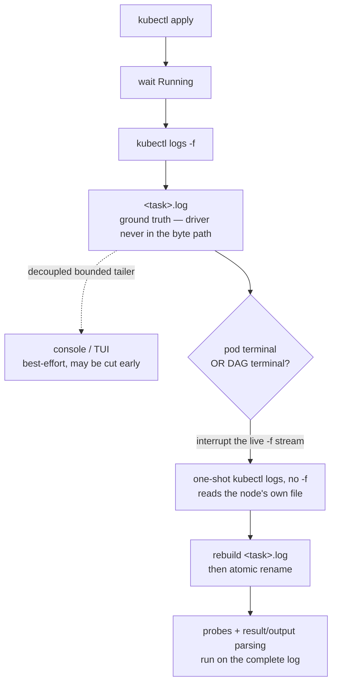

`sflow` creates a consistent output directory layout and injects built-in env vars into every task.

## Output directory structure

Default output root is `./sflow_output/` (relative to `--workspace-dir`, default: current directory).

For a real run (non dry-run):

- `<output_dir>/<run_id>/sflow.log`: global sflow log (orchestration and command/status lines; per-task subprocess output is intentionally excluded)
- `<output_dir>/<run_id>/sflow_summary.log`: live execution summary, updated during the run and finalized when the workflow exits
- `<output_dir>/<run_id>/sflow_monitor.log`: resource-monitor overview (only when `monitor:` is used; see [Monitor](./monitor.md))
- `<output_dir>/<run_id>/sflow_monitor/`: raw samples and per-monitor/per-task reports (only when `monitor:` is used)
- `<output_dir>/<run_id>/results.json`: workflow-level results index (only when any task declares [`result:`](./results.md))
- `<output_dir>/<run_id>/*_cmds.log`: command-only launch logs, grouped by command family such as `bash`, `slurm`, `docker`, `ssh`, or `python`
- `<output_dir>/<run_id>/<task>/<task>.log`: per-task log (full per-task stdout/stderr)
- `<output_dir>/<run_id>/<task>/result.json`: canonical per-task result (only when the task declares [`result:`](./results.md))
- `<output_dir>/<run_id>/...`: anything your scripts write

> **Per-task output routing:** a task's subprocess stdout/stderr is always written to its own `<task>/<task>.log`. It is **not** written to `sflow.log` (nor the Slurm `.out`/`.err` files), which are reserved for orchestration and command/status lines. In an interactive terminal (TTY) task output is also echoed live to the console, but in non-interactive/batch runs it goes only to the per-task log so `sflow.log` and Slurm stdout stay readable.

**Kubernetes log streaming (offloaded + decoupled).** Kubernetes is async — `kubectl apply`
returns immediately and log delivery lags execution. So the `k8s` operator **offloads** the
log off the driver's event loop and treats the on-disk file as ground truth:



- **The console/TUI stream may be cut early; the on-disk `<task>.log` is always made complete
  before anything parses it.** After pod status is final, sflow re-fetches each pod's whole
  container log (one-shot, not `-f`, so it isn't behind), rebuilds `<task>.log` (grouped per
  pod for multi-pod tasks), and atomically renames it into place — no duplication.
- **Exceptions** (the live-streamed content is kept as-is): a pod *cancelled* because the
  workflow ended, or one deleted out from under the driver so it can no longer be re-fetched.
- Long-lived services that reach `READY` are stopped (pods deleted) as soon as the workflow
  finishes, rather than lingering.

Dry-run does not `mkdir` anything; it only prints planned output paths.

After a successful run, `sflow run` prints the output folder, summary path, and any command-log paths. When a run fails or is interrupted after the workflow output directory exists, the same paths are printed on the error path so you can jump straight to diagnostics.

## Execution summary

`sflow_summary.log` is a terminal-friendly status report for the whole run. It is useful for quick triage because it collects the most important details in one place:

- workflow status, start/end time, duration, output directory, and task counts
- executable/runtime details, including package version, binary path, Python path, install mode, repo path, and git branch/commit when available
- task duration timeline and task event timeline
- probe traces — the last attempt of every readiness/failure probe — when any task defines probes
- GPU and node usage charts when resource placement data exists
- command-log paths
- workflow DAG and dependency list
- failure hints with task name, attempts, reason, and task log path when a task fails or is cancelled

Example `sflow_summary.log`:

```text
Sflow Summary
=============
Workflow : quickstart_dag
Status   : COMPLETED
Started  : 2026-05-22T12:31:32+08:00
Ended    : 2026-05-22T12:31:41+08:00
Duration : 9.017s
Output   : /workspace/sflow_output/quickstart_dag-20260522-123132-1ba51e
Tasks    : 6
Summary  : /workspace/sflow_output/quickstart_dag-20260522-123132-1ba51e/sflow_summary.log
Counts   : COMPLETED=6

Runtime
-------
sflow executable:
  version : 0.2.2.dev7+g0858dce39.d20260522
  bin     : /workspace/.venv/bin/sflow
  python  : /workspace/.venv/bin/python
  package : /workspace/.venv/lib/python3.12/site-packages/sflow
  install : direct-url
  source  : https://github.com/NVIDIA/nv-sflow.git@develop

Task Duration Chart
-------------------
prepare_data         |###...........................| 1.002s COMPLETED
preprocess           |.......####...................| 1.002s COMPLETED
train                |..............####............| 1.001s COMPLETED
evaluate_on_dataset1 |.....................#####....| 1.004s COMPLETED
evaluate_on_dataset2 |.....................#####....| 1.003s COMPLETED
export_model         |............................##| 0.002s COMPLETED

Timeline
--------
Time      Elapsed   Task                  Event      Summary
--------  --------  --------------------  ---------  -------------------------------
12:31:33  +01.001s  prepare_data          SUBMITTED  attempt=1
12:31:34  +02.003s  prepare_data          COMPLETED  exit=0
12:31:37  +05.007s  train                 SUBMITTED  attempt=1
12:31:38  +06.008s  train                 COMPLETED  exit=0
12:31:41  +09.017s  export_model          COMPLETED  exit=0

Command Logs
------------
bash: /workspace/sflow_output/quickstart_dag-20260522-123132-1ba51e/bash_cmds.log

Dependencies
------------
START -> prepare_data
prepare_data -> preprocess
preprocess -> train
train -> evaluate_on_dataset1
train -> evaluate_on_dataset2
evaluate_on_dataset1, evaluate_on_dataset2 -> export_model
```

When a task defines probes, a **Probe Traces (last attempt)** section is added after the
timeline. It keeps only the *last* attempt of each probe — enough to see what the probe
observed when the task went READY / timed out / failed, without flooding the log — and
refreshes live while a task sits RUNNING (so a readiness probe that never triggers still
shows its latest attempt). Each row is `task  phase  kind  status  runtime  detail`:

```text
Probe Traces (last attempt)
---------------------------
vllm_server  readiness  log_watch  [OK]     0.01s  matched 'Application startup complete' (1/1) | line: 'INFO: Application startup complete.'
vllm_server  failure    log_watch  [FAIL]   0.01s  no match (0/1) | last line: 'INFO: Started server process [42]'
bench        readiness  tcp_port   [OK]     0.00s  tcp 10.0.0.7:8000 open
```

The `detail` is probe-type specific: `log_watch` shows the matched line (or the last line
seen on a miss) and the running `matched/required` count; `tcp_port` / `http_get` /
`http_post` show the endpoint and its result. This is the first place to look when a task
hangs waiting on a probe or a readiness marker is never seen.

## Command logs

Command logs record launch commands without mixing in task stdout/stderr. They are grouped by command family and written only when matching commands are executed:

- `slurm_cmds.log` for `salloc`, `srun`, `scontrol`, `scancel`, and `sbatch`
- `bash_cmds.log` for `bash` / `sh`
- `docker_cmds.log` for Docker commands
- `ssh_cmds.log` for SSH commands
- `python_cmds.log` for Python commands
- `backend_cmds.log` for other backend commands

Each entry includes a timestamp, command family, task name when applicable, whether it used a shell, and the formatted command. Use these logs to reproduce launch commands or verify generated Slurm/container flags without scanning full task logs.

## Built-in env vars

These are always available inside task scripts:

- `SFLOW_WORKSPACE_DIR`: workspace root
- `SFLOW_OUTPUT_DIR`: output root (default: `<workspace>/sflow_output`)
- `SFLOW_WORKFLOW_OUTPUT_DIR`: per-run root (where `sflow.log` lives)
- `SFLOW_TASK_OUTPUT_DIR`: per-task dir (where `<task>.log` lives)
- `SFLOW_TASK_RESULT_FILE`: canonical per-task result file (`${SFLOW_TASK_OUTPUT_DIR}/result.json`) — write JSON here to publish results directly
- `SFLOW_WORKFLOW_RESULT_FILE`: workflow-level results index (`${SFLOW_WORKFLOW_OUTPUT_DIR}/results.json`)

This is the common subset. For the full set injected by sflow (backend/node/rank vars, `CUDA_VISIBLE_DEVICES`, etc.), see [Reserved Environment Variables](./quick-reference.md#reserved-environment-variables).

Example pattern:

```yaml
workflow:
  name: wf
  tasks:
    - name: write_files
      script:
        - echo "hello" > ${SFLOW_WORKFLOW_OUTPUT_DIR}/hello.txt
        - echo "task" > ${SFLOW_TASK_OUTPUT_DIR}/task.txt
```

## `task.outputs`: parse metrics from task logs (MVP)

> **Newer alternative:** [`task.result`](./results.md) is the consolidated successor to
> `task.outputs`. It uses regex (not `parse`) patterns, writes a canonical
> `result.json` plus a workflow-level `results.json` index, and also supports
> writing results directly to `$SFLOW_TASK_RESULT_FILE`. `task.outputs` still works and
> is unchanged; prefer `task.result` for new workflows.

`task.outputs` is the **legacy MVP** “metrics extraction” mechanism, superseded by
[`task.result`](./results.md). It still works unchanged and is **best-effort**:

- You declare one or more **parse-style patterns**
- After a task completes successfully, `sflow` scans the task log and extracts named fields
- The parsed outputs are written to `${SFLOW_TASK_OUTPUT_DIR}/outputs.json`

### Example: extract TTFT and throughput

```yaml
workflow:
  name: wf
  tasks:
    - name: benchmark
      script:
        - echo "TTFT: 42.5 ms"
        - echo "tok/s: 123.0"
      outputs:
        - pattern: "TTFT: {ttft:f} ms"
        - pattern: "tok/s: {tps:f}"
```

Result file:

- `${SFLOW_TASK_OUTPUT_DIR}/outputs.json`

It looks like:

```json
{
  "task": "benchmark",
  "specs": [
    { "pattern": "TTFT: {ttft:f} ms", "source": "stdout" },
    { "pattern": "tok/s: {tps:f}", "source": "stdout" }
  ],
  "outputs": {
    "ttft": 42.5,
    "tps": 123.0
  }
}
```

### Semantics (current MVP behavior)

- **Where it parses from**: the merged task log file (`${SFLOW_TASK_OUTPUT_DIR}/${task}.log`)
- **When it runs**: only after the task finishes with exit code 0
- **Multiple matches**: if the same key appears multiple times, you get a list; otherwise a scalar
- **Failure behavior**: missing log / parse errors return `{}` (best-effort; workflow does not fail)
- **Only `pattern` (and `source`) are honored**: an `outputs:` entry also accepts a `metrics:`
  sub-key (`description`/`type`/`aggregate`) in the schema, but it is currently **ignored at
  runtime** — no casting or aggregation is applied and it never reaches `outputs.json`. For
  typed, aggregated metrics use [`task.result`](./results.md) instead.

## Common gotchas (worth knowing)

- **Parallel tasks writing the same file**: if two tasks run in parallel and both write to the same path under
  `${SFLOW_WORKFLOW_OUTPUT_DIR}` (e.g. `metrics.txt`), you'll have a race/overwrite. Prefer either:
  - write per-task files under `${SFLOW_TASK_OUTPUT_DIR}`, or
  - give each task a unique filename under `${SFLOW_WORKFLOW_OUTPUT_DIR}`.
