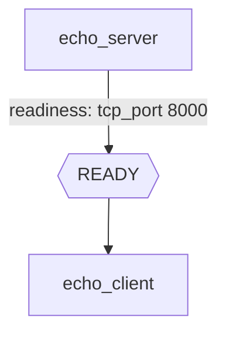
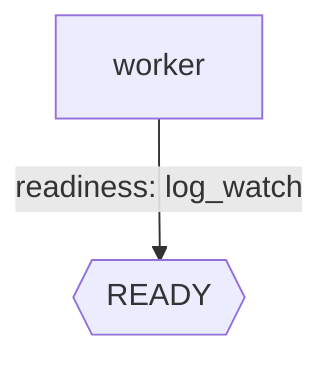

Probes let you gate task execution on an external condition, like:

- “wait until a TCP port is open”
- “wait until a log line appears”

You can use probes under:

- `probes.readiness`: wait before treating the task as ready (so dependents can run)
- `probes.failure`: mark task as failed early if a failure condition is met

## Readiness: TCP port probe

This is based on `tests/integration/guide/sflow_http_echo.yaml`:

```yaml
version: "0.1"

workflow:
  name: http_echo
  tasks:
    - name: echo_server
      script:
        - python3 -m http.server 8000
      probes:
        readiness:
          tcp_port:
            port: 8000
          timeout: 30
          interval: 1
    - name: echo_client
      depends_on: [echo_server]
      script:
        - curl -sf http://127.0.0.1:8000/ > /dev/null
```



## Readiness: log watch probe (+ retries)

This is based on `tests/integration/guide/sflow_dynamo.yaml`.

`log_watch` looks for a pattern in a task log file:

- default: watches the task's own log
- optional: watch another task's log by setting `logger` (must be a valid task name)
- by default: the pattern is treated as a **literal string match**
- to use a real regex: prefix the pattern with `re:` (or `regex:`)

```yaml
workflow:
  name: wf
  tasks:
    - name: worker
      script:
        - echo "Setting PyTorch memory fraction"
        - sleep 999
      probes:
        readiness:
          log_watch:
            regex_pattern: "Setting PyTorch memory fraction"
          timeout: 600
          interval: 10
      retries:
        count: 3
        interval: 10
        backoff: 2
```


