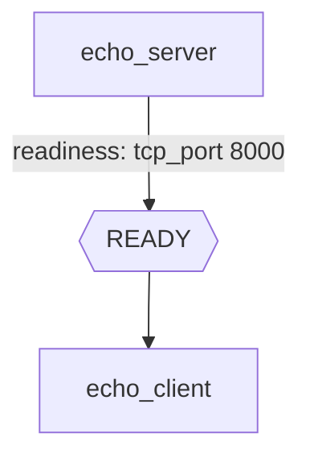
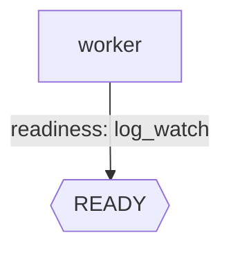

Probes let you gate task execution on an external condition, like:

- “wait until a TCP port is open”
- “wait until a log line appears”

You can use probes under:

- `probes.readiness`: wait before treating the task as ready (so dependents can run)
- `probes.failure`: mark task as failed early if a failure condition is met

## Readiness: TCP port probe

Example:

```yaml
version: "0.1"

workflow:
  name: http_echo
  tasks:
    - name: echo_server
      script:
        - python3 -m http.server 8000
      probes:
        readiness:
          tcp_port:
            port: 8000
          timeout: 30
          interval: 1
    - name: echo_client
      depends_on: [echo_server]
      script:
        - curl -sf http://127.0.0.1:8000/ > /dev/null
```



## Readiness: log watch probe (+ retries)

`log_watch` scans a task's log file for a matching string.

**Pattern field** — use one of (not both):

| Field | Description |
|-------|-------------|
| `regex_pattern` | Original field name |
| `match_pattern` | Alias (identical behavior, for forward compatibility) |

**Matching behavior:**

- By default the pattern is treated as a **literal string match** — characters like `(`, `)`, `.`, `*` are matched as-is, no escaping needed.
- To use a real regex, prefix the pattern with `re:` (or `regex:`).

| Pattern value | What it matches |
|---------------|-----------------|
| `"server started"` | Literal text `server started` |
| `"Traceback (most recent call last)"` | Literal text including the parentheses |
| `"re:worker_\\d+ ready"` | Regex: `worker_` followed by one or more digits, then ` ready` |
| `"regex:ERROR\|FATAL"` | Regex: `ERROR` or `FATAL` |

**Other options:**

- `logger`: watch another task's log instead of the current task's (must be a valid task name)
- `match_count`: number of times the pattern must appear before the probe passes (default `1`)

```yaml
workflow:
  name: wf
  tasks:
    - name: worker
      script:
        - echo "Setting PyTorch memory fraction"
        - sleep 999
      probes:
        readiness:
          log_watch:
            regex_pattern: "Setting PyTorch memory fraction"
          timeout: 600
          interval: 10
      retries:
        count: 3
        interval: 10
        backoff: 2
```


