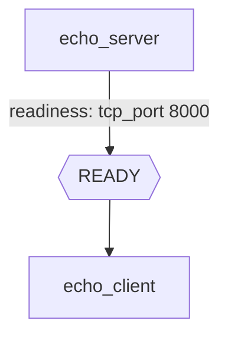
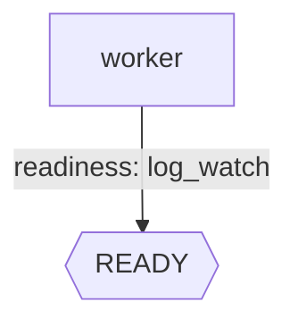

Probes let you gate task execution on an external condition, like:

- “wait until a TCP port is open”
- “wait until an HTTP endpoint returns success”
- “wait until a log line appears”
- “fail the workflow early when an error pattern appears”

You can use probes under:

- `probes.readiness`: wait before treating the task as ready (so dependents can run)
- `probes.failure`: mark task as failed early if a failure condition is met

Common timing options:

- `delay`: seconds before the first check (default `0`)
- `timeout`: overall readiness deadline in seconds (default `1200`). Only readiness probes time out the task.
- `each_check_timeout`: per-check timeout in seconds (default `30`)
- `interval`: seconds between checks (default `5`)
- `success_threshold`: consecutive successful readiness checks required (default `1`)
- `failure_threshold`: consecutive matching failure checks required (default `3`)

`readiness` may be a single probe or a list of probes. When multiple readiness probes are configured, the task becomes ready only after every readiness probe has triggered.

## Readiness: TCP port probe

Example:

```yaml
version: "0.1"

workflow:
  name: http_echo
  tasks:
    - name: echo_server
      script:
        - python3 -m http.server 8000
      probes:
        readiness:
          tcp_port:
            port: 8000
          timeout: 30
          interval: 1
    - name: echo_client
      depends_on: [echo_server]
      script:
        - curl -sf http://127.0.0.1:8000/ > /dev/null
```


```mermaid
flowchart TD
  echo_server[echo_server] -->|readiness: tcp_port 8000| ready{{READY}}
  ready --> echo_client[echo_client]
```

## Readiness: HTTP probes

Use `http_get` or `http_post` when an HTTP endpoint is a better health signal than an open port:

```yaml
workflow:
  name: http_ready
  tasks:
    - name: api_server
      script:
        - python -m my_server --port 8000
      probes:
        readiness:
          http_get:
            url: "http://127.0.0.1:8000/health"
            headers:
              Accept: application/json
          timeout: 120
          interval: 2
    - name: client
      depends_on: [api_server]
      script:
        - curl -sf http://127.0.0.1:8000/health
```

`http_post` supports the same `url` and `headers` fields plus an optional `body`:

```yaml
probes:
  readiness:
    http_post:
      url: "http://127.0.0.1:8000/v1/health"
      headers:
        Content-Type: application/json
      body: '{"ping": true}'
```

## Readiness: log watch probe (+ retries)

`log_watch` scans a task's log file for a matching string.

**Pattern field** — use one of (not both):

| Field | Description |
|-------|-------------|
| `regex_pattern` | Original field name |
| `match_pattern` | Alias (identical behavior, for forward compatibility) |

**Matching behavior:**

- By default the pattern is treated as a **literal string match** — characters like `(`, `)`, `.`, `*` are matched as-is, no escaping needed.
- To use a real regex, prefix the pattern with `re:` (or `regex:`).

| Pattern value | What it matches |
|---------------|-----------------|
| `"server started"` | Literal text `server started` |
| `"Traceback (most recent call last)"` | Literal text including the parentheses |
| `"re:worker_\\d+ ready"` | Regex: `worker_` followed by one or more digits, then ` ready` |
| `"regex:ERROR\|FATAL"` | Regex: `ERROR` or `FATAL` |

**Other options:**

- `logger`: watch another task's log instead of the current task's (must be a valid task name)
- `match_count`: number of times the pattern must appear before the probe passes (default `1`)

```yaml
workflow:
  name: wf
  tasks:
    - name: worker
      script:
        - echo "Setting PyTorch memory fraction"
        - sleep 999
      probes:
        readiness:
          log_watch:
            regex_pattern: "Setting PyTorch memory fraction"
          timeout: 600
          interval: 10
      retries:
        count: 3
        interval: 10
        backoff: 2
```


```mermaid
flowchart TD
  worker[worker] -->|readiness: log_watch| ready{{READY}}
```

## Failure probes

Failure probes watch for conditions that should stop the workflow early. A common pattern is to watch long-running server logs for tracebacks or fatal errors:

```yaml
workflow:
  name: wf
  tasks:
    - name: server
      script:
        - start_server.sh
      probes:
        readiness:
          log_watch:
            match_pattern: "server ready"
          timeout: 600
        failure:
          log_watch:
            match_pattern: "Traceback (most recent call last)"
            match_count: 1
          interval: 2
          failure_threshold: 1
    - name: benchmark
      depends_on: [server]
      script:
        - run_benchmark.sh
```

When a failure probe triggers, sflow marks the task as failed by probe and cancels downstream work through fail-fast. Failure probes do not use the overall `timeout` as a deadline; they keep checking while the task is running. `each_check_timeout` still applies to each individual check.

## Replicas and HTTP probe deduplication

For parallel replicas, identical HTTP probes that do not reference per-replica values are checked once on the first replica and propagated to follower replicas. This avoids sending the same health check N times when all replicas share one service endpoint.

sflow keeps a separate HTTP probe on every replica when the probe references a per-replica value such as:

- a swept variable from `replicas.variables`
- `SFLOW_REPLICA_INDEX`

TCP probes always stay per replica because each replica may expose a different port or node binding.
