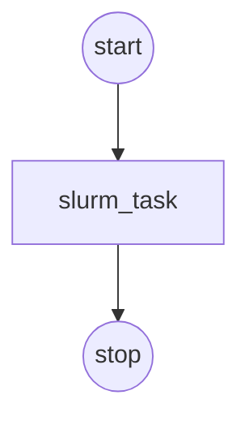
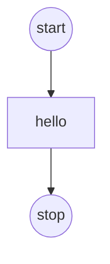
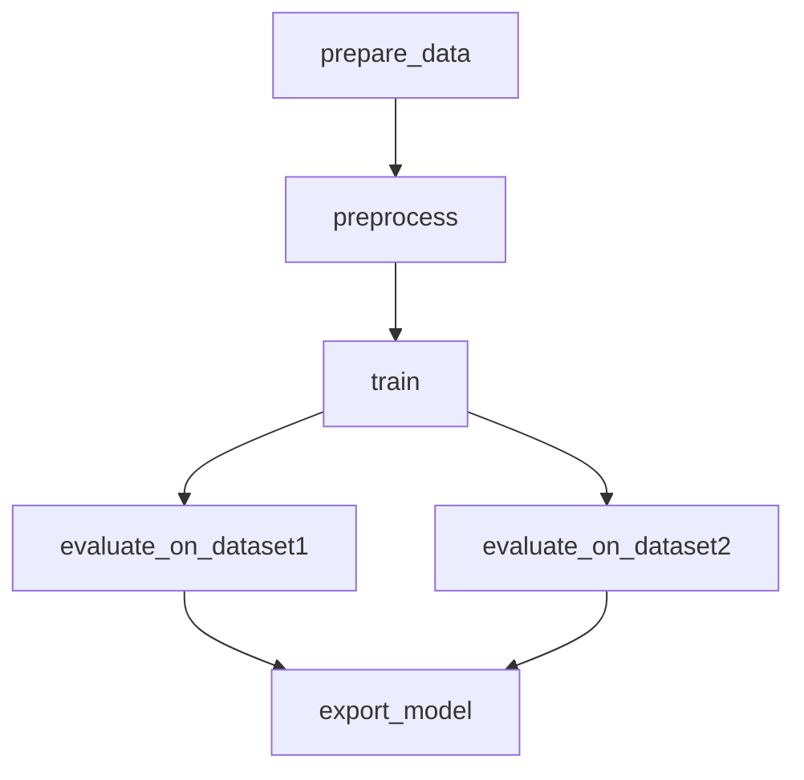

This guide covers two ways to run `sflow`:

- **Part I: Slurm Cluster** – Production workflows on HPC clusters (recommended for most users)
- **Part II: Local Backend** – Testing and development without Slurm

---

# Part I: Slurm Cluster

Most `sflow` users run workflows on Slurm clusters. This section gets you started with Slurm.

## 1) Setup Python Environment and uv

Login to your cluster login node, and open a bash terminal.

```bash
# Make sure your cluster have python 3.10 or newer
mkdir -p sflow_workspace
cd sflow_workspace
curl -LsSf https://astral.sh/uv/install.sh | sh
uv --help
```

If you meet problems with curl way of installing uv, try pip instead, this might not work on some high security level clusters

```bash
# You don't need to run this if above sh install for uv worked fine
mkdir -p sflow_workspace
cd sflow_workspace
pip install uv
uv --help
```

## 2) Install sflow

Create a venv for sflow and install python wheels.

```bash
uv venv --python python3
source .venv/bin/activate
# Install the latest sflow version
uv pip install "sflow @ git+https://github.com/NVIDIA/nv-sflow.git@main"
sflow --help
```

## 3) Prepare a Slurm Workflow

You can use `sflow sample` to quickly get a starter workflow:

```bash
# List all available samples
sflow sample --list

# Copy a sample to your current directory
sflow sample slurm_dynamo_trtllm_disagg
```

Or create a minimal Slurm config manually:

```yaml
version: "0.1"

backends:
  - name: slurm_cluster
    type: slurm
    default: true
    account: "your_slurm_account"
    partition: "your_slurm_partition"
    time: "00:10:00"
    nodes: 1

workflow:
  name: wf
  tasks:
    - name: slurm_task
      script:
        - echo hello
```



Notes:

- Update `account/partition/time/nodes` to match your cluster.
- If you're already inside a Slurm allocation, `sflow` will reuse it; otherwise it will call `salloc` first.

## 4) Run on Slurm (Interactive)

```bash
sflow run --file sflow.yaml --tui
```

The TUI shows:

- Left: task status table + backend allocation summary
- Right: auto-tail logs (timestamp + level + module/logger)

For headless mode (automated jobs), run without `--tui`:

```bash
sflow run --file sflow.yaml
```

## 5) Batch Mode: Fire-and-Forget Slurm Jobs

For long-running or production workflows, `sflow batch` generates a complete sbatch script with proper environment setup and job submission. This is the **recommended way** to run production workloads.

### Why Use Batch Mode?

- **Fire-and-forget**: Submit the job and disconnect; it runs headlessly
- **Automatic environment setup**: Creates/activates a Python venv on compute nodes, this solves the python and lib difference often seen in clusters (e.g., login vs compute nodes)
- **Dry-run validation**: Validates the workflow before running to fail early
- **Portable scripts**: Generated scripts can be saved, reviewed, and resubmitted

### Basic Usage

Generate an sbatch script to stdout:

```bash
sflow batch --file workflow.yaml
```

Save to a file:

```bash
sflow batch --file workflow.yaml --sbatch-path run_workflow.sh
```

Generate and submit immediately:

```bash
sflow batch --file workflow.yaml --sbatch-path run_workflow.sh --submit
```

Add extra slurm flags if required when submitting jobs in some cluster:

```bash
sflow batch --file workflow.yaml --sbatch-path run_workflow.sh -e '--exclusive' -e '--gpus-per-node=8' -e '--segment=8'
```

### Full Example with Slurm Options

```bash
sflow batch \
  --file examples/slurm_sglang_server_client.yaml \
  --partition gpu \
  --account myaccount \
  --time 02:00:00 \
  --nodes 2 \
  --gpus-per-node 8 \
  --job-name my-inference-job \
  --sbatch-path run_inference.sh \
  --submit
```

### With Variable Overrides

Override workflow variables at submission time:

```bash
sflow batch \
  --file workflow.yaml \
  --set NUM_GPUS=8 \
  --set MODEL_NAME=llama-70b \
  --sbatch-path run.sh
```

### Custom Virtual Environment

If you have a pre-configured venv (important for clusters with different architectures like x86 login nodes and arm64 compute nodes):

```bash
sflow batch \
  --file workflow.yaml \
  --sflow-venv-path /path/to/arm64/.venv \
  --sbatch-path run.sh
```

### What the Generated Script Does

1. **Sets sbatch directives**: job name, output/error files, partition, account, time limit
2. **Activates or creates a Python venv**: Uses existing `.sflow_venv/` or creates one with sflow installed
3. **Runs dry-run validation**: Catches configuration errors before the full run
4. **Executes the workflow**: Runs `sflow run` with all provided options

### Common Options

| Option | Description |
|--------|-------------|
| `--file`, `-f` | Path to the sflow.yaml workflow file |
| `--sbatch-path`, `-o` | Write sbatch script to file (required for `--submit`) |
| `--submit` | Submit the job immediately after generating |
| `--partition`, `-p` | Slurm partition |
| `--account`, `-A` | Slurm account |
| `--time` | Time limit (e.g., `02:00:00`) |
| `--nodes`, `-N` | Number of nodes for the sbatch job |
| `--gpus-per-node`, `-G` | Number of GPUs per node |
| `--job-name`, `-J` | Slurm job name (default: `sflow`) |
| `--set`, `-s` | Override variable (can be repeated) |
| `--artifact`, `-a` | Override artifact URI (can be repeated) |
| `--sflow-venv-path`, `-v` | Path to existing Python venv |

### Monitoring Batch Jobs

After submission, monitor your job with standard Slurm commands:

```bash
squeue -u $USER           # Check job status
scancel <job_id>          # Cancel a job
tail -f sflow_output/sflow-<job_id>.out  # Follow output logs
```

## 6) Validate Only (Dry-Run)

```bash
sflow run --file sflow.yaml --dry-run
```

Dry-run does not create output directories/files. It prints the execution plan and computed output paths.

---

# Part II: Local Backend

For testing and development, you can run workflows locally without Slurm.

## 1) Prepare a Minimal Local Workflow

Get a starter workflow using `sflow sample`:

```bash
sflow sample local_hello_world
```

Or create a minimal config manually:

```yaml
version: "0.1"

workflow:
  name: wf
  tasks:
    - name: hello
      script:
        - echo hello
```



Notes:

- This uses defaults (local backend + inline script). See the [backends](backends.md) page for explicit backend configuration.

## 2) Run Locally

```bash
sflow run --file sflow.yaml --tui
```

Default output structure:

- `./sflow_output/<run_id>/`: per-run root directory
- `./sflow_output/<run_id>/<task_name>/`: per-task directory (stdout/stderr go to `<task_name>.log`)

## 3) Example: DAG Workflow with `depends_on`

The minimal example runs a single task. Below is the smallest "real workflow" example showing a DAG using training-style step names:

- `prepare_data` → `preprocess` → `train` → (`evaluate_on_dataset1`, `evaluate_on_dataset2`) → `export_model`

This also demonstrates variables in both forms:

- expression: `${{ variables.MODEL_NAME }}`
- env var (in task script): `${MODEL_NAME}`

Or get it directly using `sflow sample`:

```bash
sflow sample local_dag
```


```yaml
version: "0.1"

variables:
  - name: MODEL_NAME
    type: string
    value: tiny-transformer

workflow:
  name: quickstart_dag
  tasks:
    - name: prepare_data
      script:
        - echo "prepare_data start"
        - echo "model(jinja)=${{ variables.MODEL_NAME }}" > ${SFLOW_WORKFLOW_OUTPUT_DIR}/dataset.txt
        - echo "model(shell)=${MODEL_NAME}" >> ${SFLOW_WORKFLOW_OUTPUT_DIR}/dataset.txt

    - name: preprocess
      depends_on: [prepare_data]
      script:
        - test -f ${SFLOW_WORKFLOW_OUTPUT_DIR}/dataset.txt
        - grep -q "model(jinja)=tiny-transformer" ${SFLOW_WORKFLOW_OUTPUT_DIR}/dataset.txt
        - grep -q "model(shell)=tiny-transformer" ${SFLOW_WORKFLOW_OUTPUT_DIR}/dataset.txt
        - echo "encoded_data ok" > ${SFLOW_WORKFLOW_OUTPUT_DIR}/encoded.txt

    - name: train
      depends_on: [preprocess]
      script:
        - test -f ${SFLOW_WORKFLOW_OUTPUT_DIR}/encoded.txt
        - echo "checkpoint for ${MODEL_NAME}" > ${SFLOW_WORKFLOW_OUTPUT_DIR}/checkpoint.pt

    - name: evaluate_on_dataset1
      depends_on: [train]
      script:
        - test -f ${SFLOW_WORKFLOW_OUTPUT_DIR}/checkpoint.pt
        - echo "accuracy=0.99 dataset=dataset1" > ${SFLOW_TASK_OUTPUT_DIR}/metrics.txt

    - name: evaluate_on_dataset2
      depends_on: [train]
      script:
        - test -f ${SFLOW_WORKFLOW_OUTPUT_DIR}/checkpoint.pt
        - echo "accuracy=0.88 dataset=dataset2" > ${SFLOW_TASK_OUTPUT_DIR}/metrics.txt

    - name: export_model
      depends_on: [evaluate_on_dataset1, evaluate_on_dataset2]
      script:
        - test -f ${SFLOW_WORKFLOW_OUTPUT_DIR}/evaluate_on_dataset1/metrics.txt
        - test -f ${SFLOW_WORKFLOW_OUTPUT_DIR}/evaluate_on_dataset2/metrics.txt
        - echo "exported ${MODEL_NAME}" > ${SFLOW_WORKFLOW_OUTPUT_DIR}/model.onnx
```



Run it:

```bash
sflow run --file local_dag.yaml
```

If you want to visualize the DAG without running it:

```bash
sflow visualize --file local_dag.yaml --format mermaid
```

## 4) Validate Only (Dry-Run)

```bash
sflow run --file sflow.yaml --dry-run
```

Dry-run does not create output directories/files. It prints the execution plan and computed output paths.
