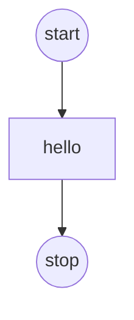
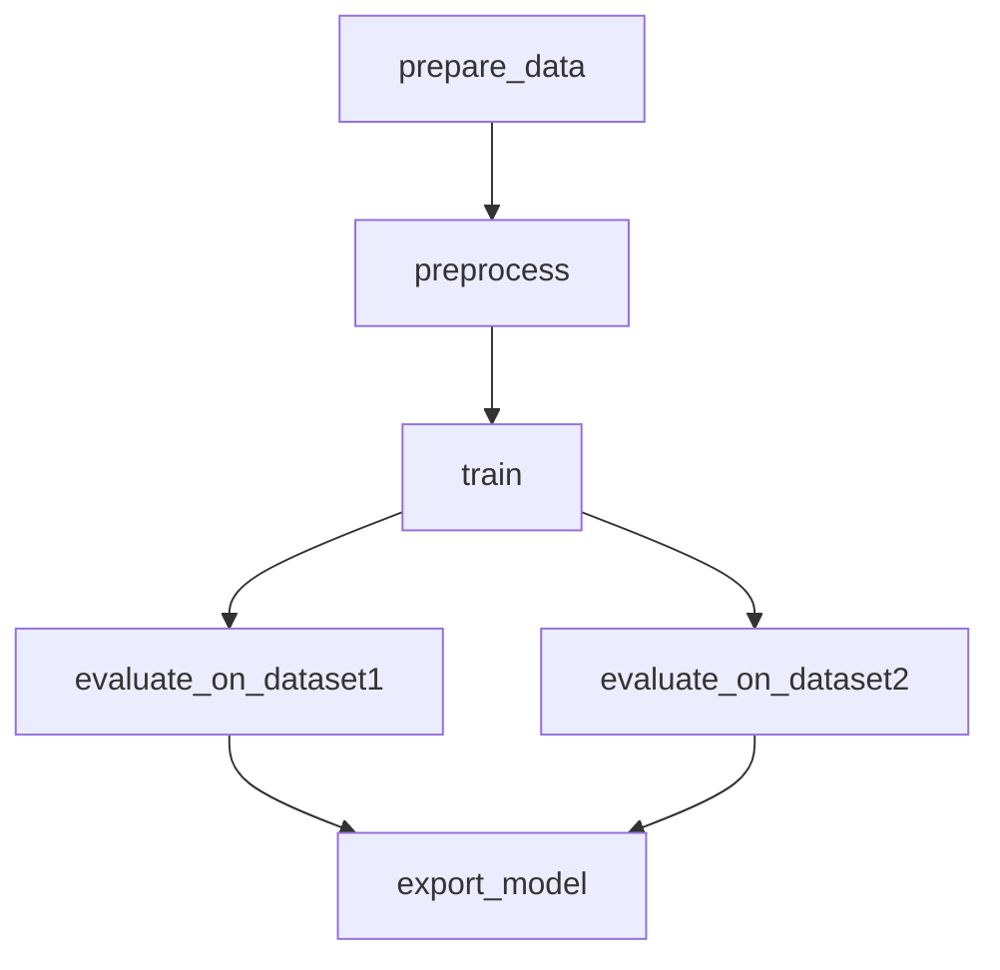
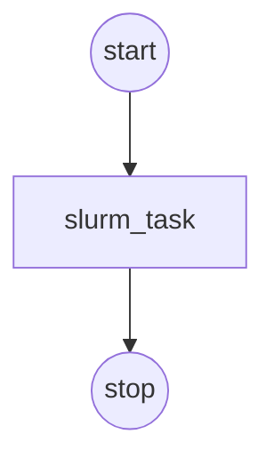

## One-Minute Mindset

`sflow` lets you describe a multi-step workflow in a single YAML file and run it on **any compute backend** — your laptop today, a Slurm cluster tomorrow — without rewriting scripts.

**Core ideas:**

| Concept | What it does | Example |
|---------|-------------|---------|
| **Backend** | Declares *where* tasks run. Swap one line to move between local and Slurm. | `type: slurm`, `partition: gpu` |
| **Operator** | Declares *how* a task's script is launched. Each backend has a default (local → `bash`, Slurm → `srun`). Define named operators to preset flags and reuse them across tasks. | `type: srun`, `ntasks: 4` |
| **Variable** | A named value reusable everywhere — scripts, resource counts, backend config. Override from the CLI with `--set`. | `NUM_GPUS: 8` |
| **Task & DAG** | Each task is a unit of work with a script. `depends_on` wires them into a directed graph so sflow runs them in the right order. | `depends_on: [train]` |
| **Probe** | A readiness or failure check attached to a task. Downstream tasks wait until the probe passes. Built-ins: TCP port, HTTP endpoint, log pattern match. | `type: tcp_port`, `port: 8080` |
| **Resource placement** | Topology-aware: sflow assigns nodes and GPUs automatically after allocation, packing tasks contiguously to respect node boundaries. Assigned resources are exposed as variables. | `${{ backends.slurm_cluster.nodes[0].ip_address }}` |

**Why not just write a bash script?**
A bash script hard-wires node names, GPU indices, and execution order. With sflow you declare what you want; it handles allocation, node discovery, GPU assignment, dependency ordering, log collection, and retries — the same YAML works locally for debugging and on Slurm for production.

---

## Install sflow

```bash
mkdir -p sflow_workspace && cd sflow_workspace
curl -LsSf https://astral.sh/uv/install.sh | sh
uv venv --python python3
source .venv/bin/activate
uv pip install "sflow @ git+https://github.com/NVIDIA/nv-sflow.git@main"
sflow --help
```

If `curl` is unavailable (e.g. on some locked-down clusters), install `uv` via pip instead:

```bash
pip install uv
```

---

This guide teaches sflow in two parts:

- **Part I: Learn the Basics Locally** – Write workflows, build DAGs, add variables — no cluster needed
- **Part II: Run on Slurm** – Take the same config to a real HPC cluster

---

## Part I: Learn the Basics Locally

Start here to learn sflow concepts without needing a Slurm cluster.

### 1. Start with a Plain-Text Config

The fastest way to learn sflow is to start with **hardcoded values** — no variables, no expressions. Get the workflow logic right first.

```yaml
version: "0.1"

workflow:
  name: wf
  tasks:
    - name: hello
      script:
        - echo hello
```



Validate and run:

```bash
sflow run --file sflow.yaml --dry-run   # validate first
sflow run --file sflow.yaml --tui       # run with TUI
```

Default output structure:

- `./sflow_output/<run_id>/`: per-run root directory
- `./sflow_output/<run_id>/<task_name>/`: per-task directory (stdout/stderr go to `<task_name>.log`)

### 2. Build a DAG with `depends_on`

Add multiple tasks and wire them with `depends_on`. Start with plain text — hardcode everything:

```yaml
version: "0.1"

workflow:
  name: training_pipeline
  tasks:
    - name: prepare_data
      script:
        - echo "Downloading cifar10..."
        - echo "cifar10" > ${SFLOW_WORKFLOW_OUTPUT_DIR}/dataset.txt

    - name: preprocess
      depends_on: [prepare_data]
      script:
        - test -f ${SFLOW_WORKFLOW_OUTPUT_DIR}/dataset.txt
        - echo "encoded_data ok" > ${SFLOW_WORKFLOW_OUTPUT_DIR}/encoded.txt

    - name: train
      depends_on: [preprocess]
      script:
        - test -f ${SFLOW_WORKFLOW_OUTPUT_DIR}/encoded.txt
        - echo "checkpoint for tiny-transformer" > ${SFLOW_WORKFLOW_OUTPUT_DIR}/checkpoint.pt

    - name: evaluate_on_dataset1
      depends_on: [train]
      script:
        - test -f ${SFLOW_WORKFLOW_OUTPUT_DIR}/checkpoint.pt
        - echo "accuracy=0.99 dataset=dataset1" > ${SFLOW_TASK_OUTPUT_DIR}/metrics.txt

    - name: evaluate_on_dataset2
      depends_on: [train]
      script:
        - test -f ${SFLOW_WORKFLOW_OUTPUT_DIR}/checkpoint.pt
        - echo "accuracy=0.88 dataset=dataset2" > ${SFLOW_TASK_OUTPUT_DIR}/metrics.txt

    - name: export_model
      depends_on: [evaluate_on_dataset1, evaluate_on_dataset2]
      script:
        - test -f ${SFLOW_WORKFLOW_OUTPUT_DIR}/evaluate_on_dataset1/metrics.txt
        - test -f ${SFLOW_WORKFLOW_OUTPUT_DIR}/evaluate_on_dataset2/metrics.txt
        - echo "exported tiny-transformer" > ${SFLOW_WORKFLOW_OUTPUT_DIR}/model.onnx
```



Always validate first, then run:

```bash
sflow run --file pipeline.yaml --dry-run
sflow run --file pipeline.yaml --tui
```

Visualize the DAG without running:

```bash
sflow visualize --file pipeline.yaml --format mermaid
```

### 3. Extract Variables for Reusability

Once the plain-text config works, identify values that you'd want to change between runs
and extract them into `variables`. This makes the config reusable without editing the YAML each time.

**Before (hardcoded):**
```yaml
    - name: train
      script:
        - echo "checkpoint for tiny-transformer" > ${SFLOW_WORKFLOW_OUTPUT_DIR}/checkpoint.pt
```

**After (parameterized):**
```yaml
variables:
  MODEL_NAME:
    description: "Model to train"
    value: tiny-transformer

workflow:
  tasks:
    - name: train
      script:
        - echo "checkpoint for ${MODEL_NAME}" > ${SFLOW_WORKFLOW_OUTPUT_DIR}/checkpoint.pt
```

Now you can override the value from the CLI without touching the file:

```bash
sflow run -f pipeline.yaml --set MODEL_NAME=large-transformer --tui
```

Variables can be used in two ways:
- **In YAML fields** (resolved before execution): `${{ variables.MODEL_NAME }}`
- **In scripts** (as env var at runtime): `${MODEL_NAME}`

Here's the full parameterized version (or get it via `sflow sample local_dag`):

```yaml
version: "0.1"

variables:
  MODEL_NAME:
    description: "Model to train"
    value: tiny-transformer

workflow:
  name: quickstart_dag
  tasks:
    - name: prepare_data
      script:
        - echo "prepare_data start"
        - echo "model=${{ variables.MODEL_NAME }}" > ${SFLOW_WORKFLOW_OUTPUT_DIR}/dataset.txt

    - name: preprocess
      depends_on: [prepare_data]
      script:
        - test -f ${SFLOW_WORKFLOW_OUTPUT_DIR}/dataset.txt
        - echo "encoded_data ok" > ${SFLOW_WORKFLOW_OUTPUT_DIR}/encoded.txt

    - name: train
      depends_on: [preprocess]
      script:
        - test -f ${SFLOW_WORKFLOW_OUTPUT_DIR}/encoded.txt
        - echo "checkpoint for ${MODEL_NAME}" > ${SFLOW_WORKFLOW_OUTPUT_DIR}/checkpoint.pt

    - name: evaluate_on_dataset1
      depends_on: [train]
      script:
        - test -f ${SFLOW_WORKFLOW_OUTPUT_DIR}/checkpoint.pt
        - echo "accuracy=0.99 dataset=dataset1" > ${SFLOW_TASK_OUTPUT_DIR}/metrics.txt

    - name: evaluate_on_dataset2
      depends_on: [train]
      script:
        - test -f ${SFLOW_WORKFLOW_OUTPUT_DIR}/checkpoint.pt
        - echo "accuracy=0.88 dataset=dataset2" > ${SFLOW_TASK_OUTPUT_DIR}/metrics.txt

    - name: export_model
      depends_on: [evaluate_on_dataset1, evaluate_on_dataset2]
      script:
        - test -f ${SFLOW_WORKFLOW_OUTPUT_DIR}/evaluate_on_dataset1/metrics.txt
        - test -f ${SFLOW_WORKFLOW_OUTPUT_DIR}/evaluate_on_dataset2/metrics.txt
        - echo "exported ${MODEL_NAME}" > ${SFLOW_WORKFLOW_OUTPUT_DIR}/model.onnx
```

:::tip Recommended Approach
**Plain text first, variables second.** Start every new workflow with hardcoded values.
Once it runs successfully, extract the values you want to change into `variables`.
This makes debugging much easier — you know the recipe works before adding abstraction.
:::

### 4. Validate Only (Dry-Run)

```bash
sflow run --file sflow.yaml --dry-run
```

Dry-run does not create output directories/files. It prints the execution plan and computed output paths.

---

## Part II: Slurm Cluster

Take the same workflow concepts to a real HPC cluster. Make sure you have already installed sflow (see [Install sflow](#install-sflow) above).

### 1. Prepare a Slurm Workflow


**How it works (Slurm example):**

```
┌─────────────────────────────────────────────────────────┐
│  workflow.yaml                                          │
│                                                         │
│  variables:          backends:          workflow:       │
│    NUM_GPUS: 8         type: slurm        tasks:        │
│    MODEL: llama        partition: gpu      - train      │
│                        nodes: 2            - evaluate   │
│                                            - export     │
└──────────────────────────┬──────────────────────────────┘
                           │  sflow run -f workflow.yaml
                           ▼
              ┌────────────────────────┐
              │  1. Resolve variables  │
              │  2. Allocate (salloc)  │
              │  3. Place tasks on GPUs│
              │  4. Execute DAG        │
              └────────────────────────┘
```

Start with a plain-text config — hardcode your actual cluster values. No variables yet.

```yaml
version: "0.1"

backends:
  - name: slurm_cluster
    type: slurm
    default: true
    account: "your_slurm_account"
    partition: "your_slurm_partition"
    time: "00:10:00"
    nodes: 1

workflow:
  name: wf
  tasks:
    - name: slurm_task
      script:
        - echo hello
```



Notes:

- Update `account/partition/time/nodes` to match your cluster.
- If you're already inside a Slurm allocation, `sflow` will reuse it; otherwise it will call `salloc` first.
- The backend also supports `extra_args` to pass arbitrary flags to `salloc`:

```yaml
backends:
  - name: slurm_cluster
    type: slurm
    default: true
    account: "your_slurm_account"
    partition: "your_slurm_partition"
    time: "01:00:00"
    nodes: 2
    extra_args:
      - "--exclusive"
      - "--gpus-per-node=8"
      - "--segment=8"
```

Once the plain-text config works, you can extract account, partition, nodes, etc. into variables (same pattern as Part I step 4) to make it reusable across clusters.

You can also use `sflow sample` to get starter workflows with variables already set up:

```bash
sflow sample --list
sflow sample slurm_dynamo_trtllm_disagg
```

### 2. Operators & srun — How Your Script Actually Runs

On a Slurm backend the default operator is **srun**. sflow takes your task's `script:` lines and wraps them into:

```bash
srun [flags from operator config] bash -c "<your script lines>"
```

Operator config fields map **directly** to srun flags, so you never have to hand-craft srun commands:

| Operator config | srun flag | Purpose |
|-----------------|-----------|---------|
| `ntasks` | `--ntasks` | Number of task slots |
| `ntasks_per_node` | `--ntasks-per-node` | Tasks per node |
| `gpus_per_task` | `--gpus-per-task` | GPUs per task slot |
| `cpus_per_task` | `--cpus-per-task` | CPU cores per task |
| `nodes` | `--nodes` | Node count for this step |
| `container_image` | `--container-image` | Pyxis container (enroot) |
| `mpi` | `--mpi` | MPI type (e.g. `pmix`) |
| `extra_args` | *(pass-through)* | Any other srun flag |

`extra_args` is a list that passes arbitrary srun flags not covered by the named fields:

```yaml
operators:
  - name: custom_worker
    type: srun
    ntasks_per_node: 1
    extra_args:
      - --exclusive
      - --mem-per-gpu=80G
      - --container-image=nvcr.io/nvidia/pytorch:24.05-py3
      - --container-mounts=/data:/data:ro
```

You can define **named operators** once and reference them by name in tasks — or override individual fields per task:

```yaml
operators:
  - name: gpu_worker
    type: srun
    ntasks_per_node: 1
    gpus_per_task: 1
    container_image: nvcr.io/nvidia/pytorch:24.05-py3

workflow:
  tasks:
    - name: train
      operator: gpu_worker          # uses the preset above
      script:
        - torchrun train.py

    - name: inference
      operator:                     # inline override
        name: gpu_worker
        ntasks: 8                   # override just this field
      script:
        - python infer.py
```

Without sflow, the equivalent `train` task would require you to manually write:

```bash
srun --jobid=$SLURM_JOB_ID --nodes=1 --ntasks-per-node=1 --gpus-per-task=1 \
     --container-image=nvcr.io/nvidia/pytorch:24.05-py3 \
     bash -c "torchrun train.py"
```

sflow builds this command for you from the declarative config.

### 3. Run on Slurm (Interactive)

Before running, make sure you have updated the workflow YAML for your environment:

- **Slurm settings**: set `account` and `partition` to values valid on your cluster
- **Model paths**: update any model or data paths to locations accessible from your compute nodes
- **Container images**: if the workflow uses a container operator, update the image tag to the version you need
- **Extra args**: Some of the cluster need to add --gpus-per-node flag when requesting GPU partition, remember to add this in backend.extra_args which accepts a list of extra args 

**Validate first with a dry-run** to catch config errors without allocating nodes:

```bash
sflow run --file sflow.yaml --dry-run
```

Once validation passes, launch the workflow:

```bash
sflow run --file sflow.yaml --tui
```

The TUI shows:

- Left: task status table + backend allocation summary
- Right: auto-tail logs (timestamp + level + module/logger)


For headless mode (automated jobs), run without `--tui`:

```bash
sflow run --file sflow.yaml
```

:::tip Container Registry Authentication
If your workflow pulls images from a private registry (e.g. `nvcr.io`), you need to configure enroot credentials on the cluster **before** running. Create or edit `~/.config/enroot/.credentials`:

```
machine nvcr.io login $oauthtoken password <your-ngc-api-key>
```

Replace the machine/credentials for whichever registry your images come from. Without this file, `srun --container-image` will fail to pull private images.
:::

### 4. Batch Mode: Fire-and-Forget Slurm Jobs

For long-running or production workflows, `sflow batch` generates a complete sbatch script with proper environment setup and job submission. This is the **recommended way** to run production workloads.

#### Why Use Batch Mode?

- **Fire-and-forget**: Submit the job and disconnect; it runs headlessly
- **Automatic environment setup**: Creates/activates a Python venv on compute nodes, this solves the python and lib difference often seen in clusters (e.g., login vs compute nodes)
- **Dry-run validation**: Validates the workflow before running to fail early
- **Portable scripts**: Generated scripts can be saved, reviewed, and resubmitted

#### Basic Usage

Generate an sbatch script to stdout:

```bash
sflow batch --file workflow.yaml
```

Save to a file:

```bash
sflow batch --file workflow.yaml --sbatch-path run_workflow.sh
```

Generate and submit immediately:

```bash
sflow batch --file workflow.yaml --sbatch-path run_workflow.sh --submit
```

Add extra slurm flags if required when submitting jobs in some cluster:

```bash
sflow batch --file workflow.yaml --sbatch-path run_workflow.sh -e '--exclusive' -e '--gpus-per-node=8' -e '--segment=8'
```

#### Full Example with Slurm Options

```bash
sflow batch \
  --file examples/slurm_sglang_server_client.yaml \
  --partition gpu \
  --account myaccount \
  --time 02:00:00 \
  --nodes 2 \
  --gpus-per-node 4 \
  --job-name my-inference-job \
  --sbatch-path run_inference.sh \
  --submit
```

> Note: `--gpus-per-node` (`-G`) sets the cluster topology for sflow's resource planning (default: 4). It does NOT add a `#SBATCH --gpus-per-node` directive. If your cluster requires that directive, add it via `-e '--gpus-per-node=4'`.

#### With Variable Overrides

Override workflow variables at submission time:

```bash
sflow batch \
  --file workflow.yaml \
  --set NUM_GPUS=8 \
  --set MODEL_NAME=llama-70b \
  --sbatch-path run.sh
```

#### Custom Virtual Environment

If you have a pre-configured venv (important for clusters with different architectures like x86 login nodes and arm64 compute nodes):

```bash
sflow batch \
  --file workflow.yaml \
  --sflow-venv-path /path/to/arm64/.venv \
  --sbatch-path run.sh
```

#### What the Generated Script Does

1. **Sets sbatch directives**: job name, output/error files, partition, account, time limit
2. **Activates or creates a Python venv**: Uses existing `.sflow_venv/` or creates one with sflow installed
3. **Runs dry-run validation**: Catches configuration errors before the full run
4. **Executes the workflow**: Runs `sflow run` with all provided options

#### Common Options

| Option | Description |
|--------|-------------|
| `--file`, `-f` | Path to the sflow.yaml workflow file |
| `--sbatch-path`, `-o` | Write sbatch script to file (required for `--submit`) |
| `--submit` | Submit the job immediately after generating |
| `--partition`, `-p` | Slurm partition |
| `--account`, `-A` | Slurm account |
| `--time` | Time limit (e.g., `02:00:00`) |
| `--nodes`, `-N` | Number of nodes for the sbatch job |
| `--gpus-per-node`, `-G` | Number of GPUs per node |
| `--job-name`, `-J` | Slurm job name (default: `sflow`) |
| `--set`, `-s` | Override variable (can be repeated) |
| `--artifact`, `-a` | Override artifact URI (can be repeated) |
| `--sflow-venv-path`, `-v` | Path to existing Python venv |

#### Monitoring Batch Jobs

After submission, monitor your job with standard Slurm commands:

```bash
squeue -u $USER           # Check job status
scancel <job_id>          # Cancel a job
tail -f sflow_output/sflow-<job_id>.out  # Follow output logs
```

