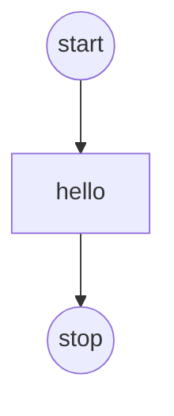
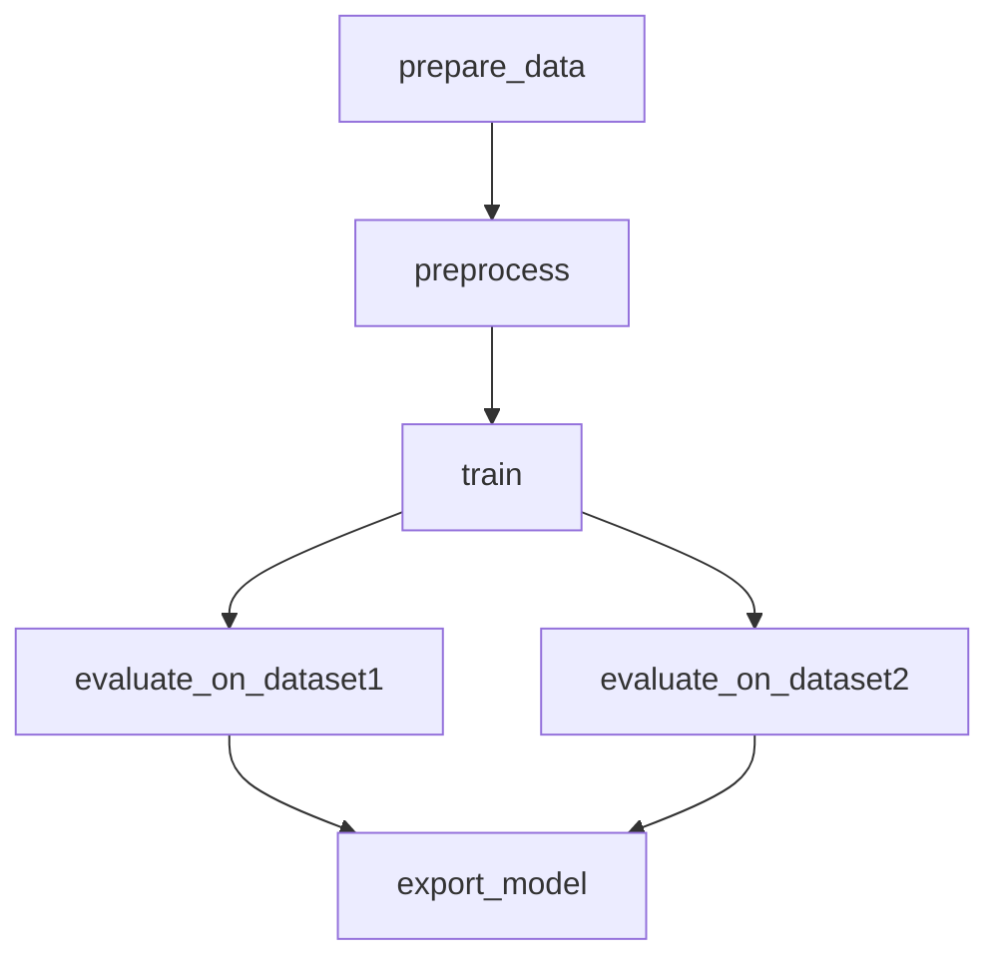
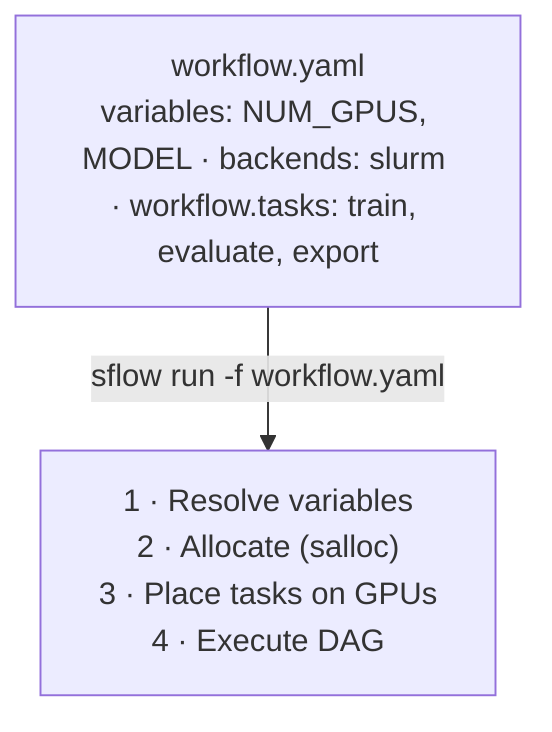
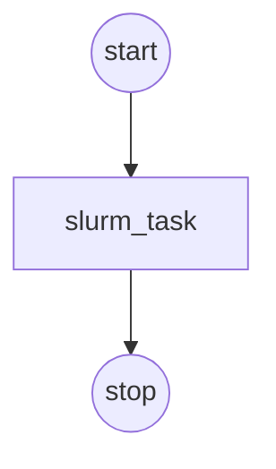
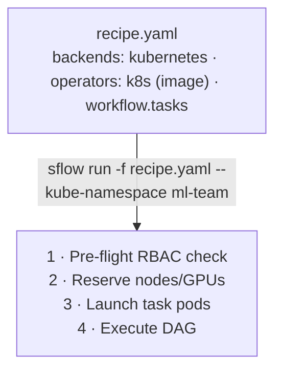

## Install sflow

```bash
mkdir -p sflow_workspace && cd sflow_workspace
curl -LsSf https://astral.sh/uv/install.sh | sh
uv venv --python python3
source .venv/bin/activate
uv pip install "sflow @ git+https://github.com/NVIDIA/nv-sflow.git@main"
sflow --help
sflow --version   # or: sflow -V — print version + runtime/build details
```

If `curl` is unavailable (e.g. on some locked-down clusters), install `uv` via pip instead:

```bash
pip install uv
```

**Optional extras** enable features that pull in extra dependencies:

```bash
pip install 'sflow[s3]'        # S3 artifact/result uploads (boto3)
pip install 'sflow[monitor]'   # PNG charts for the hardware monitor
```

---

## One-Minute Mindset

`sflow` lets you describe a multi-step workflow in a single YAML file and run it on **any compute backend** — your laptop, a Slurm cluster, a Docker host, or a Kubernetes cluster — without rewriting scripts.

**Core ideas:**

| Concept | What it does | Example |
|---------|-------------|---------|
| **Backend** | Declares *where* tasks run. Swap one line to move between `local`, `slurm`, `docker`, and `kubernetes`. | `type: slurm`, `partition: gpu` |
| **Operator** | Declares *how* a task's script is launched. Each backend has a default (local → `bash`, Slurm → `srun`). Define named operators to preset flags and reuse them across tasks. | `type: srun`, `ntasks: 4` |
| **Variable** | A named value reusable everywhere — scripts, resource counts, backend config. Override from the CLI with `--set`. | `NUM_GPUS: 8` |
| **Task & DAG** | Each task is a unit of work with a script. `depends_on` wires them into a directed graph so sflow runs them in the right order. | `depends_on: [train]` |
| **Probe** | A readiness or failure check attached to a task. Downstream tasks wait until the probe passes. Built-ins: TCP port, HTTP endpoint, log pattern match. | `type: tcp_port`, `port: 8080` |
| **Resource placement** | Topology-aware: sflow assigns nodes and GPUs automatically after allocation, packing tasks contiguously to respect node boundaries. Assigned resources are exposed as variables. | `${{ backends.slurm_cluster.nodes[0].ip_address }}` |

**Why not just write a bash script?**
A bash script hard-wires node names, GPU indices, and execution order. With sflow you declare what you want; it handles allocation, node discovery, GPU assignment, dependency ordering, log collection, and retries — the same YAML works locally for debugging and on Slurm for production.

---

This guide teaches sflow in three parts:

- **Part I: Learn the Basics Locally** – Write workflows, build DAGs, add variables — no cluster needed
- **Part II: Run on Slurm** – Take the same config to a real HPC cluster
- **Part III: Run on Kubernetes** – Take the same config to a Kubernetes cluster

:::tip More backends
This quickstart covers `local`, `slurm`, and `kubernetes`. The same YAML also runs on the **Docker** backend — just swap the backend block. See [Backends](./backends.md) for all four.
:::

---

## Part I: Learn the Basics Locally

Start here to learn sflow concepts without needing a Slurm cluster.

### 1. Start with a Plain-Text Config

The fastest way to learn sflow is to start with **hardcoded values** — no variables, no expressions. Get the workflow logic right first.

```yaml
version: "0.1"

workflow:
  name: wf
  tasks:
    - name: hello
      script:
        - echo hello
```


```mermaid
flowchart TD
  start((start)) --> hello[hello]
  hello --> stop((stop))
```

Validate and run:

```bash
sflow run --file sflow.yaml --dry-run   # validate first
sflow run --file sflow.yaml --tui       # run with TUI
```

Default output structure:

- `./sflow_output/<run_id>/`: per-run root directory
- `./sflow_output/<run_id>/<task_name>/`: per-task directory (stdout/stderr go to `<task_name>.log`)

### 2. Build a DAG with `depends_on`

Add multiple tasks and wire them with `depends_on`. Start with plain text — hardcode everything:

```yaml
version: "0.1"

workflow:
  name: training_pipeline
  tasks:
    - name: prepare_data
      script:
        - echo "Downloading cifar10..."
        - echo "cifar10" > ${SFLOW_WORKFLOW_OUTPUT_DIR}/dataset.txt

    - name: preprocess
      depends_on: [prepare_data]
      script:
        - test -f ${SFLOW_WORKFLOW_OUTPUT_DIR}/dataset.txt
        - echo "encoded_data ok" > ${SFLOW_WORKFLOW_OUTPUT_DIR}/encoded.txt

    - name: train
      depends_on: [preprocess]
      script:
        - test -f ${SFLOW_WORKFLOW_OUTPUT_DIR}/encoded.txt
        - echo "checkpoint for tiny-transformer" > ${SFLOW_WORKFLOW_OUTPUT_DIR}/checkpoint.pt

    - name: evaluate_on_dataset1
      depends_on: [train]
      script:
        - test -f ${SFLOW_WORKFLOW_OUTPUT_DIR}/checkpoint.pt
        - echo "accuracy=0.99 dataset=dataset1" > ${SFLOW_TASK_OUTPUT_DIR}/metrics.txt

    - name: evaluate_on_dataset2
      depends_on: [train]
      script:
        - test -f ${SFLOW_WORKFLOW_OUTPUT_DIR}/checkpoint.pt
        - echo "accuracy=0.88 dataset=dataset2" > ${SFLOW_TASK_OUTPUT_DIR}/metrics.txt

    - name: export_model
      depends_on: [evaluate_on_dataset1, evaluate_on_dataset2]
      script:
        - test -f ${SFLOW_WORKFLOW_OUTPUT_DIR}/evaluate_on_dataset1/metrics.txt
        - test -f ${SFLOW_WORKFLOW_OUTPUT_DIR}/evaluate_on_dataset2/metrics.txt
        - echo "exported tiny-transformer" > ${SFLOW_WORKFLOW_OUTPUT_DIR}/model.onnx
```


```mermaid
flowchart TD
  prepare_data[prepare_data] --> preprocess[preprocess]
  preprocess --> train[train]
  train --> evaluate_on_dataset1[evaluate_on_dataset1]
  train --> evaluate_on_dataset2[evaluate_on_dataset2]
  evaluate_on_dataset1 --> export_model[export_model]
  evaluate_on_dataset2 --> export_model
```

Always validate first, then run:

```bash
sflow run --file pipeline.yaml --dry-run
sflow run --file pipeline.yaml --tui
```

Visualize the DAG without running:

```bash
sflow visualize --file pipeline.yaml --format mermaid
```

### 3. Extract Variables for Reusability

Once the plain-text config works, identify values that you'd want to change between runs
and extract them into `variables`. This makes the config reusable without editing the YAML each time.

**Before (hardcoded):**
```yaml
    - name: train
      script:
        - echo "checkpoint for tiny-transformer" > ${SFLOW_WORKFLOW_OUTPUT_DIR}/checkpoint.pt
```

**After (parameterized):**
```yaml
variables:
  MODEL_NAME:
    description: "Model to train"
    value: tiny-transformer

workflow:
  tasks:
    - name: train
      script:
        - echo "checkpoint for ${MODEL_NAME}" > ${SFLOW_WORKFLOW_OUTPUT_DIR}/checkpoint.pt
```

Now you can override the value from the CLI without touching the file:

```bash
sflow run -f pipeline.yaml --set MODEL_NAME=large-transformer --tui
```

Variables can be used in two ways:
- **In YAML fields** (resolved before execution): `${{ variables.MODEL_NAME }}`
- **In scripts** (as env var at runtime): `${MODEL_NAME}`

Here's the full parameterized version (or get it via `sflow sample self_contained/local/dag`):

```yaml
version: "0.1"

variables:
  MODEL_NAME:
    description: "Model to train"
    value: tiny-transformer

workflow:
  name: quickstart_dag
  tasks:
    - name: prepare_data
      script:
        - echo "prepare_data start"
        - echo "model=${{ variables.MODEL_NAME }}" > ${SFLOW_WORKFLOW_OUTPUT_DIR}/dataset.txt

    - name: preprocess
      depends_on: [prepare_data]
      script:
        - test -f ${SFLOW_WORKFLOW_OUTPUT_DIR}/dataset.txt
        - echo "encoded_data ok" > ${SFLOW_WORKFLOW_OUTPUT_DIR}/encoded.txt

    - name: train
      depends_on: [preprocess]
      script:
        - test -f ${SFLOW_WORKFLOW_OUTPUT_DIR}/encoded.txt
        - echo "checkpoint for ${MODEL_NAME}" > ${SFLOW_WORKFLOW_OUTPUT_DIR}/checkpoint.pt

    - name: evaluate_on_dataset1
      depends_on: [train]
      script:
        - test -f ${SFLOW_WORKFLOW_OUTPUT_DIR}/checkpoint.pt
        - echo "accuracy=0.99 dataset=dataset1" > ${SFLOW_TASK_OUTPUT_DIR}/metrics.txt

    - name: evaluate_on_dataset2
      depends_on: [train]
      script:
        - test -f ${SFLOW_WORKFLOW_OUTPUT_DIR}/checkpoint.pt
        - echo "accuracy=0.88 dataset=dataset2" > ${SFLOW_TASK_OUTPUT_DIR}/metrics.txt

    - name: export_model
      depends_on: [evaluate_on_dataset1, evaluate_on_dataset2]
      script:
        - test -f ${SFLOW_WORKFLOW_OUTPUT_DIR}/evaluate_on_dataset1/metrics.txt
        - test -f ${SFLOW_WORKFLOW_OUTPUT_DIR}/evaluate_on_dataset2/metrics.txt
        - echo "exported ${MODEL_NAME}" > ${SFLOW_WORKFLOW_OUTPUT_DIR}/model.onnx
```

:::tip Recommended Approach
**Plain text first, variables second.** Start every new workflow with hardcoded values.
Once it runs successfully, extract the values you want to change into `variables`.
This makes debugging much easier — you know the recipe works before adding abstraction.
:::

### 4. Validate Only (Dry-Run)

```bash
sflow run --file sflow.yaml --dry-run
```

Dry-run does not create output directories/files. It prints the execution plan and computed output paths.

### 5. Explore More Local Capabilities

The `local` backend is enough to try several sflow features before touching a cluster. Copy any of these with `sflow sample <name>` (each writes `./<basename>.yaml` in the current directory — e.g. `sflow sample self_contained/local/result_parsing` writes `./result_parsing.yaml`):

| Capability | Sample | What it shows |
|-----------|--------|---------------|
| Result parsing | `self_contained/local/result_parsing` | Parse metrics from a log/JSON into `result.json` (see [Results](./results.md)) |
| Storage uploads | `self_contained/local/storage_upload`, `self_contained/local/storage_upload_all` | Ship logs/results to a storage target such as S3 (see [Uploads](./uploads.md)) |
| Workflow monitor | `self_contained/local/monitor` | Sample hardware utilization during a run and (optionally) render charts (see [Monitor](./monitor.md)) |

```bash
sflow sample self_contained/local/monitor
sflow run -f monitor.yaml
```

---

## Part II: Slurm Cluster

Take the same workflow concepts to a real HPC cluster. Make sure you have already installed sflow (see [Install sflow](#install-sflow) above).

### 1. Prepare a Slurm Workflow


**How it works (Slurm example):**


```mermaid
flowchart TD
  Y["workflow.yaml<br/>variables: NUM_GPUS, MODEL · backends: slurm · workflow.tasks: train, evaluate, export"] -->|sflow run -f workflow.yaml| P["1 · Resolve variables<br/>2 · Allocate (salloc)<br/>3 · Place tasks on GPUs<br/>4 · Execute DAG"]
```

Start with a plain-text config — hardcode your actual cluster values. No variables yet.

```yaml
version: "0.1"

backends:
  - name: slurm_cluster
    type: slurm
    default: true
    account: "your_slurm_account"
    partition: "your_slurm_partition"
    time: "00:10:00"
    nodes: 1
    gpus_per_node: 8

workflow:
  name: wf
  tasks:
    - name: slurm_task
      script:
        - echo hello
```


```mermaid
flowchart TD
  start((start)) --> slurm_task[slurm_task]
  slurm_task --> stop((stop))
```

Notes:

- Update `account/partition/time/nodes` to match your cluster.
- If you're already inside a Slurm allocation, `sflow` will reuse it; otherwise it will call `salloc` first.
- `gpus_per_node` is used for sflow resource planning and GPU index assignment; it does not add a Slurm allocation flag.
- The backend also supports `extra_args` to pass arbitrary flags to `salloc`:

```yaml
backends:
  - name: slurm_cluster
    type: slurm
    default: true
    account: "your_slurm_account"
    partition: "your_slurm_partition"
    time: "01:00:00"
    nodes: 2
    gpus_per_node: 8
    extra_args:
      - "--exclusive"
      - "--gpus-per-node=8"
      - "--segment=8"
```

Once the plain-text config works, you can extract account, partition, nodes, etc. into variables (same pattern as Part I step 4) to make it reusable across clusters.

You can also use `sflow sample` to get starter workflows with variables already set up:

```bash
sflow sample --list
sflow sample self_contained/slurm/dynamo_trtllm_disagg
```

### 2. Operators & srun — How Your Script Actually Runs

On a Slurm backend the default operator is **srun**. sflow takes your task's `script:` lines and wraps them into:

```bash
srun [flags from operator config] bash -c "<your script lines>"
```

Operator config fields map **directly** to srun flags, so you never have to hand-craft srun commands:

| Operator config | srun flag | Purpose |
|-----------------|-----------|---------|
| `ntasks` | `--ntasks` | Number of task slots |
| `ntasks_per_node` | `--ntasks-per-node` | Tasks per node |
| `gpus_per_task` | `--gpus-per-task` | GPUs per task slot |
| `cpus_per_task` | `--cpus-per-task` | CPU cores per task |
| `nodes` | `--nodes` | Node count for this step |
| `container_image` | `--container-image` | Pyxis container (enroot) |
| `mpi` | `--mpi` | MPI type (e.g. `pmix`) |
| `extra_args` | *(pass-through)* | Any other srun flag |

`extra_args` is a list that passes arbitrary srun flags not covered by the named fields:

```yaml
operators:
  - name: custom_worker
    type: srun
    ntasks_per_node: 1
    extra_args:
      - --exclusive
      - --mem-per-gpu=80G
      - --container-image=nvcr.io/nvidia/pytorch:24.05-py3
      - --container-mounts=/data:/data:ro
```

You can define **named operators** once and reference them by name in tasks — or override individual fields per task:

```yaml
operators:
  - name: gpu_worker
    type: srun
    ntasks_per_node: 1
    gpus_per_task: 1
    container_image: nvcr.io/nvidia/pytorch:24.05-py3

workflow:
  tasks:
    - name: train
      operator: gpu_worker          # uses the preset above
      script:
        - torchrun train.py

    - name: inference
      operator:                     # inline override
        name: gpu_worker
        ntasks: 8                   # override just this field
      script:
        - python infer.py
```

Without sflow, the equivalent `train` task would require you to manually write:

```bash
srun --jobid=$SLURM_JOB_ID --nodes=1 --ntasks-per-node=1 --gpus-per-task=1 \
     --container-image=nvcr.io/nvidia/pytorch:24.05-py3 \
     bash -c "torchrun train.py"
```

sflow builds this command for you from the declarative config.

### 3. Run on Slurm (Interactive)

Before running, make sure you have updated the workflow YAML for your environment:

- **Slurm settings**: set `account` and `partition` to values valid on your cluster
- **Model paths**: update any model or data paths to locations accessible from your compute nodes
- **Container images**: if the workflow uses a container operator, update the image tag to the version you need
- **Extra args**: Some clusters require `--gpus-per-node` when requesting GPU partitions. Add it explicitly in backend `extra_args`; sflow does not infer or add that Slurm flag from `gpus_per_node`.

**Validate first with a dry-run** to catch config errors without allocating nodes:

```bash
sflow run --file sflow.yaml --dry-run
```

Once validation passes, launch the workflow:

```bash
sflow run --file sflow.yaml --tui
```

The TUI shows:

- Left: task status table + backend allocation summary
- Right: auto-tail logs (timestamp + level + module/logger)


For headless mode (automated jobs), run without `--tui`:

```bash
sflow run --file sflow.yaml
```

:::tip Container Registry Authentication
If your workflow pulls images from a private registry (e.g. `nvcr.io`), you need to configure enroot credentials on the cluster **before** running. Create or edit `~/.config/enroot/.credentials`:

```
machine nvcr.io login $oauthtoken password <your-ngc-api-key>
```

Replace the machine/credentials for whichever registry your images come from. Without this file, `srun --container-image` will fail to pull private images.
:::

### 4. Batch Mode: Fire-and-Forget Slurm Jobs

For long-running or production workflows, `sflow batch` generates a complete sbatch script with proper environment setup and job submission. This is the **recommended way** to run production workloads.

#### Why Use Batch Mode?

- **Fire-and-forget**: Submit the job and disconnect; it runs headlessly
- **Automatic environment setup**: Creates/activates a Python venv on compute nodes, this solves the python and lib difference often seen in clusters (e.g., login vs compute nodes)
- **Dry-run validation**: Validates the workflow before running to fail early
- **Portable scripts**: Generated scripts can be saved, reviewed, and resubmitted

#### Basic Usage

Generate an sbatch script to stdout:

```bash
sflow batch --file workflow.yaml
```

Save to a file:

```bash
sflow batch --file workflow.yaml --sbatch-path run_workflow.sh
```

Generate and submit immediately:

```bash
sflow batch --file workflow.yaml --sbatch-path run_workflow.sh --submit
```

Add extra slurm flags if required when submitting jobs in some cluster:

```bash
sflow batch --file workflow.yaml --sbatch-path run_workflow.sh -e '--exclusive' -e '--gpus-per-node=8' -e '--segment=8'
```

#### Full Example with Slurm Options

```bash
sflow batch \
  --file sglang_server_client.yaml \
  --partition gpu \
  --account myaccount \
  --time 02:00:00 \
  --nodes 2 \
  --gpus-per-node 4 \
  --job-name my-inference-job \
  --sbatch-path run_inference.sh \
  --submit
```

> Note: `--gpus-per-node` (`-G`) sets the cluster topology for sflow's resource planning (default: 4). It does NOT add a `#SBATCH --gpus-per-node` directive. If your cluster requires that directive, add it via `-e '--gpus-per-node=4'`.

#### With Variable Overrides

Override workflow variables at submission time:

```bash
sflow batch \
  --file workflow.yaml \
  --set NUM_GPUS=8 \
  --set MODEL_NAME=llama-70b \
  --sbatch-path run.sh
```

#### Per-Job Virtual Environment

By default each Slurm job creates its own fresh, disposable venv on the compute node
(`.sflow_venv-<job id>/`) using the node's system `python3`, so it always matches the node
architecture (e.g. x86 login node vs arm64 compute node) and is removed when the job exits.
Pass `--sflow-venv-path` to change the parent directory it is created under (e.g. a
shared-filesystem path instead of node-local scratch):

```bash
sflow batch \
  --file workflow.yaml \
  --sflow-venv-path /shared/scratch/sflow-venvs \
  --sbatch-path run.sh
```

#### What the Generated Script Does

1. **Sets sbatch directives**: job name, output/error files, partition, account, time limit
2. **Creates a fresh per-job venv**: builds `.sflow_venv-<job id>/` on the compute node with sflow installed, then removes it on exit (override the parent dir with `--sflow-venv-path`)
3. **Runs dry-run validation**: Catches configuration errors before the full run
4. **Executes the workflow**: Runs `sflow run` with all provided options

#### Common Options

| Option | Description |
|--------|-------------|
| `--file`, `-f` | Path to the sflow.yaml workflow file |
| `--sbatch-path`, `-o` | Write sbatch script to file (required for `--submit`) |
| `--submit` | Submit the job immediately after generating |
| `--partition`, `-p` | Slurm partition |
| `--account`, `-A` | Slurm account |
| `--time` | Time limit (e.g., `02:00:00`) |
| `--nodes`, `-N` | Number of nodes for the sbatch job |
| `--gpus-per-node`, `-G` | Number of GPUs per node |
| `--job-name`, `-J` | Slurm job name (default: `sflow`) |
| `--set`, `-s` | Override variable (can be repeated) |
| `--artifact`, `-a` | Override artifact URI (can be repeated) |
| `--sflow-venv-path` | Parent dir for the fresh per-job venv (default: compute-node-local scratch) |

#### Monitoring Batch Jobs

After submission, monitor your job with standard Slurm commands:

```bash
squeue -u $USER           # Check job status
scancel <job_id>          # Cancel a job
tail -f sflow_output/sflow-<job_id>.out  # Follow output logs
```

---

## Part III: Kubernetes Cluster

Run the same workflow concepts on a Kubernetes cluster. Make sure you have already installed sflow (see [Install sflow](#install-sflow) above), and that the machine running `sflow` has working cluster access — sflow shells out to your **local `kubectl`**.

**How it works (Kubernetes example):**


```mermaid
flowchart TD
  Y["recipe.yaml<br/>backends: kubernetes · operators: k8s (image) · workflow.tasks"] -->|sflow run -f recipe.yaml --kube-namespace ml-team| P["1 · Pre-flight RBAC check<br/>2 · Reserve nodes/GPUs<br/>3 · Launch task pods<br/>4 · Execute DAG"]
```

:::note Requires sflow v0.3.0+
A few things differ from Slurm on the Kubernetes backend today:

- `sflow run` is **interactive (attached) only** — there is no `sflow batch` / fire-and-forget mode on K8S yet, so the driver process must stay connected for the whole run.
- `monitor:` blocks are **skipped** (no in-cluster hardware collector yet).
- Tested on vanilla bare-metal Kubernetes and Google GKE; other environments are untested.
:::

### 1. Prepare a Kubernetes Workflow

Two things differ from the Slurm setup:

- **The workload image lives on the *operator*, not the backend.** The `kubernetes` backend declares *where* (namespace, nodes, GPUs); the operator declares the container `image` to run.
- **There is no default operator on Kubernetes.** Unlike `local` → `bash` or `slurm` → `srun`, every K8S task must name an explicit `k8s` (or `k8s_mpi`) operator that carries an `image`.

Start with the smallest working recipe — CPU-only (`gpus_per_node: 0`). Grab it with `sflow sample self_contained/kubernetes/hello_world`:

```yaml
version: "0.1"

backends:
  - name: k8s
    type: kubernetes
    default: true
    namespace: default
    nodes: 1
    gpus_per_node: 0

operators:
  - name: k8s_op
    type: k8s
    image: ubuntu:22.04       # the workload image lives on the operator

workflow:
  name: kubernetes_hello_world
  tasks:
    - name: hello
      operator: k8s_op
      script:
        - echo "Hello from Kubernetes"
```


```mermaid
flowchart TD
  start((start)) --> hello[hello]
  hello --> stop((stop))
```

Common backend fields:

| Backend field | Default | Purpose |
|---------------|---------|---------|
| `namespace` | — | Namespace to run in; **must already exist**. One namespace per backend (use separate backends for separate namespaces). |
| `nodes` | — | Number of nodes to reserve for the workflow. |
| `gpus_per_node` | derived from node capacity | GPUs per node; checked against real GPU capacity at pre-flight. Set `0` for CPU-only. |
| `scheduling` | `device_plugin` | How GPUs are requested: `device_plugin` (NVIDIA gpu-operator, `nvidia.com/gpu`) or `dra` (K8s 1.34+, WIP). |
| `gpu_resource_name` | `nvidia.com/gpu` | Override the device-plugin resource name (e.g. MIG `nvidia.com/mig-1g.5gb`). |
| `host_network` | `true` | Pod shares the node network namespace (pod IP == node IP). Privileged; turn off on CNI-routable clusters. |
| `host_ipc` | `false` | Share the node IPC namespace + `/dev/shm` for cross-pod CUDA IPC over NVLink. Privileged; opt-in. |
| `volumes` | — | Mount existing PVCs / `emptyDir` scratch into every task pod. PVCs must already exist — sflow references them, it does not create them. |

See [Backends](./backends.md) for the full field list, including DRA/MIG, RDMA, and Multi-Node NVLink options.

### 2. Operators on Kubernetes

Each task's `script:` lines run inside a pod built from the operator's container `image`. There are two K8S operator types:

| Operator | Use for |
|----------|---------|
| `k8s` | Standard single/multi-node container tasks. Required field: `image`. |
| `k8s_mpi` | `mpirun`-launched workloads — inherits every `k8s` field and adds an `mpi:` block; sflow injects the SSH/hostfile/sshd glue for you. |

Frequently-used `k8s` operator fields:

| Operator field | Default | Purpose |
|----------------|---------|---------|
| `image` | *(required)* | Container image for the task's pod. |
| `image_pull_secrets` | — | Secret name(s) for pulling from a private registry (e.g. `nvcr.io`). |
| `service_account` | — | Pod service account (RBAC / cloud workload identity). |
| `run_as_root` | `false` | Run the container as root. |
| `shm_size` | node RAM | Shared-memory (`/dev/shm`) size. The K8s 64Mi default segfaults multi-GPU NCCL/MPI jobs — set e.g. `64Gi`. |
| `cpu` / `memory` | — | Resource requests (`cpu_limit` / `memory_limit` set limits). |
| `env` | — | Extra environment variables for the pod. |

You can define named operators once and reference them by name in tasks, or override fields per task — the same pattern shown for Slurm operators in Part II.

### 3. Connect to the Cluster and Run

Cluster credentials are passed as **CLI flags on `sflow run`, never in the YAML** — so the same recipe stays cluster-agnostic:

| Flag | Default |
|------|---------|
| `--kubeconfig PATH` | `$KUBECONFIG`, else `~/.kube/config` |
| `--kube-context NAME` | current context |
| `--kube-namespace NAME` | the backend's `namespace` |

**Validate first with a dry-run** to catch config errors without touching the cluster:

```bash
sflow run --file hello_world.yaml --dry-run
```

Then run against your cluster (add `--tui` for the live status/log view):

```bash
sflow run -f hello_world.yaml \
  --kubeconfig ~/.kube/prod.config \
  --kube-context prod-east \
  --kube-namespace ml-team \
  --tui
```

Before allocating, sflow runs a **non-mutating RBAC pre-flight** (`kubectl auth can-i …`) for the pod/configmap/secret/log operations it needs and fails fast with an actionable message if a permission is missing. Only namespaced permissions it truly depends on are hard gates — denied cluster-scoped reads (`namespaces`, `nodes`) just warn, so a namespaced ServiceAccount works out of the box. Bypass the check entirely with `SFLOW_SKIP_K8S_PREFLIGHT=1`.

**Prerequisites:**

- Working `kubectl` access from the machine running sflow.
- The target namespace already exists, with RBAC to create/delete pods, configmaps, and secrets and to read pod logs and nodes.
- For GPUs: the NVIDIA gpu-operator installed (`device_plugin`, the default), or K8s 1.34+ with `nvidia-dra-driver-gpu` (`dra`, WIP).
- Any PVCs referenced under `volumes:` already exist in the namespace. For quick debugging on a cluster that lacks them, `sflow run --kube-skip-pvc` drops PVC-backed volumes.

:::tip Private registry images
For images from a private registry (e.g. `nvcr.io`), create a Kubernetes pull secret in your namespace and reference it from the operator:

```bash
kubectl create secret docker-registry ngc-secret \
  --docker-server=nvcr.io \
  --docker-username='$oauthtoken' \
  --docker-password=<your-ngc-api-key> \
  -n ml-team
```

```yaml
operators:
  - name: gpu_worker
    type: k8s
    image: nvcr.io/nvidia/pytorch:24.05-py3
    image_pull_secrets: [ngc-secret]
```
:::

### 4. A Real GPU Workload

For a full disaggregated LLM-serving deployment, grab the packaged sample:

```bash
sflow sample self_contained/kubernetes/dynamo_trtllm_disagg
```

It shows a 3-node, 8-GPU-per-node backend with `host_network`, `host_ipc` (cross-pod CUDA IPC over NVLink), RDMA, and a read-only model PVC — wired to a `k8s_mpi` operator for the prefill/decode servers and plain `k8s` operators for the NATS/etcd/frontend infra and the benchmark client. Browse all Kubernetes starters with:

```bash
sflow sample --list
```

