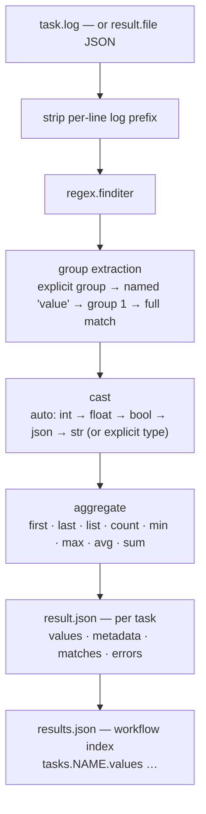

# Results (`task.result`)

`task.result` is the consolidated way to capture small, structured outputs from a
task — benchmark metrics, scores, throughput numbers — and expose them through a
stable, machine-readable contract that downstream tasks and external tooling can
rely on.

For every task with a `result:` entry, sflow writes a canonical per-task file
`${SFLOW_TASK_OUTPUT_DIR}/result.json` and updates a workflow-level index
`${SFLOW_WORKFLOW_OUTPUT_DIR}/results.json` after the task finishes successfully.

> `task.result` is the successor to the older [`task.outputs`](./outputs.md#taskoutputs-parse-metrics-from-task-logs-mvp)
> MVP. `outputs` still works, but new workflows should prefer `result`. Prefer
> regex over the `parse`-style syntax used by `outputs`.

## When to use it

- You want one obvious place to publish a few metrics from a task.
- You want a downstream task to read those metrics from a predictable JSON file.
- You want a single workflow-level index of every task's results.

For large files (checkpoints, datasets, full logs), keep using regular task
outputs or [artifacts](./artifacts.md) / [uploads](./uploads.md) — `result` is
for small structured values, not big payloads.

## Entry styles

`result` accepts three shapes.

### 1. Simple regex map (recommended)

The common case. Each map key is the result name; the value is a Python regex
matched against the task's merged log. The first capture group becomes the value.

```yaml
workflow:
  tasks:
    - name: benchmark
      script:
        - python run_benchmark.py
      result:
        ttft: 'TTFT:\s*([0-9.]+)\s*ms'
        tps: 'tok/s:\s*([0-9.]+)'
        latency_p99: 'p99 latency:\s*([0-9.]+)\s*ms'
```

Each simple-map entry is equivalent to an advanced pattern with these defaults:

```yaml
type: auto
aggregate: last
required: false
source: log
```

So when a pattern matches multiple lines, the **last** match wins by default —
handy for progress-style logs that print a metric repeatedly.

### 2. Advanced regex patterns

Use the list form when you need type casting, aggregation, units, or required
checks:

```yaml
workflow:
  tasks:
    - name: benchmark
      script:
        - python run_benchmark.py
      result:
        patterns:
          - name: ttft
            regex: 'TTFT:\s*(?P<value>[0-9.]+)\s*ms'
            type: float
            unit: ms
            aggregate: last
            required: true

          - name: all_ttft
            regex: 'TTFT:\s*([0-9.]+)\s*ms'
            type: float
            aggregate: list

          - name: best_tps
            regex: 'tok/s:\s*([0-9.]+)'
            type: float
            aggregate: max
```

Pattern fields:

| Field | Required | Default | Description |
|---|---|---|---|
| `name` | yes | | Result key written under `values`. |
| `regex` | yes | | Python regex. Prefer one capture group or a named `value` group. |
| `type` | no | `auto` | `auto`, `string`, `int`, `float`, `bool`, or `json`. |
| `unit` | no | `null` | Optional display/metadata unit, e.g. `ms` or `tok/s`. |
| `aggregate` | no | `last` | How to reduce multiple matches (see below). |
| `required` | no | `false` | If `true`, a missing match marks the result `ok: false`. |
| `source` | no | `log` | Source selector. Only `log` is implemented today. |
| `group` | no | `null` | Capture group name or index to extract. When unset, the precedence below applies. |

Capture-group precedence per match: an explicit `group` first, then a named
`value` group, then the first positional group (`1`), then the full match.

Supported `aggregate` values:

| Aggregate | Behavior |
|---|---|
| `first` | First matched value. |
| `last` | Last matched value (default). |
| `list` | All matched values, in order. |
| `count` | Number of matches. |
| `min` | Minimum numeric value. |
| `max` | Maximum numeric value. |
| `avg` | Average of numeric values. |
| `sum` | Sum of numeric values. |

### 3. File source

When a task already produces structured output, point `result.file` at a JSON
file it writes. sflow reads that source and normalizes it into the canonical
`result.json`:

```yaml
workflow:
  tasks:
    - name: benchmark
      script:
        - python run_benchmark.py --out "${SFLOW_TASK_OUTPUT_DIR}/tmp.json"
      result:
        file: tmp.json
```

`result.file` is a **source**, not the downstream contract: sflow never renames
or deletes it. It reads the source and writes the canonical file alongside it:

```text
${SFLOW_TASK_OUTPUT_DIR}/tmp.json      # your file, untouched
${SFLOW_TASK_OUTPUT_DIR}/result.json   # canonical, written by sflow
```

The simplest path is to write directly to `$SFLOW_TASK_RESULT_FILE` — the source and
canonical file are then the same path, and sflow re-normalizes it in place:

```yaml
workflow:
  tasks:
    - name: benchmark
      script:
        - echo '{"throughput": 999.5, "errors": 0}' > "$SFLOW_TASK_RESULT_FILE"
      result:
        file: result.json
```

Normalization rules:

- A plain JSON object is treated as `values` (each key becomes a result value).
- A file already in `sflow.result.v1` shape is validated and preserved verbatim — its own
  `values` / `metadata` / `matches` / `errors` / `source` are kept, and only missing
  envelope keys are back-filled.
- `result.file` must point to a JSON source path ending in `.json`.
- `result.file` must be a relative path inside the task output directory; `..`
  and absolute paths are rejected.

`result.patterns` and `result.file` are **mutually exclusive** — set one or the
other, not both. Within `patterns`, each `name` must be unique — duplicate pattern
names are rejected at validation time.

If you need a result value literally named `file`, use the advanced pattern form:

```yaml
result:
  patterns:
    - name: file
      regex: 'source file:\s*(\S+)'
```

## Standard environment variables

sflow injects these into every task script:

| Variable | Value |
|---|---|
| `SFLOW_TASK_RESULT_FILE` | `${SFLOW_TASK_OUTPUT_DIR}/result.json` — frictionless direct-write target (similar in spirit to GitHub Actions' `$GITHUB_OUTPUT`, but JSON). |
| `SFLOW_WORKFLOW_RESULT_FILE` | `${SFLOW_WORKFLOW_OUTPUT_DIR}/results.json` — the workflow-level index. |

## How parsing works



## Output files

### Per-task `result.json`

Every task with a `result:` entry produces `${SFLOW_TASK_OUTPUT_DIR}/result.json`.
For the simple-map example above:

```json
{
  "schema_version": "sflow.result.v1",
  "task": "benchmark",
  "status": "COMPLETED",
  "ok": true,
  "source": {
    "type": "log",
    "path": "benchmark.log"
  },
  "values": {
    "ttft": 42.5,
    "tps": 123.0,
    "latency_p99": 88
  },
  "metadata": {
    "ttft": { "unit": null, "type": "auto", "aggregate": "last" },
    "tps": { "unit": null, "type": "auto", "aggregate": "last" },
    "latency_p99": { "unit": null, "type": "auto", "aggregate": "last" }
  },
  "matches": {
    "ttft": [
      { "line": 2, "value": 40.0, "text": "TTFT: 40.0 ms" },
      { "line": 3, "value": 42.5, "text": "TTFT: 42.5 ms" }
    ]
  },
  "errors": []
}
```

- `values` is the primary downstream contract.
- `metadata` records each spec's `unit`/`type`/`aggregate` so consumers don't
  re-parse your YAML.
- `matches` is debug/trace data: every matched line, its number, and cast value.
- `status` is the task's terminal outcome (`COMPLETED`), not an internal state.
- `errors` lists non-fatal issues (e.g. a cast failure or a missing required
  pattern).

> The file is written atomically with keys sorted alphabetically on disk; the
> ordering above is just for readability.

### Workflow-level `results.json`

After each task's result is collected, sflow updates
`${SFLOW_WORKFLOW_OUTPUT_DIR}/results.json` with a compact per-task summary:

```json
{
  "schema_version": "sflow.results.v1",
  "workflow": "local_result_parsing-20260601-155526-c39ccc",
  "tasks": {
    "benchmark_log": {
      "status": "COMPLETED",
      "ok": true,
      "result_file": "benchmark_log/result.json",
      "values": { "ttft": 42.5, "tps": 123.0, "latency_p99": 88 }
    },
    "benchmark_file": {
      "status": "COMPLETED",
      "ok": true,
      "result_file": "benchmark_file/result.json",
      "values": { "throughput": 999.5, "errors": 0 }
    }
  }
}
```

`result_file` is a portable, forward-slash path relative to the workflow output
directory, so the index stays usable when copied to another machine.

## Runtime behavior

- **Source**: regex specs match the per-task merged log
  `${SFLOW_TASK_OUTPUT_DIR}/${task}.log` (the launcher writes both stdout and
  stderr there). `source: log` is the only implemented source today.
- **When it runs**: only after the task's process exits with code `0`. Result
  parsing is part of task finalization, and a task is not marked `COMPLETED`
  until parsing (and any uploads) finish — so a **downstream task never starts
  while its upstream's results are still being collected**.
- **Type casting**: `type: auto` infers `int`, then `float`, then `bool`
  (`true`/`false`), then JSON-looking objects/arrays, otherwise keeps a string.
  Explicit `type: bool` is more lenient — it accepts `true/1/yes/y/on` as true and
  `false/0/no/n/off` as false (case-insensitive). Explicit-type failures, and any
  invalid or missing regex, are recorded under `errors` (fatal only for a `required`
  spec); they never crash the run.
- **Required vs optional**: a missing optional match is simply absent from
  `values`. A missing `required` match sets `ok: false` and is reported under
  `errors`. In this release a failed/missing result is **best-effort** — it does
  not fail the task or workflow; sflow logs a warning so it isn't silent.
- **Best-effort I/O**: a missing log yields empty `values` with `ok: true`.

## Reading results downstream

Because parsing finishes before dependents start, a downstream task can read an
upstream task's `result.json` (or the workflow index) directly:

```yaml
workflow:
  tasks:
    - name: benchmark
      script:
        - echo "TTFT: 42.5 ms"
      result:
        ttft: 'TTFT:\s*([0-9.]+)\s*ms'

    - name: gate
      depends_on: [benchmark]
      script:
        - |
          set -euo pipefail
          ttft=$(python -c "import json;print(json.load(open('$SFLOW_WORKFLOW_OUTPUT_DIR/benchmark/result.json'))['values']['ttft'])")
          echo "upstream TTFT was ${ttft} ms"
```

> Parsed results are **not** available as `${{ }}` expressions (e.g.
> `${{ task.benchmark.result.ttft }}`). YAML expressions are resolved before
> execution, while results only exist after the upstream task finishes. Read the
> JSON file at runtime instead.

## Replicated tasks

Each replica (`benchmark_0`, `benchmark_1`, ...) has its own
`SFLOW_TASK_OUTPUT_DIR`, so it writes its own `result.json`. The workflow
`results.json` indexes every concrete replica by name.

## Dry-run

`sflow run --dry-run` does not execute tasks, so no `result.json` /
`results.json` files are produced. Validate the `result:` schema with a dry-run
before a live run.

## Runnable example

The `self_contained/local/result_parsing` sample exercises both the regex-map and
the direct `$SFLOW_TASK_RESULT_FILE` styles plus a downstream verifier:

```bash
sflow sample self_contained/local/result_parsing
sflow run -f result_parsing.yaml
```

## See also

- [Outputs & logs](./outputs.md) — output directory layout, built-in env vars, and the legacy `task.outputs` MVP
- [Uploads](./uploads.md) — ship `result.json` and other files to S3 on completion
- [Variables](./variables.md) — the `${{ }}` expression system and its resolution timing
