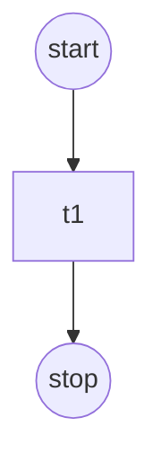
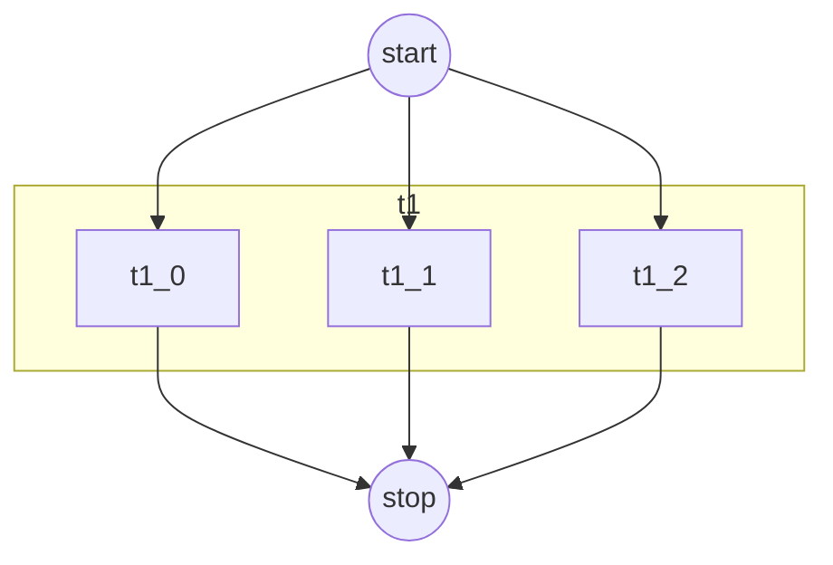

`variables` are named values you can reference in two places:

- YAML expressions: `${{ variables.NAME }}`
- Task scripts (as env vars): `${NAME}`

All resolved variables are injected into every task environment by default.

## Why sflow Variables vs Regular Environment Variables?

sflow variables offer significant advantages over traditional environment variables:

| Feature | sflow Variables `${{ }}` | Shell Env Vars `${}` |
|---------|--------------------------|----------------------|
| **Resolution time** | Before workflow execution (plan time) | At runtime (shell expansion) |
| **Scope** | Across entire YAML (backends, operators, resources, scripts) | Only within shell scripts |
| **Dynamic values** | Can reference backends, artifacts, tasks, other variables | Static values only |
| **Type safety** | Supports int, float, bool, string, list with validation | Strings only |
| **Override** | `--set VAR=value` from CLI | Requires manual export |
| **Visibility** | Shown in dry-run plan | Hidden until execution |

### Key Benefits

1. **Cross-section references**: Use the same value in backends, operators, and scripts without duplication
   ```yaml
   variables:
     NUM_GPUS:
       value: 4
   
   backends:
     - name: cluster
       gpus_per_node: ${{ NUM_GPUS }}  # Used in backend config
   
   workflow:
     tasks:
       - name: train
         resources:
           gpus:
             count: ${{ NUM_GPUS }}    # Used in resource allocation
         script:
           - echo "Training with ${NUM_GPUS} GPUs"  # Used in script
   ```

2. **Dynamic resolution**: Access runtime information like node IPs and task assignments
   ```yaml
   workflow:
     variables:
       HEAD_NODE: 
         value: "${{ backends.cluster.nodes[0].ip_address }}"  # Resolved after allocation
     tasks:
       - name: worker
         script:
           - echo "Connecting to ${{ task.server.nodes[0].ip_address }}"  # Task-aware
   ```

3. **Parameter sweeps**: Define domains for automated replica generation
   ```yaml
   variables:
     BATCH_SIZE:
       value: 32
       domain: [32, 64, 128]  # Creates 3 replicas automatically
   ```

4. **CLI overrides**: Change values without editing YAML
   ```bash
   sflow run -f workflow.yaml --set NUM_GPUS=8 --set 'BATCH_SIZE=[16,32,64]'
   ```

## Available Expression Contexts

When using `${{ ... }}` expressions, you have access to these contexts:

| Context | Example | Description |
|---------|---------|-------------|
| `variables` | `${{ variables.MY_VAR }}` | Global and workflow variables |
| `backends` | `${{ backends.slurm_cluster.nodes[0].ip_address }}` | Backend allocation info (nodes, IPs) |
| `artifacts` | `${{ artifacts.model.path }}` | Artifact paths |
| `workflow` | `${{ workflow.name }}` | Workflow metadata |
| `task` | `${{ task.my_task.nodes[0].ip_address }}` | Task-specific node and GPU info (scripts only) |

### Backend Node Access

After Slurm allocation, you can access node information:

```yaml
workflow:
  variables:
    HEAD_NODE_IP:
      value: "${{ backends.slurm_cluster.nodes[0].ip_address }}"
    SECOND_NODE:
      value: "${{ backends.slurm_cluster.nodes[1].name }}"
```

Available node properties:
- `nodes[i].name` - Hostname of the node
- `nodes[i].ip_address` - IP address of the node
- `nodes[i].index` - Index of the node in the allocation
- `nodes[i].num_gpus` - Number of GPUs on the node

### Variable Shorthand

For convenience, variables can be accessed directly without the `variables.` prefix:

```yaml
# Both are equivalent:
value: "${{ variables.MY_VAR }}"
value: "${{ MY_VAR }}"
```

### Task Node and GPU Access (Scripts Only)

Inside task scripts, you can reference other tasks' assigned nodes and GPUs using the `task` context:

```yaml
workflow:
  tasks:
    - name: prefill_server
      resources:
        gpus:
          count: 2
        nodes:
          indices: [0]
      script:
        - echo "Starting prefill server"
        - start_server

    - name: decode_server
      resources:
        gpus:
          count: 2
        nodes:
          indices: [1]
      script:
        # Reference prefill_server's node IP
        - echo "Connecting to prefill at ${{ task.prefill_server.nodes[0].ip_address }}"
        - start_decoder --prefill-host=${{ task.prefill_server.nodes[0].ip_address }}
      depends_on:
        - prefill_server
```

Available task properties:
- `task.<name>.nodes` - List of nodes assigned to the task
- `task.<name>.nodes[i].name` - Hostname of the i-th assigned node
- `task.<name>.nodes[i].ip_address` - IP address of the i-th assigned node
- `task.<name>.nodes[i].index` - Index of the node within the task's assignment
- `task.<name>.nodes[i].num_gpus` - Number of GPUs on the node
- `task.<name>.gpus` - List of GPU indices assigned to the task (from `CUDA_VISIBLE_DEVICES`)
- `task.<name>.backend` - Name of the backend used by the task
- `task.<name>.operator` - Name of the operator used by the task

### sflow Reserved Environment Variables

sflow automatically injects these environment variables into every task script:

| Variable | Description | Example |
|----------|-------------|---------|
| `SFLOW_WORKSPACE_DIR` | Workspace root directory | `/home/user/project` |
| `SFLOW_OUTPUT_DIR` | Output root directory | `/home/user/project/sflow_output` |
| `SFLOW_WORKFLOW_OUTPUT_DIR` | Workflow-specific output directory | `sflow_output/12345-wf-20260315-abcdef` |
| `SFLOW_TASK_OUTPUT_DIR` | Task-specific output directory | `sflow_output/12345-wf-20260315-abcdef/task_name` |
| `SFLOW_REPLICA_INDEX` | Replica index (0-based) for replicated tasks | `0`, `1`, `2` |
| `SFLOW_TASK_ASSIGNED_NODE_NAMES` | Comma-separated hostnames assigned to this task | `node0,node1` |
| `SFLOW_TASK_ASSIGNED_NODE_IPS` | Comma-separated IPs assigned to this task | `10.0.0.1,10.0.0.2` |

In addition, all user-defined variables are available as environment variables by their name (e.g. `${SLURM_NODES}`, `${MODEL_NAME}`).

#### Output directory variables

Use these to write output files to the correct location:

```yaml
script:
  - echo "results" > ${SFLOW_TASK_OUTPUT_DIR}/results.txt
  - cp model.pt ${SFLOW_WORKFLOW_OUTPUT_DIR}/final_model.pt
```

#### Replica index

For replicated tasks, `SFLOW_REPLICA_INDEX` identifies which replica is running (0-based). Use it to differentiate replicas:

```yaml
tasks:
  - name: server
    replicas:
      count: 3
      policy: parallel
    script:
      - echo "I am replica ${SFLOW_REPLICA_INDEX}"
      - export MY_PORT=$((8000 + ${SFLOW_REPLICA_INDEX}))
      - start_server --port ${MY_PORT}
```

When a task uses `replicas.variables` for domain sweeps, the sweep variable values are also injected as env vars:

```yaml
tasks:
  - name: benchmark
    replicas:
      variables:
        - CONCURRENCY    # each value from domain: [64, 128, 256]
      policy: sequential
    script:
      - echo "Running with concurrency=${CONCURRENCY}"
      - benchmark --concurrency ${CONCURRENCY}
```

### Task-Assigned Node Environment Variables

Each task automatically receives environment variables with its assigned node information:

| Variable | Description | Example |
|----------|-------------|---------|
| `SFLOW_TASK_ASSIGNED_NODE_NAMES` | Comma-separated list of assigned node hostnames | `node0,node1` |
| `SFLOW_TASK_ASSIGNED_NODE_IPS` | Comma-separated list of assigned node IP addresses | `10.0.0.1,10.0.0.2` |

These are useful in scripts when you need to iterate over assigned nodes or use them for distributed computing:

```yaml
workflow:
  tasks:
    - name: distributed_train
      resources:
        nodes:
          count: 2
        gpus:
          count: 8  # 4 per node
      script:
        - echo "My nodes: ${SFLOW_TASK_ASSIGNED_NODE_NAMES}"
        - echo "My IPs: ${SFLOW_TASK_ASSIGNED_NODE_IPS}"
        # Use in distributed training
        - torchrun --nnodes=2 --node_rank=${SLURM_NODEID} \
            --master_addr=$(echo ${SFLOW_TASK_ASSIGNED_NODE_IPS} | cut -d',' -f1) \
            train.py
```

For replicated tasks, each replica gets its own assigned nodes:
- `worker_0` might have `SFLOW_TASK_ASSIGNED_NODE_NAMES=n1` and `SFLOW_TASK_ASSIGNED_NODE_IPS=10.0.0.1`
- `worker_1` might have `SFLOW_TASK_ASSIGNED_NODE_NAMES=n2` and `SFLOW_TASK_ASSIGNED_NODE_IPS=10.0.0.2`

### Accessing Replicated Tasks

For tasks with replicas, you can access each replica in two ways:

1. **By full replica name**: `${{ task.prefill_server_0.nodes[0].ip_address }}`
2. **By base name with index**: `${{ task.prefill_server[0].nodes[0].ip_address }}`

Example with replicated tasks:

```yaml
workflow:
  tasks:
    - name: prefill_server
      replicas:
        count: 2
        policy: parallel
      resources:
        gpus:
          count: 2
        nodes:
          count: 1
      script:
        - echo "Starting prefill server"

    - name: client
      script:
        # Access each replica by index
        - echo "Prefill 0 IP: ${{ task.prefill_server[0].nodes[0].ip_address }}"
        - echo "Prefill 1 IP: ${{ task.prefill_server[1].nodes[0].ip_address }}"
        - echo "Prefill 0 GPUs: ${{ task.prefill_server[0].gpus }}"
        - echo "Prefill 1 GPUs: ${{ task.prefill_server[1].gpus }}"
        # Or by full replica name
        - echo "Full name access: ${{ task.prefill_server_0.nodes[0].ip_address }}"
      depends_on:
        - prefill_server
```

**Note:** The `task` context is only available in task scripts, not in global/workflow variables or other configuration sections. This is because task resource assignments are computed after variable resolution.

## Minimal example

Minimal example:

```yaml
version: "0.1"

variables:
  - name: MSG
    type: string
    value: hello

workflow:
  name: wf
  tasks:
    - name: t1
      script:
        - echo "jinja=${{ variables.MSG }}" > ${SFLOW_WORKFLOW_OUTPUT_DIR}/msg.txt
        - echo "shell=${MSG}" >> ${SFLOW_WORKFLOW_OUTPUT_DIR}/msg.txt
```



## Declare variables (dict vs list)

You can write variables as a dict (recommended) or list (both are supported).

Dict form:

```yaml
variables:
  SLURM_PARTITION:
    description: "Slurm partition"
    type: string
    value: debug
```

List form:

```yaml
variables:
  - name: SLURM_PARTITION
    description: "Slurm partition"
    type: string
    value: debug
```

## Override variables at runtime (`--set`)

```bash
sflow run --file sflow.yaml --set SLURM_PARTITION=debug --set NUM_GPUS=4
```

Notes:

- `--set` can only override variables that already exist in `variables:` (otherwise it errors).
- Values use simple type inference (int/float/bool/list/string).

### Override Domains for Replica Sweeps

When you provide a JSON list as the value, it sets the variable's `domain` (used for replica sweeps):

```bash
# Override domain for parameter sweep
sflow run --file workflow.yaml --set 'CONCURRENCY=[16,32,64,128]'

# Multiple domain overrides
sflow run --file workflow.yaml --set 'BATCH_SIZE=[32,64]' --set 'LR=[0.001,0.01]'
```

This is equivalent to modifying the YAML:

```yaml
variables:
  CONCURRENCY:
    value: 16
    domain: [16, 32, 64, 128]  # Set by --set 'CONCURRENCY=[16,32,64,128]'
```

When a list is provided:
- The `domain` field is set to the list
- The `value` is set to the first element of the list

## Replicas + variables (a slightly deeper step)

Example with replicas and variables:

```yaml
version: "0.1"

variables:
  - name: GPU_COUNT
    type: integer
    value: 2
  - name: REPLICA_COUNT
    type: integer
    value: 3

workflow:
  name: wf
  tasks:
    - name: t1
      script:
        - echo "hello from replica ${SFLOW_REPLICA_INDEX}"
        - echo "I have ${GPU_COUNT} GPUs"
      replicas:
        count: "${{ variables.REPLICA_COUNT }}"
        policy: parallel
      resources:
        gpus:
          count: "${{ variables.GPU_COUNT }}"
```



## Chained (recursive) variable resolution

Variables can reference other computed variables. The resolver iterates multiple passes until all resolvable variables are fully resolved.

```yaml
variables:
  AGG_TP_SIZE:
    type: integer
    value: 4
  AGG_DP_SIZE:
    type: integer
    value: 1
  AGG_PP_SIZE:
    type: integer
    value: 1
  GPUS_PER_NODE:
    type: integer
    value: 8

  # Computed from TP * DP * PP
  AGG_GPUS_PER_WORKER:
    type: integer
    value: ${{ variables.AGG_TP_SIZE * variables.AGG_DP_SIZE * variables.AGG_PP_SIZE }}

  # References AGG_GPUS_PER_WORKER (chained)
  AGG_NODES_PER_WORKER:
    type: integer
    value: ${{ [variables.AGG_GPUS_PER_WORKER // variables.GPUS_PER_NODE, 1] | max }}
```

In this example:

1. `AGG_GPUS_PER_WORKER` is computed from `TP * DP * PP = 4`
2. `AGG_NODES_PER_WORKER` references `AGG_GPUS_PER_WORKER` (chained) and computes `max(4 // 8, 1) = 1`

The resolver handles this by:

- Only including fully-resolved variables in the evaluation context for each pass
- Retrying unresolved variables on subsequent passes until all dependencies are satisfied
- Variables with `type: integer` are automatically cast to integers after resolution (important for arithmetic in chained expressions)

### Tips for computed variables

- Always declare `type: integer` on variables used in arithmetic expressions. Without it, values are treated as strings and arithmetic will fail.
- Computed variables are available as environment variables in task scripts (e.g. `${AGG_GPUS_PER_WORKER}`), eliminating the need for inline calculations in bash.
- When using `sflow compose --resolve`, computed variables are resolved to their literal values and removed from the output.

### The `--resolve` flag and replica variables

When you use `sflow compose --resolve` or `sflow batch --bulk-input --resolve`, all resolvable variables are inlined to literal values and removed from the variables section. However, **variables referenced by `replicas.variables` (sweep variables) are never resolved**, even with `--resolve`. This is intentional:

```yaml
variables:
  CONCURRENCY:
    value: 64
    domain: [64, 128, 256]

workflow:
  tasks:
    - name: benchmark
      replicas:
        variables:
          - CONCURRENCY    # sweep over domain values
        policy: sequential
      script:
        - benchmark --concurrency ${CONCURRENCY}
```

After `--resolve`, `CONCURRENCY` stays in the variables section because:

- Its value changes per replica (each replica gets a different domain value)
- Resolving it would collapse the sweep into a single value, losing the scalability

Variables referenced by `replicas.count` expressions are also preserved. For example:

```yaml
variables:
  NUM_CTX_SERVERS:
    type: integer
    value: 2

workflow:
  tasks:
    - name: prefill_server
      replicas:
        count: ${{ variables.NUM_CTX_SERVERS }}
        policy: parallel
```

Here `NUM_CTX_SERVERS` is kept after `--resolve` because it controls how many replicas are created. Resolving it would make the config less flexible -- you wouldn't be able to override it with `--set NUM_CTX_SERVERS=4` at run time.

This ensures the composed config remains a valid, scalable workflow template even after resolution.

Similarly, variables that depend on runtime contexts (e.g. `${{ backends.slurm_cluster.nodes[0].ip_address }}`) cannot be resolved at compose time and are kept as expressions.
